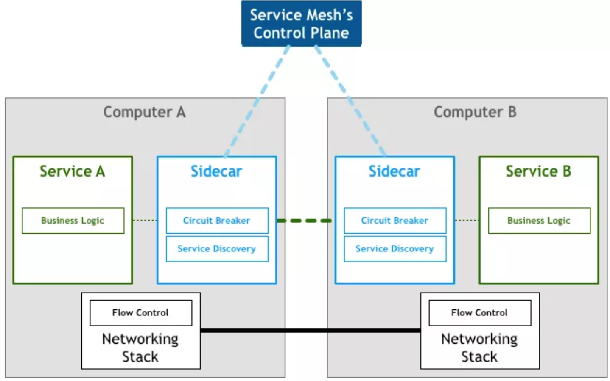

# 分布式系统设计必备知识图谱

### 为什么要懂分布式架构设计

系统学习分布式架构设计对于技术人的成长非常关键，对于云原生开发者而言如何设计出符合云原生设计哲学的应用，往往离不开分布式系统知识与方法论的运用。如何设计出高弹性、可配置、可分布、高性能、高容错、更安全、更韧性、快交付的云原生应用往往是衡量开发者水准的重要参考。

然而分布式系统是一个很大的概念，从架构设计、研发流程、运维部署、工程效率等多个角度均有很深的知识可以挖掘，学习成本和难度相对较大。

## 设计

### 1. 网关模式（Gateway）

**功能：**

* **请求路由**，客户端直接调用 `Gateway`，`Gateway` 负责路由转发到注册服务上
* **服务注册**，后端服务将 `API` 注册，`Gateway` 负责路由
* 负载均衡，支持多种负载策略
  * round robin
  * 随机均衡算法
  * 多权重负载
  * session 粘连
  * 其它
* **安全特性**，支持 `HTTPS`，账户鉴权，及其它安全特性支持
* **灰度发布**，可以针对服务版本或者租户等特性做灰度发布
* **API 聚合**，将多个后端接口聚合，减少客户端调用次数
* **API 编排**，通过编排来串接多个 API 完成特定业务

**设计要点:**

* 可用性，必须保证高可用
* 扩展性，可以灵活扩展以支持特定业务比如特定业务流控
* 高性能，通常使用异步 IO 模型框架实现，比如 Java netty，Go Channel
* 安全，如加密通信，鉴权，DDOS 防御等
* 运维
  * 应用监控，包括容量，性能，异常检测等
  * 弹性伸缩，具备高弹性能力，以低成本应对高峰值
* 架构
  * **与业务解耦合，提供扩展扩展机制比如 `Plugin`，`Serverless` 的思路支持后端业务**
  * **服务隔离**，可以按照后端服务划分网关，做到不同服务使用不同网关
  * 网关部署靠近后端，保证网络损耗最小，性能最佳

### 2.边车模式（Sidecar）

**价值:**

* 分离控制与逻辑，分离业务逻辑与路由，流控，熔断，幂等，服务发现，鉴权等控制组件
* 适用场景
  * 老系统改造扩展，`Sidecar` 进程与服务进程部署在同一个节点，通过网络协议通讯
  * 多语言混合分布式系统扩展
  * 应用程序由多方提供

**设计要点:**

* 标准服务协议，`Sidecar` 到 `Service`，`Sidecar` 到 `Sidecar` 协议尽可能与语言解耦
* 聚合控制逻辑比如流控，熔断，幂等，重试，减少业务逻辑
* 不要使用对服务侵入的方式进行进程间通讯如信号量，共享内存，优先使用本地网络通讯的方式比如 TPCP 或者 HTTP

### 3.服务网格（Service Mesh）

新一代微服务架构，本质是服务间通信的基础设施层。

**特点:**

* 应用间通讯中间层
* 轻量级网络代理
* 解耦应用程序
* 应用程序无感知

**主流框架:**

* Istio
* Linkerd

### 4.分布式锁

* Redis 分布式锁，SETNX key value PX expiretime
  * `value` 生成，最好全局唯一比如 TraceID，可以使用 `/dev/urandom` 生成
  * **`expiretime` 单位是毫秒，过期锁自动释放 ，锁持有者保证过期时间内争抢资源完成计算**
* **悲观锁，先获取锁，再进行操作，吞吐量底**
* **乐观锁，使用版本号方式实现，吞吐量高，可能出现锁异常，适用于多读情况**
* `CAS`，修改共享数据源的场景可以代替分布式锁

**设计要点:**

* 排他性，任意条件只有一个 client 可以获取锁
* 锁有自动释放方式，比如超时释放
* 锁必须高可用，且持久化
* 锁必须非阻塞且可重入
* 避免死锁，client最终一定可以获取锁，不存在异常情况锁无法释放的情况
* 集群容错性，集群部分机器故障，锁操作仍然可用

**配置中心:**

* **静态配置，环境及软件启动配置**
* **动态配置，运行时动态调整的配置如流控开关，熔断开关等**

**异步通讯:**

* **请求响应式，发送方直接向接收方发送请求**
  * 发送方主动轮询
  * 发送方注册一个回调函数，接收方处理完成后回调发送方
* **事件驱动设计（EDA）**
  * `消息订阅`，发送方发布消息，接收方订阅并消费消息
  * `Broker` 中间人，发送方向 `Broker` 发布消息，接收方向 `Broker` 订阅消息，彼此解耦,比如中间件 `RocketMQ`
  * 事情驱动设计优势:
  * 服务间依赖解除
  * 服务隔离程度高

### 5. 幂等性

* 本质是一个操作，无论执行多少次，执行结果总是一致的
* **幂等核心是全局唯一 ID**，**链路依据全局 ID 做幂等**，依据业务复杂度可以选取多种实现方式
  * 数据库自增长 ID
  * 本地生成 uuid
  * Redis 生产 id
  * Twitter 开源算法 Snowflake
* `HTTP` 幂等性，除 `POST` 外，`HEAD`，`GET`，`OPTIONS`，`DELETE`，`PUT` 均满足幂等

## 容错

### 1. 系统可用性

* `MTTF`, `Mean Time To Failure`，系统平均运行多长时间才发生故障，**越长越好**
* `MTTR,Mean Time To Recover`, **故障平均修复时间，越短越好**
* **可用性计算公式**， `Availability= MTTF /（MTTF+MTTR）`

### 2. 服务降级

* **降低一致性**
  * 强一致性，将所有的同步一致性，切换为最终一致性，提高吞吐量
  * 弱一致性，必要时候牺牲一致性换取服务整体可靠性
* **关闭次要服务**
  * 不同应用，关闭次要应用，释放物理资源
  * 相同应用，关闭应用次要功能，更多资源给到核心功能
* **简化服务功能**
  * 如简化业务流程，减少通讯数据等

### 3. 服务限流

#### 限流目的

* `SLA` 保证方式之一
* 应对突发峰刺流量，一定程度节约容量规划成本
* 租户隔离策略之一，避免某些用户占用其它用户的资源，导致服务大范围不可用

#### 限流方式

* 服务降级
* 服务拒绝

#### 解决方案

* **服务权重划分**，多租户环境将资源按权重划分，保证重要客户的资源
* **服务延时处理**，加入服务缓冲队列延缓服务压力，用于削峰
* **服务弹性伸缩**，依赖服务监控，弹性伸缩容

#### 流控算法

* 计数器
  * 单机或者集群保存某用户某时间段请求数，达到阈值则触发流控

* 队列算法
  * **FIFO 队列** : 请求速度波动，消费速度均匀，队列满则流控
  * **权重队列**: 按服务划分优先级队列，不同队列权重不同
  * **队列算法设计关键**：
  * 队列长度的预设非常关键
  * 队列太长，流控未生效，服务已经被打死
  * 队列太短，流控被频繁触发，体验差
* 漏斗算法
  * 本质上是队列+限流器实现，限流器保证消费速度均匀类 `TCP sync backlog`
  * 转发速度均匀
* 令牌桶
  * 中间人已恒定速率向桶里发放令牌，服务请求拿到 `token` 则开始服务，否则不处理
  * 转发速度不均匀，流量小时积累，流量大时消费
* 动态流控
  * 实时计算服务能力如 QPS，对比服务 RT 如果 RT 过大，则减少 QPS

#### 设计要点

* 手动开关，主动运维和应急使用
* 监控通知，限流发生时干系人要清楚
* 用户感知，如返回特定错误信息（错误code/错误提示）
* 链路标识，RPC链路加入限流标识方便上下游业务识别限流场景做不同处理

   
### 4. 熔断设计

#### 场景

* 过载保护，系统负载过高情况为防止故障产生，而采取的一种保护措施
* 防止应用程序不断尝试可能会失败的操作

#### 三个状态

* `Closed`，闭合状态，正常状态，系统需要一个基于时间线到错误计数器，如果错误累计达到阈值则切换至 Open 状态
* `Open`，断开状态，所有对服务对请求立即返回错误，不用调用后端服务进行计算
* `Half-Open`，半开状态，允许部分请求流量进入并处理，如果请求成功则按照某种策略切换到 Closed 状态

#### 设计要点

* 定义触发熔断的错误类型
* 所有触发熔断的错误请求必须要有统一的日志输出
* 熔断机制必须有服务诊断及自动恢复能力
* 最好为熔断机制设置手动开关用于三种状态的切换
* 熔断要切分业务，做到业务隔离熔断

### 5.补偿事务

#### CAP

* 一致性 (Consistence)、可用性 (Availability)、分区容忍性 (Partition Tolerance)

#### BASE

* Basic Availabillity，基本可用
* Soft State，软状态
* Eventual Consistency，最终一致性

#### Design For Failure

#### `Exponential Blackoff`，指数级退避

