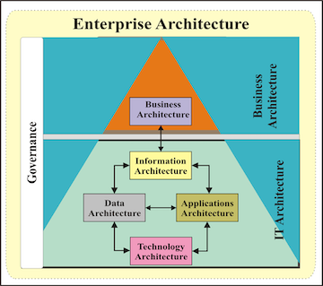

# Be a Great Architect 

 

1. [22 款受欢迎的CI工具](1CI_22_tools.md)
2. [7 款你不得不了解的开源云监控工具](https://github.com/Chao-Xi/JacobTechBlog/blob/master/k8s_tutorial/k8s_arch1_monitor7.md)
   * 原生云应用程序中最受认可的时间序列监控解决方案 - `Prometheus`
   * 开发者最熟悉的开源云监控工具—— `Graphite`
   * 互联网用户中使用最广的监控软件—— `Zabbix`
   * 鲜为人知但值得考虑的`cAdvisor`
   * 满足大部分人需求的`Riemann`
   * 搜索功能最实用的`Elasticsearch`
   * 拥有强大管理中心的`Nagios`
3. [应该使用什么 CI/CD 工具？](3CICD_tools.md)
	* 为什么需要自动化流水线
	* 部署典型流水线的组件
	* CD 流水线功能需要考虑
	* 如何合并 GitOps

4. [分布式系统设计必备知识图谱](4Distributed_sys.md)
   * **设计**
     * 网关模式（Gateway）
     * 边车模式（Sidecar）
     * 服务网格（Service Mesh）
     * 分布式锁
     * 幂等性
   * **容错**
     * 系统可用性
     * 服务降级
     * 服务限流
     * 熔断设计
     * 补偿事务 
5. [浅谈数据库并发控制 - 锁和 MVCC](5DB_locc_mvcc.md)
  * 悲观并发控制 (读写锁 / 两阶段锁协议 / 死锁的处理 / 预防死锁 / 死锁检测和恢复
/ 锁的粒度)
  * 乐观并发控制 (基于时间戳的协议 / 基于验证的协议)
  * 多版本并发控制 ( MySQL 与 MVCC / PostgreSQL 与 MVCC )
