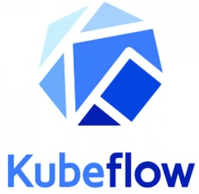

# Understanding the Earth: ML With Kubeflow Pipelines 

Petabytes of satellite imagery contain valuable insights into scientific and economic activity around the globe.

In order to turn geospatial data into decisions, Descartes Labs has built an end-to-end data processing and modeling platform in Google Cloud. 

**We leverage tools including Kubeflow Pipelines in our model building process to enable efficient experimentation, orchestrate complicated workflows, maximize repeatability and reuse, and deploy at scale.**

## Geospatial Computer Vision

#### Detect

* Classification 
* Bounding-box detection

#### Map

* Pixel-wise Segmentation
* Instance Segmentation
* Coarse Segmentation

#### Monitor 

* Time-series analysis
* Change Detection 
* Video Frame Analysis

### To Workflow

 

### Data Ingest

 

### APIs for Data Access

 

### Deployment at scale

**Area of Interest => Deploy script => Kubernetes Engine => Image services**

 

### Modeling training

Scientists shouldn't have to worry about operations

 

## Kubeflow Pipelines

1. **Reusable and reproducible**
2. **From experimentation to production**         
3. **End-to-end orchestration in Kubernetes** 

 

A framework to author and orchestrate machine learning workflows

1. Each operations had defined inputs and outputs
2. Automatic DAG inference
3. Support for conditionals and exit handlers
4. Composable and reusable parts

 

### Pipelines Introduction

 

### Complex pipeline

 

* **Pipelines can be used to train arbitrarily complex models**. 
* Common components such as ROC curves are available. 
* **Compose pre-existing components or create your own.** 
* Output viewers let you visualize training steps (ie. Tensorboard). 
* **Schemas capture model parameters and passed through the graph.** 
* **Pipeline parameters are specified at runtime.** 
* **Models and artifacts are persisted in cloud storage.** 

 

## Experiment with pipelines

* Tensorboard integrations let you easily visualize runs. 
* **Jupyter Notebook integration to speed up development cycle.** 
* Comparing runs facilitates easier experimentation. 
* Hyperparameter sweeps are possible with parallel runs. 
* Make components straight from a notebook. 

 

## Deploying with pipelines

* **Pipelines work well with existing GKE infrastructure and cloud workflows.** 
* Interop with GKE features like scaling node pools and load balancing. 
* GKE secret store manages access control and API identities. 
* Docker containers encapsulate environments. 
* **APIs for publishing and deploying pipelines.** 
* Rich metadata and logging. 
* **Supports GPU and TPU nodes for accelerated training.**

 

 

## Wrap Up

* Kubeflow Pipelines allows us to manage the scale and scope of projects. 
* Kubeflow interops well with the geospatial microservices at Descartes Labs. 
* Kubeflow pipelines is becoming to be easier to use and more powerful. 

