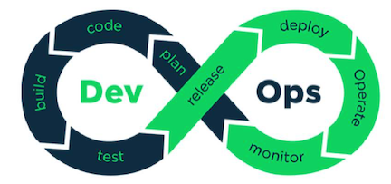
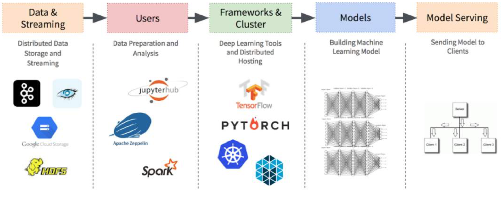
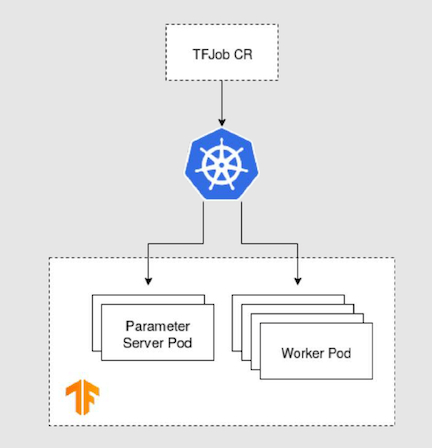

# `K8S+vGPU` + `AI Devops` + `Kubeflow in Jupyter`

## 在`Kubernetes`中使用vGPU实现机器学习任务共享GPU

### 人工智能的概念

**Artificial Intelligence**

* Intelligence demonstrated or mimicked by machine

**Machine Learning**

* Statistical techniques that enable computers to use data to progressively improve performance on a specific task without being explicitly programmed

**Deep Learning**

* Machine Learning using deep(many-level) neural networks


### Kubernetes 作为机器学习的平台

#### ML workload can be encapsulated in and run as container

* Portability
* Lightweight

#### Kubernetes is the de facto standard for containerized applications

* Scalability - distributed training, on-demand inference serving
* Microservices - job pipelines
* Multi-users
* Resource management
* Rich APIs
* Ubiquitously available in the cloud


### Kubernetes 在调用GPU的限制

#### Device plugin for AI/ML chips 

* GPU, FPGA, ASIC 

#### Limitation of GPU Scheduling in Kubernetes 

* Exclusive assignment
* No fractional assignment 

#### The problem of "Model Stuffing" 

Stuff multiple models in a single container in order to share a GPU 


### GPU虚拟化技术

#### GPU Virtualization is similar to CPU virtualization (VM)  

* NVIDIA, AMD, Intel 
* Sharing GPU resources between VMs 
* VM level isolation 
* QoS ready 

#### Hypervisor support 

* vSphere, KVM, Xen Server 


#### 在`Vsphere`使用`GPU`加速器

* **Multiple VMs share a physical GPU**
* **Allow one or more vGPUs per VM**
* **vGPU VMs can use snapshots and vMotion** 


#### 在`Vsphere`使用划分`GPU`

* **Split the physical GPU by fixed framebuffer**
* **vGPUs sharing the same GPU compute engine** 
* Scheduling 
  * Fixed Share 
  * Equal Share 
  * Best Effort 


### 在Kubernetes中共享GPU

**Flexibility, finger granularity, isolation, multi-tenant**


### 虚拟化GPU的优势

#### GPU Sharing between Pods 

* Utilization 
* Scalability 
* Isolation 
* QoS 

#### Enhanced manageability 

* Suspended / Resume a node with GPU ( vGPU profile switching) 
* Live migration of nodes for maintenance (e.g. vMotion) 
* Snapshot and cloning 
* Automation 


### 虚拟化GPU在Kubernetes中的使用

#### Pod definition

* Request GPU resources 
* 1 GPU mapped to a fractional physical GPU 
   * e.g. 1/2 GPU or 1/4 GPU 
* Node selector for scheduling to specified vGPU profile 

#### VM level isolation 

#### QoS 

 


### 推理服务的扩展性

* Scaling out inference service
* sharing physical GPU
* shortened response time


### Summary

* Kubernetes is suitable to run ML workload 
* Kubernetes can leverage GPU virtualization for ML applications
  * Utilization 
  * Scalability 
  * Isolation 
  * QoS 
  * Suspend/ resume/live migration 


## AI Devops

### Devops 

DevOps is a **software development and delivery process that emphasizes communication and collaboration** between product management, software development, operations professionals and close **alignment with business objectives**.



### AI DevOps



```
Data & Steaming    ->      Users    ->     Frame works&Cluster  -> Models   ->  Model Serving
     
     ||                     ||                    ||                  ||           ||

Distributed Data      Data preparation     Deep Learning Tools      Build Machine  Sending model
and Streaming         and analysis        and distributed Hosting   Learning Model to client
    
     ||                     ||                    ||                  ||            || 
     
Apache Cassandra         Jupyter             Tensorflow            Model
Apache Hadoop            Apache Zepplin      k8s
Google data stream       Spark
```

## Kubeflow with Jupyter notebook

### Background

#### 本地开发的问题

* **硬件资源无法共享，利用率低，成本高**
* **模型分布式训练在成熟度不高的用户环境下难以落地**

### Distributed DL Training


### 愿景

#### 云端开发

* **0侵入性， 为用户提供与本地开发相似或相同的体验（Juypter）**
* 基于云环境，为用户提供跟高级的特性（分布式训练）
* 与后续的机器学习流程的对接

### What is Kubeflow

#### The Machine Learning Toolkit for Kubernetes

**The Kubeflow project is dedicated to making deployments of machine learning (ML) workflows on Kubernetes simple, portable and scalable.**


 

**CRDs**

* TFJob 
* PyTorchJob 
* MXNetJob 
* MPIJob 
* KFServing 

**Standalone Systems** 

* Katib ( AutoML System ) 
* **Arena ( CLI for Kubeflow )** 
* **Fairing ( Python Library for Kubeflow )** 
* **Kubeflow Pipelines ( ML Pipeline System )** 
* **Kubebench ( ML Benchmark Platform )** 

#### TFJob 




### Pros and Cons

* 借助Kubernetes的容器运行时，服务发现，资源管理等能力，可以较好地完成任务运行 
  * 支持分布式扩展（增加`Parameter Server`, `Worker`数量） 
  * 支持不同的分布式模型（`All-Reduce`, `Ring-Reduce`) 
  * **隐藏底层硬件细节的同时提供显卡资源（CUDA，显卡驱动等）** 
 
* 可以较为方便地实现对任务的状态管理（重启，失败等） 
* `Kubernetes Native`资源（CRD)，可以与其他工具与资源配合使用 

#### Cons

* 每次训练需要构建镜像, 没有所见即所得的结果 
* 不适合变更频繁的开发环境, 需要手动观察pod中的训练情况 


### Kubeflow Fairing

