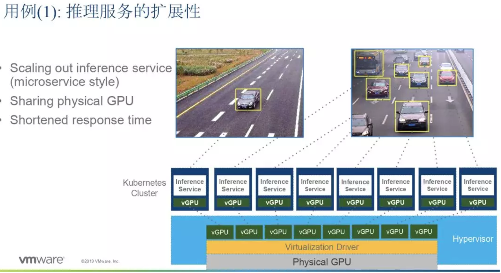

# 在 Kubernetes 中使用 vGPU 实现机器学习任务共享 GPU

## 背景与现状

首先，我们来讲一讲 AI 的现状。我们正处于人工智能的新纪元，这里的关键词不在“纪元”上，而是“新纪元”。因为 20 年前我读大学的时候，我的教授就说那时是 AI 的时代，现在我们又一次进入了 AI 时代。

我们一直在讲 AI，但是当前我们正在进入的这个 AI 时代可能有些特别。相信很多朋友，包括我本人，都亲身体验到了 AI 在我们生活中扮演的角色，如手机不用输密码，刷个脸就登录进去了，可以说现在生活的方方面面都用到了 AI，所以 AI 领域已经变成非常主流的一个方向。

机器学习是人工智能领域的一个子类，最近比较火的深度学习同样也是。它们的共同点无非就三个要素：**第一个要素是数据**，模型构建需要大量数据；**第二个要素是算法**，机器学习领域还有很多学者在创新，包括 CNN、DNN 这些算法及其改进。

那么第三个要素是什么呢？其实**第三个要素就是我们需要巨大的算力**，这也是近几年我们在 GPU 等一些硬件上努力发掘进展的原因，让算力能够更好地发挥出算法和数据的作用。也就是说，在人工智能进入千家万户的生活的过程中，这三个要素发挥着很重要的作用。

## 算力如何进行共享

今天我给大家讲的是算力如何进行共享，就是 GPU 在 Kubernetes 里的使用。很多机器学习任务可以用容器化来做，容器化之后就可很方便地部署和启动。

如今，`Kubernetes` 已经成为容器编排的事实标准，可以帮助我们做容器扩展、微服务架构等。除此之外，`Kubernete`s 还有一个优势是在云端非常普遍，它可以在大多数云端跑起来，比如现在主流的阿里云、国外的 AWS 和 Azure，这意味着 Kubernetes 具有很大的便利性。

社区里面有个问题讨论叫做`“Model Stuffing”`，就是把多个机器学习应用跑在同一个容器里面，在容器里共享 `GPU` 资源。这是一种不得已而为之的做法。社区也有些朋友做了方案，想了一些方法解决共享问题，初步实现了 `GPU` 的共享能力。但它们目前还没有实现应用的隔离，不同应用之间存在资源抢占和互相干扰的现象，同时 `QOS` 也不能保证。

**由于这些做法都不完美，我带来了一种新思路：基于 vGPU 的解决方案。**

简单来说，**`vGPU` 就是将 `GPU` 虚拟化的技术。** 虚拟化大家都不陌生，`CPU` 虚拟化就是虚拟机，这个大家用得很多了，它依靠 CPU 的硬件指令来实现虚拟化环境。经过这几年发展，GPU 现在也实现了虚拟化能力，允许每个用户隔离共享物理 GPU 资源。主流的 GPU 厂家，如 `NVIDIA`、`AMD`、`Intel` 都支持虚拟化 `GPU`，提供隔离、`QOS` 的能力。

另外，虚拟化厂商，如 `vSphere`、`KVM` 和 `XenServer` 等，也支持 `vGPU` 的功能。

**因此从硬件层面上讲，现在我们已经基本具备了虚拟化 GPU 的可行性。**

接下来我们看看怎样在 `Kubernetes` 上使用虚拟化 `GPU` 技术。首先，分割 `vSphere` 上的物理 `GPU`，我们把它分割成很多虚拟 `GPU` 并映射到虚机里面去。虽然虚机看到是一个 `GPU`，但那实际上可能只是物理 `GPU` 的 `n 分之一`，每个 VM 是独立的，互相之间不会产生干扰。

当我们在 `vSphere` 里面做配置的时候，我们可以划分 `vGPU` 的大小，像上面这个例子里面，我们按照 `grid-p100-8q` 的 `profile` 来划分 `vGPU`，这个虚拟 `GPU` 就具有 `8GB` 的显存，大约是物理 `GPU 16GB` 的二分之一。在一定情况下，虚拟 GPU 的处理能力可以媲美整个物理 GPU 的性能。虚拟 GPU 支持不同的调度算法，包括 `Fixed Share`、`Equal Share` 和 `Best Effort`。用户对不同算法的使用需求在一定程度上都可以满足。

听到 `GPU` 转化为虚拟 `GPU` 使用的时候，**大家可能比较关注有没有性能上的损失，跑大型模型训练任务的效率会不会受到影响。** 我们做过一些测试，把 `Native` 模式（即没有虚拟化）作为系统性能参照标准 1，在使用了虚拟化的 `vGPU` 后，性能大概是 1.04 左右。所以引入虚拟化的开销是非常小的，大约小于 4%。在实际运用中，这个开销基本可以忽略不计。

那么在 Kubernetes 中，我们怎么使用 vGPU 呢？这里有个图。

首先我们把一个物理 `GPU` 通过虚拟化的驱动程序，在虚拟机里面把它切割成 `vGPU`，每个 `vGPU` 看上去像是一个完整的 `GPU`。采用这样的虚拟化技术之后，我们可以提高 `GPU` 的使用率，同时也有很好的共享能力。除了共享之外，它还有额外的好处，例如动态迁移。我们 `vSphere` 可以通过 `vMotion`，把虚拟机迁移到另外一个物理机器上去，不影响应用的运行，便于日常维护管理。这也是虚拟化给我们带来的一些优势。

在 `Kubernetes` 中使用 `GPU` 的时候，我们也要注意一些细节。**我们需要把每一个 `worker Node` 打上一个 `label`**，并按照每个 `GPU` 的实际能力加以标注。比如这里我把 `label` 打成了 `4GB`，也就是说它虽然看上去是 1 个 GPU，但实际能力只有 `4GB` 显存（1/4 个 16GB 的 GPU）。

标注的目的是为了后续做调度的时候更方便些。

## 虚拟化 GPU 的作用

接下来给大家介绍几个场景，介绍虚拟化 GPU 能够解决什么问题。

业界的朋友都知道，模型推理（inference）的服务和训练其实不一样，推理一般只占到很少的 GPU 使用，但是并发量可能很大。在没有共享 GPU 的情况下，它需要较多的 GPU 来满足并发需求。

举个例子，在北京，机动车每周限行一天。路上有很多摄像头监控车辆的行驶，当有车辆违反限行规则时，摄像头会把车辆照下来，然后发通知给车主交罚款，这个过程是全自动的。

在车朝着摄像头开过来的时候，摄像头需要先识别到车这个物体，再把车的图像方块截取出来，然后做更细化的车牌识别处理，这时就需要后台的模型推理。

如果这只是一辆车，那很简单。但如果是很多车同时出现在摄像范围内，情况就变得复杂了。**在这一瞬间，大量车辆需要同时识别处理，这导致请求被压到同一个服务实例上，造成性能瓶颈。** 如果我们使用虚拟 GPU，那一个物理 GPU 就可以支持多个推理服务，提高整个物理 GPU 的使用率。所以说推理场景非常适合使用虚拟 GPU。

第二个场景是在混合机器学习的任务里面。举个典型的例子，在学校等大型组织里，不同用户会做不同的事，如研究、教学、开发、练习等，他们对 GPU 有不同的要求。但 GPU 资源往往是有限的，需要我们尽可能大的去增加利用率。

我们给某个学校设计了一个切换方案，当白天运行一些比较简单的任务时，比如学生开发练习、简单的教学任务，我们把一个物理 GPU 分成 4 份来使用，这样就有 4 个用户可以同时使用一个 GPU。到了晚上，学校要做模型训练，需要大量的算力。这时我们就切换一下，把虚拟 GPU 切换成 1:1 的虚拟 GPU，这时虚机里的 GPU 拥有 100% 的算力。

第二天白天，vGPU 按需又可以切换回 1:4 的模式，这相当于我们可以动态地在固定数量的机器里去使用不同的配置，既可满足小场景需求，也可满足大场景需要。

## 小结

最后，我来做个小结。我们可以用 Kubernetes 运行机器学习 workload，通过 vGPU 的 sharing 来实现 GPU 资源的共享和隔离，它有较多的优点，这是我们推荐这个方案的原因。

