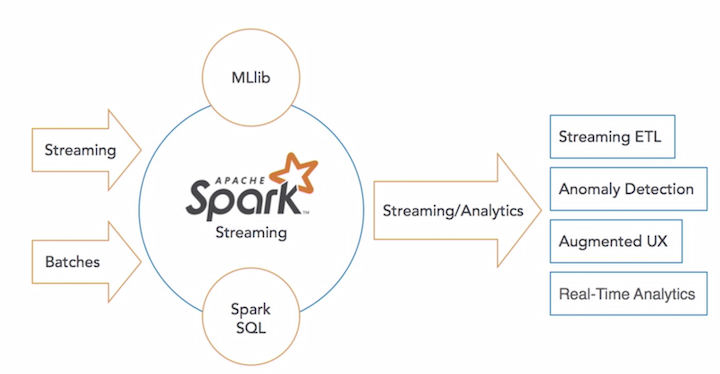

## Kubeflow 

1. [Understanding the Earth: ML With Kubeflow Pipelines](1Kubeflow_pipelines.md)
2. [`K8S+vGPU` + `AI Devops` + `Kubeflow in Jupyter`](2vGPU_Kubeflow_AI_Devops.md)
   *  在`Kubernetes`中使用vGPU实现机器学习任务共享GPU
   *  AI Devops
   *  Kubeflow with Jupyter notebook
3. [在 Kubernetes 中使用 vGPU 实现机器学习任务共享 GPU](3k8s_vGPU_share.md)

## AWS Data Infra

1. [借助`AWS Lake Formation`构建云上数据湖](aws1_data_lake.md)
2. [利用 `Amazon Kinesis` 搭建实时数据分析平台](aws2_kinesis.md)

## Apache Spark

1. [Apache Spark Introduction](sp1_Intro.md)
   * Understanding Spark
   * Origin of Spark
   * Overview of Spark components
   * Where Spark shine
   * Quiz
2. [Spark Demo Environment Setup](sp2_Env_setup.md)
   * Overview of Databricks
   * Introduction to notebooks and PySpark
3. [Analyzing Data in Spark](sp3_ana_data.md)
   * Understanding data interfaces
4. [Work with Text files](sp4_textfile.md) 
   * Type of Text Data
   * Demo
5. [Working with DataFrame](sp5_DataFrame.md)
   * Loading CSV into dataFrames
   * Exploring Data in DataFrames
   * Saving DF Results
   * Quiz
6. [Using Spark SQL to Analyze Data](sp6_SQL_ana_data.md)
   * Creating table
   * Querying Data with Spark SQL
   * Visualizing data in Databricks notebooks
   * Quiz
7. [Running Machine Learning Algorithms Using MLlib](sp7_Machine_Learning.md)
   * Introduction to machine learning with Spark
   * Preparing data for machine learning
   * Building a linear regression mode
   * Check Models for Accuracy
   * Visualizing a linear regression model
   * Quiz
8. [Real-Time Data Analysis with Spark Streaming](sp8_data_ana_streaming.md)
   * Introduction to streaming analytics
   * Setting up Streaming Context
   * Querying Streaming Data
   * Quiz
9. [Connecting BI Tools to Spark](sp9_set_locally.md)

## Hive

### Hive concepts and setup

1. [Hive Introduction](hive1_intro.md)
   * Why use hive
   * How hive works
   * Quiz
2. [Setting up our demo environment](hive2_setting_demo_env.md)

