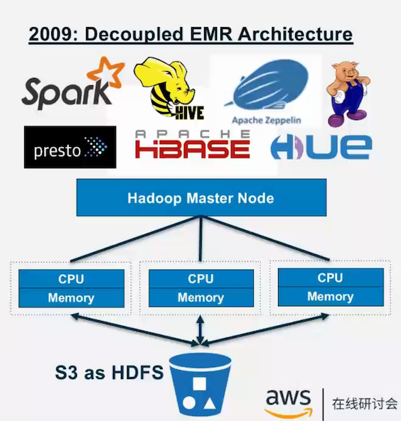
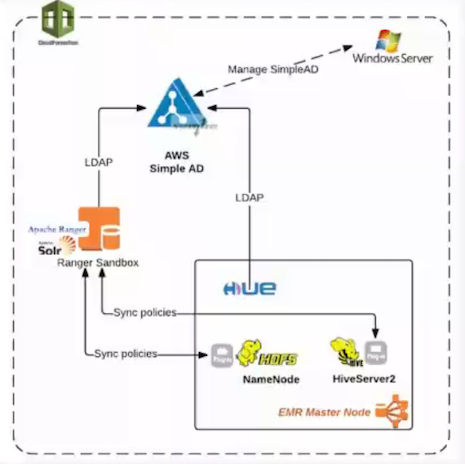

# 借助AWS Lake Formation构建云上数据湖 

### 数据分析平台的演变

### LAMBDA 架构与实时计算

`http://lambda-architecture.net/`

### 基于Lambda架构的欣和数据湖设计 

## 数据湖一实现数据变成资产 

### 业务目标 

- 数字化经济，数据驱动业务 
- 提升企业运营效率 
- 预判发展趋势，提升企业竞争力 

### 技术目标

- 停止丢弃数据 
- 分析无处不在， 采用多种技术 
- 自动化，API化 
- 赋能给更多用户，建立数据探索能力 

### 敏捷，自助式服务 

### 协作，促进企业内部协作 

### 某车企全球数据湖架构

### AWS 云上数据分析平台的创新

#### 1985 ：Data Warehouse Applicance

#### 2012: Amazon RedShift: cloud DW

#### Today: Clusterless

##### 改艺 

* 无需管理集群／基础设施 
* 业务人员及分析师可以无需提前规划集群直接提交SQL编写分析查询 
* 按请求计费 
* 零运维管理 
* 无需数据移动 

##### 不足 

* 开发语言／框架 目前仅限于`SQL / Spark `

AWS的第一个云服务（2006) 99.999999999％数据持久性 不限对像格式 存储无上限 按使用付费，价格便宜 支持事件驱动的自动化 替换HDFS解藕计算与存储 与多种分析方式深度集成 

## 基于Amazon S3的aws云上数据湖架构

### Amazon S3

* AWS的第一个云服务（2006) 
* 99.999999999％数据持久性 
* 不限对像格式 
* 存储无上限 
* 按使用付费，价格便宜 
* 支持事件驱动的自动化 
* 替换HDFS解藕计算与存储 
* 与多种分析方式深度集成 

### 企业球数据湖架构

#### Epic Games 数据湖架构

#### EQUINOX 数据流水线

## AWS Lake Formation

* 识别、接入、清洗、转换数据 
* 跨多种服务的增强安全措施 
* 获得更多的业务洞见能力 

### 搭建数据湖的基本步骤

### 步骤

* Find Source
* Configure access policies
* Map tables to Amazon S3 locations
* ETL jobs to load and clean data
* Create metadata access polices
* Configure access from analytics services

## Lake Formation 价值主张

### 核心模块

### Blueprints / Workflow

ETL任务工作流元数据及分区管理的模版 

### 基于ML算法的数据转换

基于机器学习的数据转换算法，解决特殊场景 问题（如；基于多列属性的数据去重） 

### 增强的数据治理层

在元数据管理层增强权限管控及治理能力 

### 增强的元数据管理

允许用户添加更丰富元数据信息，为数据添加标签（ 库，表，列级别） 

### AWS Lake Formation 的简单四部

#### 1. 轻松导入数据

#### 2. Blueprints build on AWS Glue

#### Blueprints & workflows

`Blueprints` 是**数据摄取、转换、元数据（schema）** 和分区管理的模板 `Blueprints` 帮助客户决速、轻松地构建和维护一个数据湖。 

##### Blueprints

1. 自动发现源数据`Schema`
2. 自动进行源和目标表的数据转换
3. 自动数据分区 
4. 作业状态跟踪 
5. 灵活客户化`Blueprints`模板 

#### 是有 ML transforms 轻松识别相同数据

### EMR权限管理

#### Kerberos Architecture Options

`https://docs.aws.amazon.com/emr/latest/ManagementGuide/emr-kerberos-options.html`

#### AWS Apache Ranger

`https://aws.amazon.com/blogs/big-data/implementing-authorization-and-auditing-using-apache-ranger-on-amazon-emr/`

### Lake formation权限管理： 一次型配置控制不同不同访问方式

#### Lake formation 中的安全控制与授权

* 使用简单的`grant`和`revoke`管理权限 
* 指定对表和列的权限，而不是对存储桶和对象的权限 
* 轻松查看和管理用户权限 
* 集中审计功能 

#### 表及列级别的访问控制

### AWS Lake formation 的安全实现

#### 跨用户的搜索和协作 

* 基于所有元数据的文本搜索 
* 添加数据所有者、管理员等属 
* 性作为表属性 
* 添加数据敏感级别、列定义等作为列属性 

