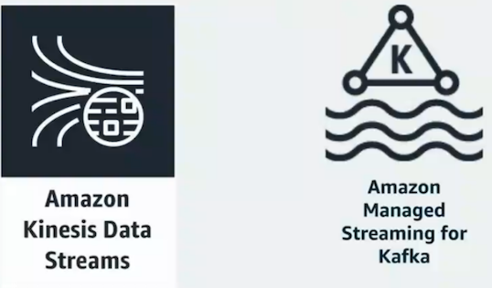
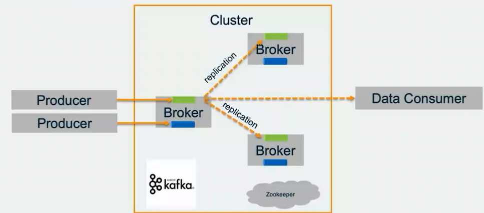
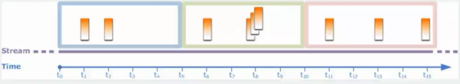
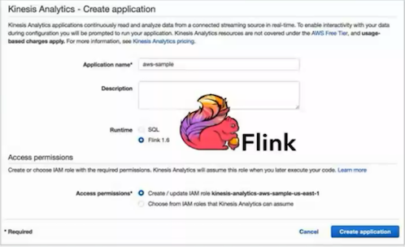

# 利用 Amazon Kinesis 搭建实时数据分析平台	
## 流式数据处理概念

### 流式数据的特征

* 高吞吐
* 持续的
* 有序的增量
* 低延时

### 为什么需要数据实时分析


### 流式数据处理的难点

* 配置管理困难
* 扩展不便
* 难以实现真正的高可用
* 集成需要大量开发工作
* 管理复杂，容易出错
* 维护成本高


### 在AWS上进行流式数据处理 -- 简化， 可靠， 低成本


#### 实时流式处理的典型流程

`Data stream` 技术使用用户能够**实时获取**， 处理和分析来自各种来源的大量高速数据


#### 数据源

* 移动数据
* web 点击流
* 实时指标
* IoT 传感器
* 只能建筑
* **应用日志**


#### 获取数据流


**`Amazon DMS` 的数据源包括8种数据库， 1种Azure数据库， 5钟RDS/Aurora数据库以及S3**

#### 流式存储

数据按照接受的顺序存储一段时间， 并且可以做在此期间无限期重播




## Amazon Kinesis Data Streams 概念

* 易于管理，成本低 
* 实时，弹性扩展 
* 安全，持久的存储 
* 可用于多个实时分析 
* 应用程序 


#### 从各种来源获取数据


#### 对接各种消费者来处理数据


#### Kinesis Data stream 的成本

* 按使用付费定价 
* 没有前期费用，也没有最低费用 
* 基于两个维度： 
  * shard每小时费用：0.015美元 
  * PUT有效载荷单位（25K）每百万单位：0.014美元 
* 每个分片小时的扩展数据保留期：0.020美元 

#### Amazon Managed Streaming for Kafka 概念

* 与`Apache Kafka v1.1.1`和`v2.1.O`完全兼容 
* 在AWS管理控制台或者通过`AWS API/CLI`创建 
  * 群集自动启动和配置 
  * 提供 `Apache Kafka brokers`和存储 
  * 按需创建和删除集群 
* 与AWS服务深度集成 


#### MSK - 托管的 Kafka





#### 兼容性

##### MSK集群能够兼容： 

* 支持`Apache Kafka`分区重新分配工具 
* Apache Kafka API 
* Apache Kafka管理客户端 
* 第三方工具 

#### MSK集群不能兼容： 

* 需要上传 `.jar` 文件的工具（`Confluent Control Center`,`Confluent Auto Data Balancer` , `Uber uReplicator` 和 `Linkedin Cruise Contro[`) 

#### 讲 Kafka 和 Kinesis 结合使用： 

`https://github.com/awslabs/kinesis-kafka-connector`


#### Amazon Kinesis Data video Stream


* 智能家居
* 智慧城市
* 安防监控
* 工业自动化
* 计算机视觉


### 流式处理

记录按照生成的顺序读取， 从而实现实时分析或流式ETL


#### Amazon Kinesis Data Analytics


#### KDA for SQL 针对简单和快速上手

* 亚秒级端到端处理延迟 
* SQL步骤可以串行或并行步骤链接在一起Bo如 
* 使用一个或数百个查询构建应用程序 
* 预构建的函数包括从`sum`和`count`到机器学习算法的所有内容 
* 聚合使用窗口运算符连续运行 


#### KDA for JAVA 针对复杂应用场景

利用 `Apache Flink`, 一个框架和分布式引擎，用于状态处理数据流


#### 如何构建实时应用

流云算应用于管道中的数据流


### SQL 流数据实时分析


* 提供模板和交互式编辑器，以及时 间窗口聚合、过滤器等丰富的SQL 查询
* 只需根据实际需求选择适合的分析任务的模板然后使压`SQL`编辑器编写数据自定义的分析代

#### `Amazon Kinesis Data Analytics`的交互式SQL编辑器 

在控制台中使用SQL模板进行快速，迭代的开发 


#### 编写流式SQL (`Pumps`持续查询)

```
CREATE OR REPLACE PUMP callsper_ippump AS 
INSERT INTO calls_per_ip_stream 
SELECT STREAM "eventTimestamp", 
	COUNT(*), 
	"sourcelPAddress" 
FROM source_sql_stream_001 ctrail 
GROUP BY "sourcelPAddress", 
	STEP(ctrail.ROWTIME BY INTERVAL '1' MINUTE), 
	STEP(ctrail."eventTimestamp" BY INTERVAL '1' MINUTE); 
```

#### 聚合流式数据？ 

* 对颗粒化的实时数据进行聚合（计数，总和，最小.....)，并将其转化 \为见解 
* 数据会持续处理，因此您需要在需要结果时告诉应用程序 

`Windows`

##### Window Type

* 滑动，滚动和交错窗口窗口 
* 滚动窗口是固定大小的，`grouped keys`不重叠 




### Amazon Kinesis Data Anlystics for Java

* 包含基`Apache Flink`的开源库能够在数小时而不是数天或者数周内构建程序 
* 使用操作习惯的`IDE`然后连接 到AWS并安装Java库 
* 包括赶过25个内着运算符的可扩展库用于过滤、聚合和转换流数据以及与多种AWS服务的集成 



* 使用熟悉的`IDE`环境构建`Java`程序 
* 上传应用程序代码到 `Amazon Kinesis Data Analytics `
* 在可扩展的托管服务中运行应用程序 


### `JAD for Java`应用扩展一资源和并行度 

#### 资源`resource` 

* 用于运行代码的`Kinesis Process Unit (KPUs)` 
* 每个`KPU`是`1 vCPU`和``4 GB memory` 
* 每个`KPU`带`50GB`存储 
* 可以自动扩展，或者指定KPU

#### 并行度`Parallelism` 

* 任务的实例数 
* 默认值为1，默认最大值为64，可以为指定，也可以自动扩展 
* `Maximum`定义应用程序的最大可能并行度 


### `Java Data Analystics for java`支持超过25 operators
 


#### `Kinesis Data Analytics for Java`与`AWS`服务的可扩展集成 

* 轻松地将源和接收器添加到应用程序 
* 为其他数据源和接收器构建自定义连接器 


### Amazon Kinesis Data Firehose 概念


* 零管理和无缝弹性 
* 直接数据存储集成 
* 无服务器连续数据转换 
* 近实时 

#### Amazon Kinesis Data Firehose 基本原理


### 点击流分析一从批处理到实时分析 


很多数抖以前通数据仓库批处理的方式或过`Hadoop` 框架进行分析而借助 `Amazon Kinesis` ．您可以对此类数据进行实时分析， 最常见的使用案例包括数据湖， 数据科学，机器学习．您可以使用`Amazon Kinesis Data Firehouse`将数据持续加载到Amazon数据湖中。 您也可以获得新数据时更频繁低更新机器学习模型，确保准确性和可靠性

### 视频监控警报系统一构建视频分析应用程序 


您可以使用`Amazon Kinesis Video Streams`将视频从家庭、办公室、工厂和公共场所的配备摄像头的设备安全地传输到AWS。 然后，可以将这些视频流用于视频播放、安全监控、面部测试、机器学习和其他分析。 

### 传感器检测一分析IoT设备数据 


您可以使用`Amazon Kinesis`来处理来自消费电器、嵌入式传感器和电视机顶盒等`IoT`设备的流数据。然后您可以用编程方式使用这 些数据，以便在传感器超过特定运行阂值时发送实时提醒或进行其他操作。使用AWS提供的IoT分析示例代码还可以帮助构建您的 应用程序，无需从头开始。 

### Demo


