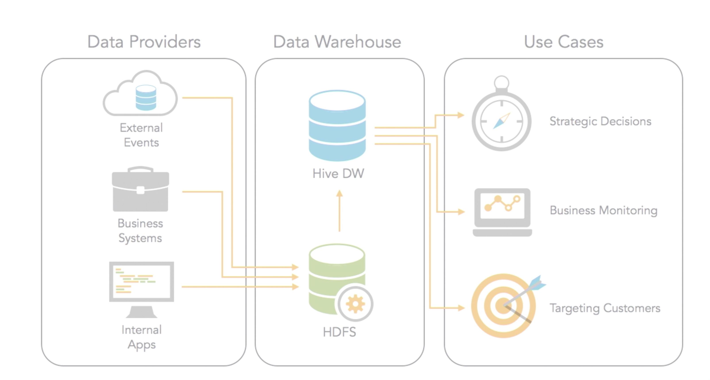
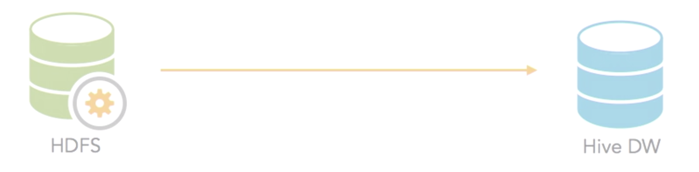

# Hive Introduction

Businesses thrive by making informed decisions that target the needs of their customers and users. 

To make such strategic decisions, they rely on data. 

**Hive is a tool of choice for many data scientists because it allows them to work with SQL, a familiar syntax, to derive insights from Hadoop, reflecting the information that businesses seek to plan effectively.**

### Abs:

* Why use hive
  * What is Hadoop?
  * Hive Benefits
  * Hive Limitations
  * Other Options
* How hive works
  * Workflow [1->4]
  * Dive into Data Warehouse

## Why use hive

#### Hive is a `SQL-like` abstraction that allows for `interactive queries` on top of **Hadoop data**.

 What this means is that we can use the language of a data analyst, SQL, and ask questions of our **data living in Hadoop's file system known as HTFS**.

**HTFS:**  Hadoop's file system

### What is Hadoop?

#### **Hadoop is not a database.**

 Hadoop is an ecosystem of programs working together to support a large scale application by using **distributed fault-tolerant workflow approach**.

Hadoop does offer some luxuries, **such as SQL support and distributed reliable backup**, so even if one of your servers goes down in your cluster your system is still functioning. A**ll these things are why Hadoop is much more than just one single thing, it is an whole ecosystem of things.**

### Hive Benefits

#### 1. Familiar language

You can use SQL, which is just the language all of us data analysts have been using for years to analyze data

#### 2. No java necessary

Previously, **Hadoop required Java to work with your data**, and now, w**ith Hive, you don't have to have any Java knowledge whatsoever, you can use SQL**

#### 3. Tool support

**Because it has a standard, SQL-like interface**, business intelligence and analytics platforms can pull directly from your data living in Hadoop. 

Now this has opened up the floodgates, and **now anyone that knows how to use Excel can actually analyze data living in Hadoop because of Hive.**

### Hive Limitations

#### 1. Not full ANSI SQL

Hive doesn't support the full ANSI standard, **what that means is you may try to run some functions or some queries that you're used to doing in other database systems that just don't work in Hive**

#### 2. Slow

**Hive is `batch-oriented`.** So, what happens is, **you write some SQL, and it converts it to MapReduce.**

Now, **MapReduce is the language of Hadoop.** It's the interface that was originally created to work with data in Hadoop, and **it's incredibly slow because it's designed to scale, it's not designed to be a fast, analytical database.**

 Hive makes it accessible because it just punches in SQL and converts it to MapReduce, it still takes a long time to even run simple-type queries.
 
#### 3. Fragile

**Hive supports schema-on-read.** What that means is that it doesn't, what that means is that **it doesn't define the structure of the data in advance, it does it when you actually query it**. 

Now this is great, because your schemas can be flexible, and you can make things more dynamic, however, the challenges is that they become fragile. 

Because what they're dependent upon is this underlying structure in Hadoop. **So, if that underlying structure kind of moves out from underneath you, and you're not aware of it, you may run a query and get invalid results or an error,** 

**because things changed and because there was no schema defined in advance, there was no way to know that, prior to actually running your query.**

### Other Options

#### - Apache Spark

It offers SQL language interface, as well as many other options, such as Python and Scala.

#### - Impala (Cloudera)

**Impala supports all the SQL-like functions as Hive, but it runs much faster** since it doesn't require MapReduce and has its own database engine running on each data node in your Hadoop cluster.

#### - Hive on Tez

It is another platform for executing the jobs and distributing the queries differently than the traditional method. 

#### - Presto

Presto provides full ANSI SQL support, so not the limitations that you have with Hive or any of the other ones that support a version of SQL. And it dramatically increases performance without having to move your data outside of Hadoop. 

#### - Third-party database(Example: Vertica)

**Vertica is probably the most popular database in the space right now**, and the idea here is **that you take your data from Hadoop, and you transform it into these analytical data sets that are conformed and consistent and really, really great for analysts,** and you put that into a database specifically designed to handle analytical workloads

## How hive works

### Workflow [1->4]

#### 1. Data providers that generate data. 

These are external events on things like **social networks, business systems** that handle all of your organization's processes, and internal apps that may be home-grown and designed with a very different storage and access method.

#### 2. All the data flow in to HDFS, that's the Hadoop File System. 

The data lives in HDFS, the format can be anything from tab delimited **text files, comma-separated vales, or compressed `.zip` files full of totally unstructured log data** 

#### 3. Hive Data Warehouse

The Hive warehouse, for the most part, is just a **logical definition of tables and user-defined functions that can be used to access the underlying data in HDFS**. 

#### 4. Use cases

You can do all sorts of things with the data but some typical-use cases are **`targeting customers`, `monitoring your business,` or `figuring out your strategic decisions`** and where, actually, things need to go.

### Dive into Data Warehouse

#### HDFS

* **Raw Data**:  This literally could be a **text file** from emails back and forth.
* **Unstructured**: It could be something that is structured but often it's unstructured data, just data that was written to the disk and then is living in HDFS in its natural form.
* **Compressed**: It's common to do this because it saves space and a lot of times we're talking about really large volumes of data.
* **Partitioned**: Isf we're getting log data or sales data, **we're going to put those into separate folder structures.**

#### Hive DW

* Processed
* Structured
* Aggregated
* Partitioned

### Quiz

* **1.What is the name of Hive's SQL implementation?**

HiveQL

* **2.Tables in Hive have a schema.**

True