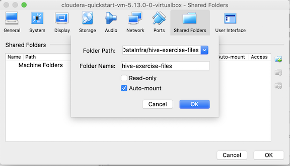
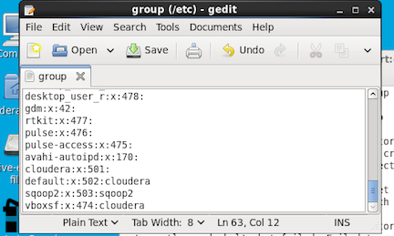
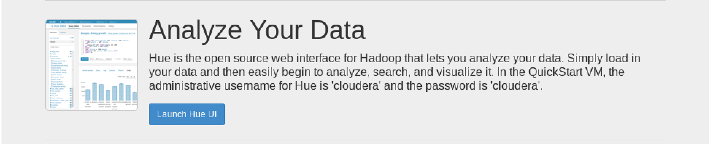
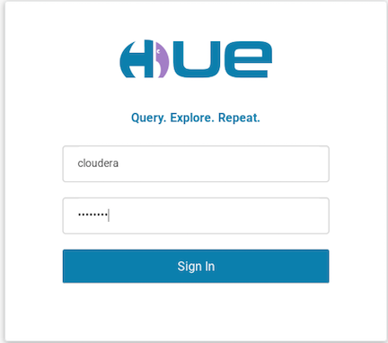

# Setting up our demo environment

### 1. Install VirtualBox


### 2. Install CDH image

[https://www.cloudera.com/downloads/quickstart_vms/5-13.html](https://www.cloudera.com/downloads/quickstart_vms/5-13.html)

* **1.Choose Virtual Box and hit download**
* **2.unzip it**
* **3.Import it from Virtual Box**
* **4.Upgrade memory and video memory as good as possible**
* **5.Change shared folder and import `hive-exercise-files` download**



* **6. user account access to that shared folder.**

```
# open new terminal
$ sudo gedit /etc/group
vboxsf:x:474:cloudera
```


*  **7.Log out cloudera vm and re-log in**

```
system -> log out
```

### 3. Follow onscreen instruction for Hue

```
127.0.0.1:8888
```



```
username: cloudera  password:cloudera
```



