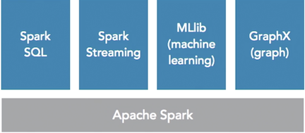

# Apache Spark Introduction

Apache Spark is a powerful platform that provides users with new ways to store and make use of big data. In this course, get up to speed with Spark, and discover how to leverage this popular processing engine to deliver effective and comprehensive insights into your data

* **Understanding Spark**
* **Origin of Spark**
* **Overview of Spark components**
* **Where Spark shine**

## Understanding Spark

### Apache Spark

**A fast and general engine for large-scale data processing**
 

### main reasons to use Spark: 

* **speed**
* **ease of use**
* **generality**
* **platform agnostic**

#### 1.Speed

**Spark has an advanced Directed Acyclic Graph (DAG) engine that can achieve up to a hundred times faster processing than traditional MapReduce jobs on Hadoop.**

This is largely due to how **Spark distributes the execution across it's cluster and performs many of its operations in memory**. 

This chart here, for example, shows the run times of **logistic regression**, a common task we need to perform in data science, both on Hadoop using **MapReduce** and on **Spark**. Besides running near 100x speeds for in memory, **Spark still boasts a 10x improvement when the operations are performed on-disk**.

#### 2.Ease of use

Spark supports `Java`, `Scala`, `Python`, and `R `natively, as well as `ANSI Standards SQL`. It offers 80 high-level operators making it fast and easy to build applications, even including **parallelization and streaming**. 

These apps can run interactively from the shell or from popular interfaces like `Jupyter Notebooks`, `Apache Zeppelin`, as well as the `command shell`. 

**Depending on your configuration, many popular analytics platforms like `Tableau` can connect directly using `Spark SQL`**

Here's a simple example showing the `Python API`, called **PySpark**, on how to do a simple word count application. As you can see, we're able to use the **map function with lambdas and also use reduced functions to come up with the actual word count here.**

#### 3. Generality

When we talk about generality, we're talking about all the **different things that Spark can do**.
 

Now using the **Notebook style interface**, Spark offers the ability to combine all of its components to make a comprehensive data product. 

Spark **implements SQL**, **Streaming**, **machine learning**, and **graphing using open-source libraries built into the platform**. This is really handy when you're working on an app and need some other library functionality from a different component of the platform. 

#### 4.platform agnostic

You can access the data in the **Hadoop distributed file system,** known as **HDFS**, **Cassandra**, **HBASE (another popular no SQL database that offers transactional consistency)**, **Hive**, or any other Hadoop data source.

In Spark 2.0 you can also connect directly to traditional relational databases using **dataframes in Python and Scala**. The idea here is that in order for Spark to be successful, it has to play well with others.

## Origin of Spark

### Time line 2003-2008

1. In 2003 some developers started working on this new idea of creating an open distributed computing platform. These guys started a project called **Nutch**. 
2. Later in 2006 those same developers were hired by Yahoo and released this project as an open source project called **Hadoop**. 
3. Around the same time Google created a Java interface for working with its data called **MapReduce**. 
4. As Hadoop grew in popularity to store massive volumes of data, another new startup with massive volumes of data, Facebook, wanted to provide their data scientists and analysts an easier way to work with the data in Hadoop. So, they created **Hive**.

### Data processing options of 2008

 

At this point we have two ways of interacting with **Hadoop data**, 

* MapReduce which is Java based, **batch oriented and pretty slow**. 
* Hive which is basically a **SQL abstraction on top of MapReduce**. So, while it's easier to write the queries, the same issues of being batch oriented and slow still persisted.

### Time line 2009-2014

1. in 2009 a few folks at UC Berkeley started a new project to provide easier access to big data for data scientists. This is the actual inception of **Spark**.
2.  A year later the team **open sourced Spark** using the BSD license and the world was introduced. 
3. A full four years later, actually three years in 2013, the team donated their code to Apache but it wasn't until 2**014 when Spark became an official top-level Apache projec**t, which is a big deal.

## Overview of Spark components

### Apache Spark components

### 1. Spark core

1. we have **Spark Core**, and this is the **main component** from which all the others are based. This is the foundation of the house, if we are thinking of a framework as a house. Now Spark Core includes **`task distribution`, `scheduling`, and the `input/output operations`**.

2. So when we execute something in Spark, whether it be SQL, machine learning, a graph, or any of the other components, **we essentially are using that one plus Spark Core to actually do and execute the functions that we're calling**

* Foundational component
* Task distribution
* Scheduling
* input/output

### 2. Spark SQL

* You need to first create or at least define table structures in Spark before being able to use SQL, but once you have it, the engine processes it flawlessly. 

* So another great advantage of having strong SQL support is that enables tools like **Tableau** to easily integrate with Spark. 

#### DataFrames

* `R => DF Self`
* `Python => pandas`
* `SQL => Table`

* In **R we have DataFrames themselves**, so they're a one-to-one with what a Spark DataFrame is. 
* In **Python, this might be considered pandas.** Very similar concept, they function exactly the same way in Spark as pandas do in Python. 
* And in **SQL**, **a DataFrame can be thought of as a table**

### 3. Spark core

* Streaming analytics 
* Micro batch
* Lambda architecture 

### 4. MLlib

* Machine learning
* 9 * faster than Apache Mahout
* Includes common functions

### 5. GraphX

* Graph processing
* In-memory version of Apache Giraaph
* Based on RDDs

### 6. SparkR

* P package for Spark
* Distributed DataFrames
* R studio integration

## Where Spark shine

### Areas Spark Shine

### How many components

### Types of products built

### Questions

1. **At what university was Spark created?**  => **UC Berkeley**
2. **How many times faster is MLLib versus Apache Mahout?** => **9**
3. Spark's processing (DAG) engine can achieve up to _____ times faster processing of queries, compared to traditional MapReduce on Hadoop. => **100**
4. What Spark component handles `input/output` operations? => **Spark Core**
5. This collection in Spark Notebooks is used to execute code and markdown commands. => **cells**

