# Spark Demo Environment Setup

* **Overview of Databricks**
* **Introduction to notebooks and PySpark**

## Overview of Databricks

Databricks is a managed platform for running Apache Spark.

**A cloud-based managed platform for running Apache Spark**

> Simplifies setup and makes learning easier 

### Databricks vs Spark

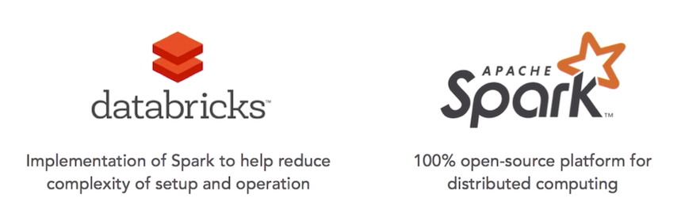

**Databricks is just a much better option.** 

### Databricks editions

#### Community Edition

* Mini 6GB cluster
* interactive notebooks and dashboards, 
* pUblic environment to share your work

#### Full Platform

* Unlimited clusters 
* Notebooks, dashboards, production jobs, RESTful APIs 
* Interactive guide to Spark and Databricks 
* Deployed to your AWS VPC 
* BI tools integration
* 14-day free trial (excludes AWS charges) 

### Databricks Terminology

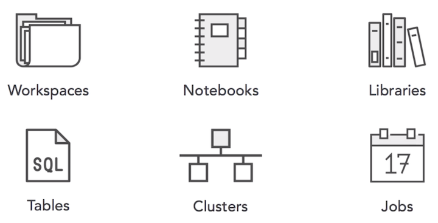

**1.workspaces**
 
This is essentially a collection of where all of your files are. Think of it like a folder structure.

**2.notebook**

You can have all different types of languages being executed. So, I can have **Scala and Python, Markdown, Sequel,** all on the same page running and actually giving you the narrative of the analysis I'm doing

**3.libraies**

Libraries are things that we can actually **use to extend the functionality of our Databricks platform**. Think `NumPy for Python`.

**4.tables**

Tables are just like they are in databases. **There are sequel tables that we can create, and you can then run your Spark sequel jobs against them.**

**5.cluster**

Clusters are what we need to execute our Spark jobs, and we get a mini 6GB cluster for free.

**6.jobs**

**Jobs are the way we can actually schedule our data workloads**. And,** that's not available in the Community Edition**, but it is available in the full Edition.

### Demi

1. Log into Databrickes Community Edition
2. Browse sample files

`community.cloud.databricks.com`

* Username: `xichao2014@gmail.com`
* Password: `Sit12@`

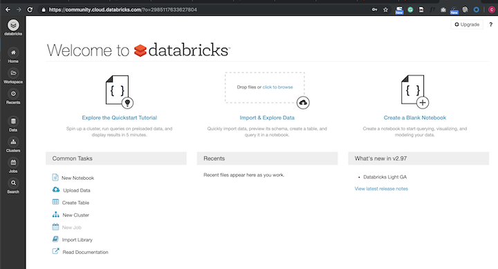

## Introduction to notebooks and PySpark

### Spark Notebook

Collection of cells containing code and markdown. Used to perform analysis

### Code in Spark Notebook

* Scala
* python
* Java
* SQL

### Demo

1. Upload exercise files

**`workspace -> right click -> import`**

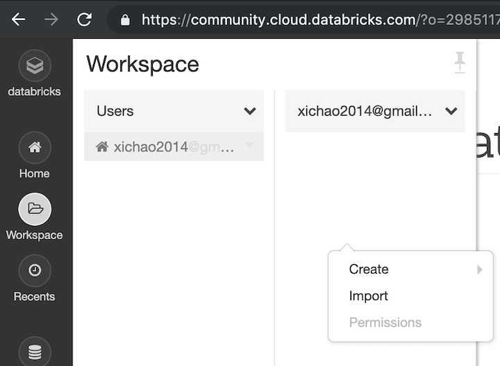

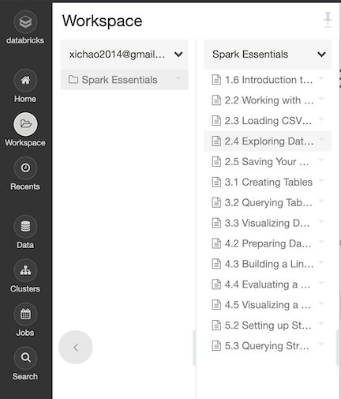

2. Explore sample notebook

* `Shift+Enter` => `launch + run`  
* If the cluster does not exist, it will create automatically

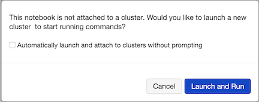

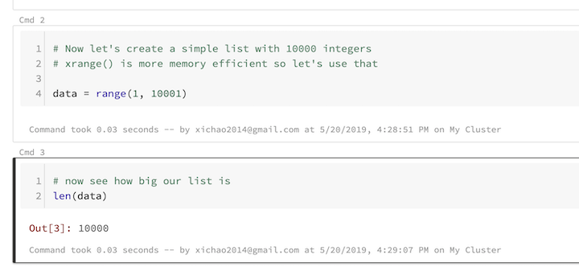

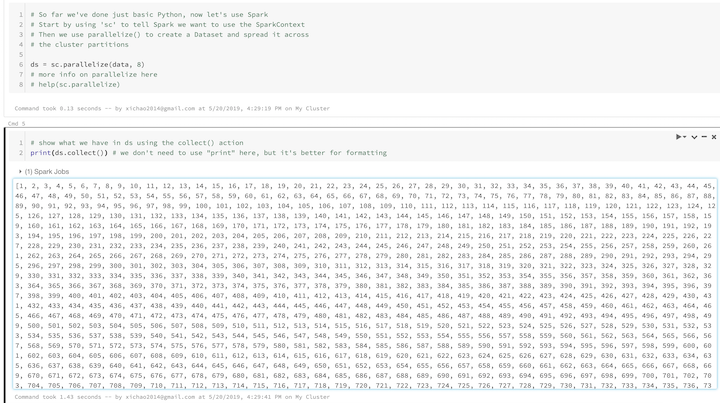

3. Create cluster

* Delete old cluster

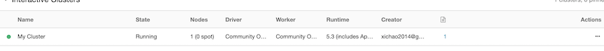

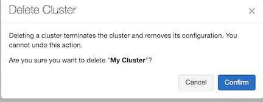

* create new cluster `mycluster2`

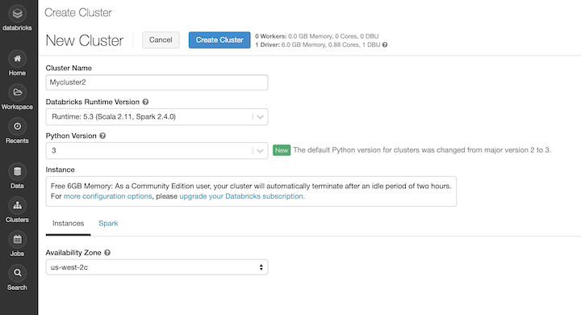

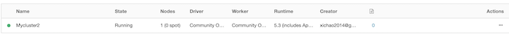

 