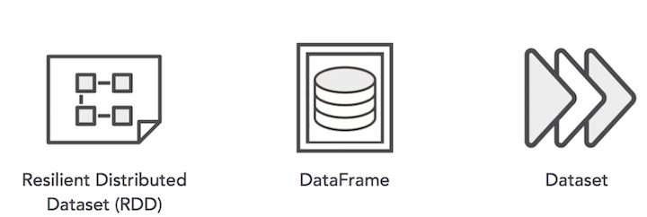
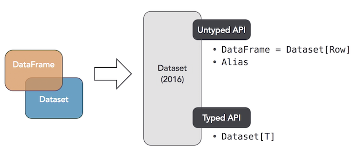
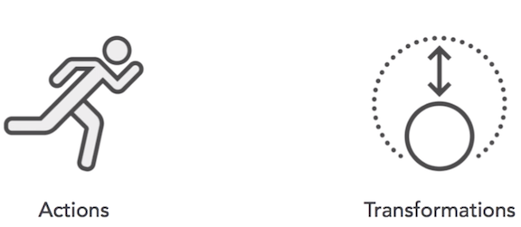

# Analyzing Data in Spark

## Understanding data interfaces

### Data Interface

The **Resilient Distributed Dataset**, this is the first, and now **lowest**, level API for working with data in Spark. 

**RDD's are what makes Spark so fast and can provide data lineage across processes as they're completed.**

You can think of an RDD as a **container** that allows you to work with `data objects`. These objects can be of varying types and spread across many machines in the cluster

### DataFrame

* **Python -> Panadas**
* **R -> DataFrames**
* **SQL -> tables**

These DataFrames are based on RDD's except they **only contain rows**, w**hereas RDD's contain different types of objects**. This is what allows you to interact with it in a familiar Panda Table DataFrame way

### Dataset

**Spark 2.0 data interfaces**

**The DataFrames and the datasets are kind of combining into what is now known as a dataset.**

There are different aspects of those two different API's before that are coming into one. 

* `untyped API`, which is a `DataFrame`, which is now equal to a row of a dataset, sort of an alias. 
* `typed API`, which is the dataset itself

### Unified Apache Spark 2.0 API

### Dataset Operations

#### Actions

Show, count, collect, save

#### Transformation(L)

select, distinct, groupBy, sum, orderBy, filter, limit

