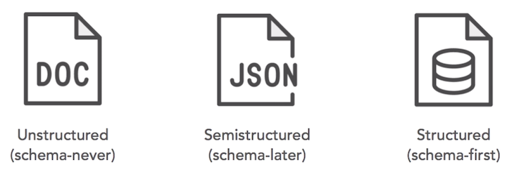
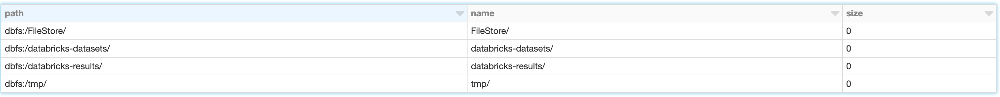
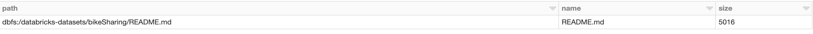
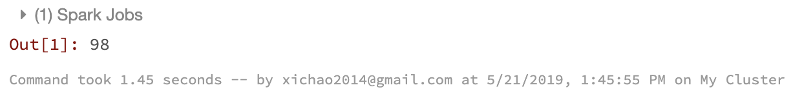
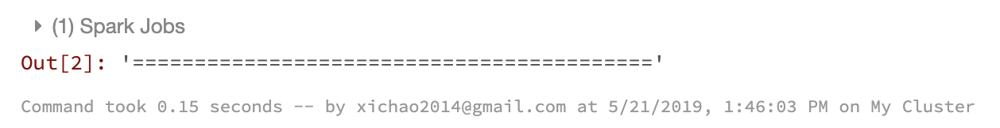
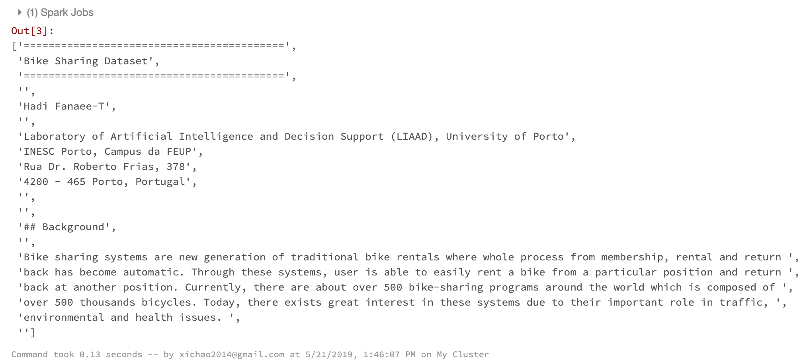
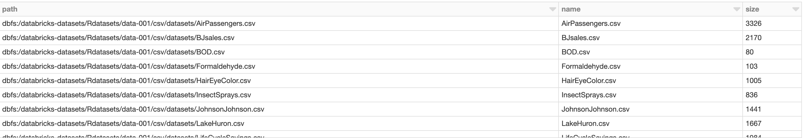
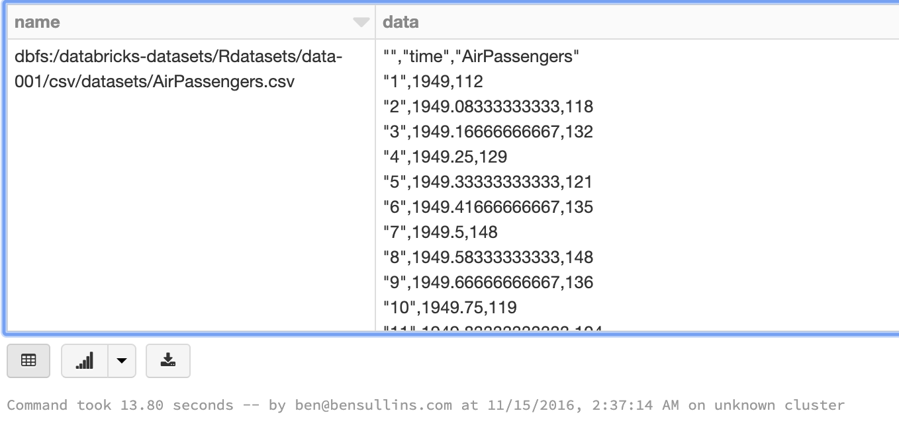
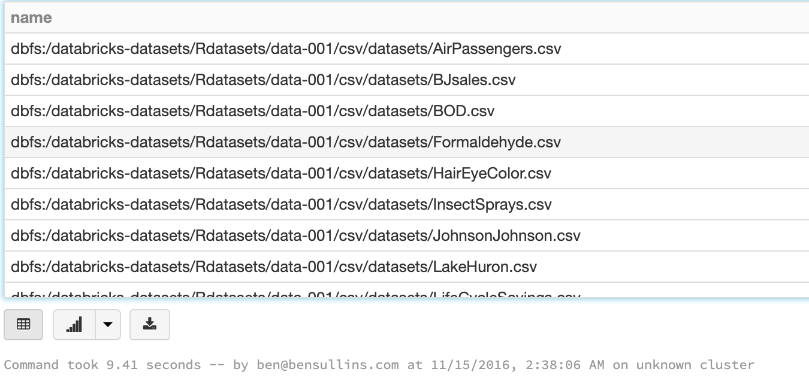

# Work with Text files

## Type of Text Data



### Unstructured data

Includes **text files**, **e-mails**, some types of **logfiles**, and often just **plain text** without any schema definition. We can call these schema-never files, there never really is a schema applied.

### Semistructured

This is data which is text based, and tagged or structured in a loose way.

### Structured

This data lives in databases and some files, like comma separated values files. We can think of this data as schema-first data.


## Demo

1. Find sample data
2. Read in text file
3. Read in directory
4. Create DataFrame


**`2.2 Working with Text Files(Python)`**


**1. browse the file system**

```
%fs ls
```


**2. checkout some sample data**

```
%fs ls /databricks-datasets/bikeSharing/README.md
```



**3. read in a file and count the lines in a document**

```
path = "/databricks-datasets/bikeSharing/README.md"
data = sc.textFile(path) # use the sc context to read in a text file
data.count()
```



**4. Take a look at the first line**

```
data.first()
```



**5.Show the top 20 lines**

```
data.take(20)
```


**6.Count lines with special string**

```
# read in file from above
logFile = path 

# cache the data
logData = sc.textFile(logFile).cache()

# get number of times "bike" shows up
# use lambda function and lower() to convert the line to lowercase
# use count to figure out how many times this is true
numBikes = logData.filter(lambda s: 'bike' in s.lower()).count()

# show results
print("Lines with 'bike': %i" % (numBikes))
```

```
>>> Lines with 'bike': 14
```

**7.Find a Directory with CSVs**

```
%fs ls /databricks-datasets/Rdatasets/data-001/csv/datasets/
```



**8.Read in Directory of Files with wholeTextFiles()**

```
# read in directory looking for anything ending in .csv
path = "/databricks-datasets/Rdatasets/data-001/csv/datasets/*.csv"

# use wholeTextFiles to get each file listed separately with {filename, content}
files = sc.wholeTextFiles(path) 

# count how many files there are
files.count()
```

```
> Out[5]: 71
```

**9.Convert List of Files to DataFrame**

```
# use toDF to convert object to data frame with column names
filenames = files.toDF(['name', 'data'])

# show entire DataFrame
display(filenames)
```



**10.Show only the names using select()**

```
display(filenames.select('name'))
```




