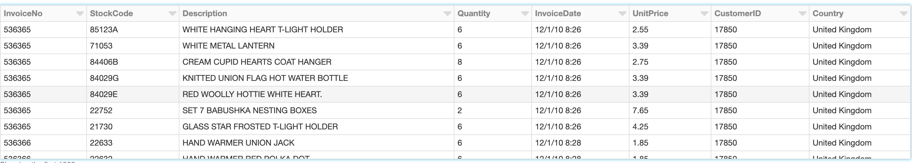
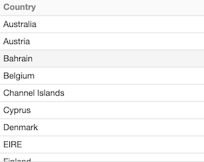
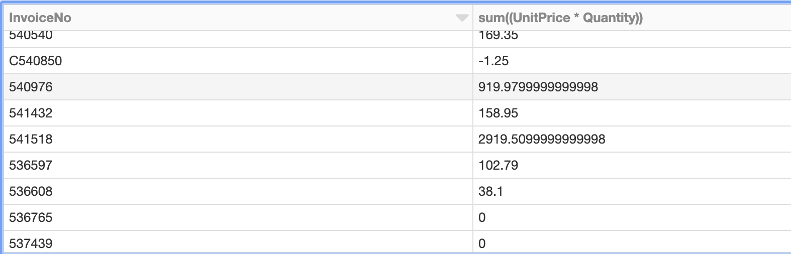
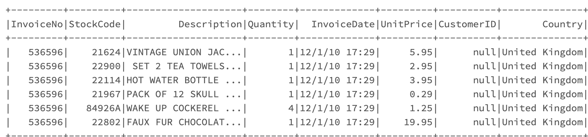
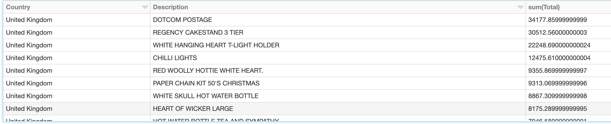
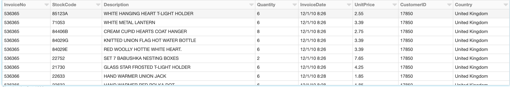
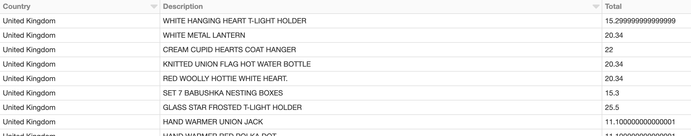
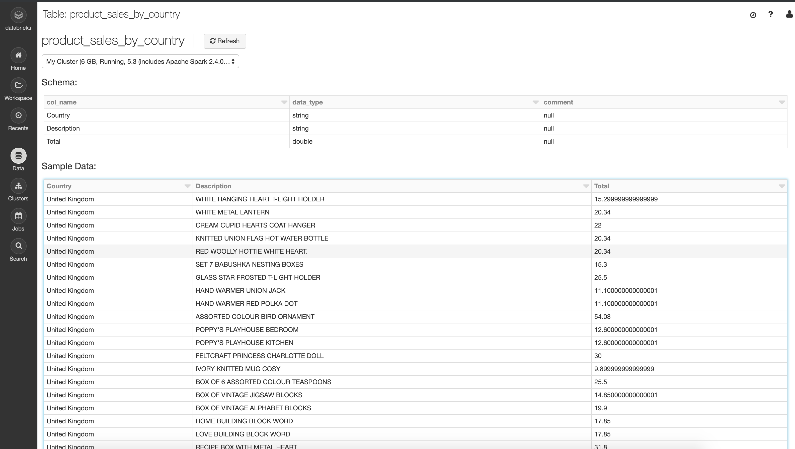

# Working with DataFrame

## Loading CSV into dataFrames

A DataFrame is similar to a **table in SQL, Pandas in Python, or a DataFrame in R**. It allows for more expressive operations on datasets. 

### Demo: Loading CSV Data into DataFrames

```
%fs ls /databricks-datasets/online_retail/data-001/
```


#### Read one csv file

```
# specify path
path = "/databricks-datasets/online_retail/data-001/data.csv"

# load as text
data = spark.read.csv(path) 

# show sample
data.take(20)
```

```
Out[1]: 
[Row(_c0=u'InvoiceNo', _c1=u'StockCode', _c2=u'Description', _c3=u'Quantity', _c4=u'InvoiceDate', _c5=u'UnitPrice', _c6=u'CustomerID', _c7=u'Country'),
 Row(_c0=u'536365', _c1=u'85123A', _c2=u'WHITE HANGING HEART T-LIGHT HOLDER', _c3=u'6', _c4=u'12/1/10 8:26', _c5=u'2.55', _c6=u'17850', _c7=u'United Kingdom'),
 Row(_c0=u'536365', _c1=u'71053', _c2=u'WHITE METAL LANTERN', _c3=u'6', _c4=u'12/1/10 8:26', _c5=u'3.39', _c6=u'17850', _c7=u'United Kingdom'),
 Row(_c0=u'536365', _c1=u'84406B', _c2=u'CREAM CUPID HEARTS COAT HANGER', _c3=u'8', _c4=u'12/1/10 8:26', _c5=u'2.75', _c6=u'17850', _c7=u'United Kingdom'),
 Row(_c0=u'536365', _c1=u'84029G', _c2=u'KNITTED UNION FLAG HOT WATER BOTTLE', _c3=u'6', _c4=u'12/1/10 8:26', _c5=u'3.39', _c6=u'17850', _c7=u'United Kingdom'),
 Row(_c0=u'536365', _c1=u'84029E', _c2=u'RED WOOLLY HOTTIE WHITE HEART.', _c3=u'6', _c4=u'12/1/10 8:26', _c5=u'3.39', _c6=u'17850', _c7=u'United Kingdom'),
 Row(_c0=u'536365', _c1=u'22752', _c2=u'SET 7 BABUSHKA NESTING BOXES', _c3=u'2', _c4=u'12/1/10 8:26', _c5=u'7.65', _c6=u'17850', _c7=u'United Kingdom'),
 Row(_c0=u'536365', _c1=u'21730', _c2=u'GLASS STAR FROSTED T-LIGHT HOLDER', _c3=u'6', _c4=u'12/1/10 8:26', _c5=u'4.25', _c6=u'17850', _c7=u'United Kingdom'),
 Row(_c0=u'536366', _c1=u'22633', _c2=u'HAND WARMER UNION JACK', _c3=u'6', _c4=u'12/1/10 8:28', _c5=u'1.85', _c6=u'17850', _c7=u'United Kingdom'),
 Row(_c0=u'536366', _c1=u'22632', _c2=u'HAND WARMER RED POLKA DOT', _c3=u'6', _c4=u'12/1/10 8:28', _c5=u'1.85', _c6=u'17850', _c7=u'United Kingdom'),
 Row(_c0=u'536367', _c1=u'84879', _c2=u'ASSORTED COLOUR BIRD ORNAMENT', _c3=u'32', _c4=u'12/1/10 8:34', _c5=u'1.69', _c6=u'13047', _c7=u'United Kingdom'),
 Row(_c0=u'536367', _c1=u'22745', _c2=u"POPPY'S PLAYHOUSE BEDROOM ", _c3=u'6', _c4=u'12/1/10 8:34', _c5=u'2.1', _c6=u'13047', _c7=u'United Kingdom'),
 Row(_c0=u'536367', _c1=u'22748', _c2=u"POPPY'S PLAYHOUSE KITCHEN", _c3=u'6', _c4=u'12/1/10 8:34', _c5=u'2.1', _c6=u'13047', _c7=u'United Kingdom'),
 Row(_c0=u'536367', _c1=u'22749', _c2=u'FELTCRAFT PRINCESS CHARLOTTE DOLL', _c3=u'8', _c4=u'12/1/10 8:34', _c5=u'3.75', _c6=u'13047', _c7=u'United Kingdom'),
 Row(_c0=u'536367', _c1=u'22310', _c2=u'IVORY KNITTED MUG COSY ', _c3=u'6', _c4=u'12/1/10 8:34', _c5=u'1.65', _c6=u'13047', _c7=u'United Kingdom'),
 Row(_c0=u'536367', _c1=u'84969', _c2=u'BOX OF 6 ASSORTED COLOUR TEASPOONS', _c3=u'6', _c4=u'12/1/10 8:34', _c5=u'4.25', _c6=u'13047', _c7=u'United Kingdom'),
 Row(_c0=u'536367', _c1=u'22623', _c2=u'BOX OF VINTAGE JIGSAW BLOCKS ', _c3=u'3', _c4=u'12/1/10 8:34', _c5=u'4.95', _c6=u'13047', _c7=u'United Kingdom'),
 Row(_c0=u'536367', _c1=u'22622', _c2=u'BOX OF VINTAGE ALPHABET BLOCKS', _c3=u'2', _c4=u'12/1/10 8:34', _c5=u'9.95', _c6=u'13047', _c7=u'United Kingdom'),
 Row(_c0=u'536367', _c1=u'21754', _c2=u'HOME BUILDING BLOCK WORD', _c3=u'3', _c4=u'12/1/10 8:34', _c5=u'5.95', _c6=u'13047', _c7=u'United Kingdom'),
 Row(_c0=u'536367', _c1=u'21755', _c2=u'LOVE BUILDING BLOCK WORD', _c3=u'3', _c4=u'12/1/10 8:34', _c5=u'5.95', _c6=u'13047', _c7=u'United Kingdom')]
```
 
### Read in Data to DataFrame with Column Headers

```
# read in file using csv format
df = spark.read.load(path,
                    format='com.databricks.spark.csv', 
                    header='true',
                    inferSchema='true')

# show 20 rows
display(df)
```



### removes duplicates, sort and list data in DF

```
# For this we'll need a few functions
display( # shows the results in a grid
   df 
    .select("Country") # chooses just the 1 column
    .distinct() # removes duplicates
    .orderBy("Country") # sorts results in ascending
)
```



## Exploring Data in DataFrames

### Show DataFrame Schema: 

**`df.printSchema()`**

```
# take a look at our schema
df.printSchema()
```

#### Output

```
root
 |-- InvoiceNo: string (nullable = true)
 |-- StockCode: string (nullable = true)
 |-- Description: string (nullable = true)
 |-- Quantity: integer (nullable = true)
 |-- InvoiceDate: string (nullable = true)
 |-- UnitPrice: double (nullable = true)
 |-- CustomerID: integer (nullable = true)
 |-- Country: string (nullable = true)
```

### Select Just one special Column

**`df.select(col.name).show()`**

```
# show just the countries
df.select("Country").show()
```

#### Output

```
+--------------+
|       Country|
+--------------+
|United Kingdom|
|United Kingdom|
|United Kingdom|
|United Kingdom|
|United Kingdom|
|United Kingdom|
|United Kingdom|
|United Kingdom|
|United Kingdom|
|United Kingdom|
|United Kingdom|
|United Kingdom|
|United Kingdom|
|United Kingdom|
|United Kingdom|
|United Kingdom|
|United Kingdom|
|United Kingdom|
|United Kingdom|
|United Kingdom|
+--------------+
only showing top 20 rows
```

### Remove Duplicates from Column and Sort

* `.select(colname)`    # chooses just the 1 column 
* ` .distinct()`        # removes duplicates
* `.orderBy("Country")` # sorts results in ascending

```
# For this we'll need a few functions
display( # shows the results in a grid
   df 
    .select("Country") # chooses just the 1 column
    .distinct() # removes duplicates
    .orderBy("Country") # sorts results in ascending
)
```

### Calculate Order Totals

```
display(
  df
    .select(df["InvoiceNo"],df["UnitPrice"]*df["Quantity"])
    .groupBy("InvoiceNo")
    .sum()
  )
```

* `.select(df["col_name"])`
* `.groupBy("col_name")`
* `.sum()`



### Inspect Results with Filter

* `df.filter("condition").show()`

```
df.filter(df["InvoiceNo"]==536596).show()
```



### Show Top 10 Products in the UK (comprehensive funcs combine)

```
display(
  df
    .select(df["Country"], df["Description"],(df["UnitPrice"]*df["Quantity"]).alias("Total"))
    .groupBy("Country", "Description")
    .sum()
    .filter(df["Country"]=="United Kingdom")
    .sort("sum(Total)", ascending=False)
    .limit(10)
  )
```

`df.`:

* `.select()`
* `.alias()`
* `.groupBy()`
* `.sum()`
* `.filter()`
* `.sort(, ascending=False)`
* `.limit()`





## Saving Results

### DataFrameWriter 


The **DataFrameWriter** will allow you to **save a DataFrame as a table in Spark**. 

If you're connected to Hive, it will create it as a managed table in the Hive metastore by default. 


### **Demo**

#### Step1: `Read in Data to DataFrame with Column Headers`

```
# specify path
path = "/databricks-datasets/online_retail/data-001/data.csv"

# read in file using csv format
df = spark.read.load(path,
                    format='com.databricks.spark.csv', 
                    header='true',
                    inferSchema='true')

# show 20 rows
display(df)
```



#### Step2: `Calculate Product Sales by Country`

```
r1 = df.select(df["Country"], df["Description"],(df["UnitPrice"]*df["Quantity"]).alias("Total"))

display(r1)
```



#### Step3: `Save Results as Table`

```
r1.write.saveAsTable("product_sales_by_country")
```




## Quiz

1. Which data interfaces are combined in the Apache Spark 2.0 API?  **DataFrame and Dataset**
2. What are the two basic Dataset operations? **Actions and Transformations**
3. When are transformations executed? **when an action is performed**
4. In PySpark, what command is used to read in a text file? **sc.textFile()**
5. Using PySpark, which option will tell Spark to automatically create the DataFrame schema based on the CSV file?  **inferSchema='true'**
6. If df is a DataFrame, what command could you use in PySpark to see the results in a table/grid layout? **display(df)**
7. Which command will create a Spark SQL table from the DataFrame r1 in PySpark? **r1.write.saveAsTable("table1)**


