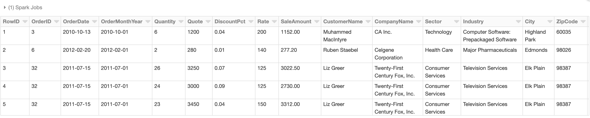

# Using Spark SQL to Analyze Data

## Creating table

### Create Table Syntex

```
CREATE [Temporary] TABLE [IF NOT EXISTS] [db_name.]table_name [(col_name1[:]col_type1[COMMENT col_comment1], ...)] USING datasource [OPTIONS(key1=val1, key2=val2, ..)] [PARTITIONED BY(col_name1, col_name2, ..)] [CLUSTERED BY (col_name3, col_name4, ...) INTO num_buckets BUCKETS] [AS select_statement]
```

### Demo - Creating Tables

#### Upload CSV and create a table

**Creating**

```
%fs ls /databricks-datasets/samples/population-vs-price/
```


### Create Table w/o Schema(without)

```
CREATE TABLE  IF NOT EXISTS population_v_price
USING CSV
OPTIONS (path "/databricks-datasets/samples/population-vs-price/data_geo.csv", header "true", inferSchema "true");

/* check results */
select * from population_v_price limit 100;
```

**Automatically create it inferring the schema => `inferSchema "true"`**


**Table `population_v_price` created**


### Create Table w/ Schema(within)

```
CREATE TABLE IF NOT EXISTS online_retail(
InvoiceNo string,
StockCode string,
Description string,
Quantity int,
InvoiceDate string,
UnitPrice double,
CustomerID int,
Country string)
USING CSV
OPTIONS (path "/databricks-datasets/online_retail/data-001/data.csv", header "true");

/* check results */
select * from online_retail limit 100;
```


**Table: `online_retail` created**


### Manually create a table with SQL

1. Upload csv file manually
2. Specify Table Attributes => First row is header


## Querying Data with Spark SQL

### 1.Basic select statement

**Take a look at `cogsley_sales` table**

```
select *
from cogsley_sales
limit 100;
```


### 2.`group by` Aggregation 

1. `Import clients table`
2. `MarketCapAmount => BIGNT`, `LastSale => double`
3. `column delimiter`: `,`


```
select CompanyName, round(sum(SaleAmount)) as Sales
from cogsley_sales
group by CompanyName
order by 2 desc
```


### 3.`join ... as ...` 


```
select CompanyName, IPOYear, Symbol, round(sum(SaleAmount)) as Sales
from cogsley_sales
left join cogsley_clients on CompanyName = Name
group by CompanyName, IPOYear, Symbol
order by 1
```


1. `Import clients table`
2. `PopulationEst2015 => BIGNT`, `HouseSeats => int`
3. `column delimiter`: `,`


```
select i.StateCode, round(sum(s.SaleAmount)) as Sales
from cogsley_sales s
join state_info i on s.State = i.State
group by i.StateCode
```


## Visualizing data in Databricks notebooks

### Data Visualization 

Converting text-based data into graphical representations to better inform the reader

### Demo

* **Re-import `cogsley_sales` data into table with some changes**
* `RowID -> INT`, `OrderID -> INT`, `OrderMonthYear ->TIMESTAMP`, `Quantity -> INT`, `Quote ->Double` ,`DiscountPct -> Double`, `Rate -> Double`, `SaleAmount -> Double`, `DaystoComplete -> INT`, `HourlyWage -> Double`, `WageMargin -> Double`
* `Create Table`


### 1.Build the bar chart

```
select *
from cogsley_sales
limit 100;
```

* `Build the Bar Chart`
* `keys => Region`, `Values => SalesAmount`


### 2.Build the line chart

`Keys=>Quantity`, `groupings => Region`, `Values => SaleAmount`


### 3.Build a Map

```
/* requires 2char state code */
select i.StateCode, round(sum(s.SaleAmount)) as Sales
from cogsley_sales s
join state_info i on s.State = i.State
group by i.StateCode
```

* `keys => StateCode`, `Values => Sales`


### 4.Box Plot

```
select *
from cogsley_sales
limit 100;
```

* `keys => ProductCategory`, `Values => SaleAmount`


## Quiz

1. SparkSQL supports ANSI SQL standards? **True**
2. Which SQL SELECT statement option combines multiple tables into a single result set? **Join**
3. What does Spark require in order to visualize a US state map within a cell? **2-character state abbreviation**


