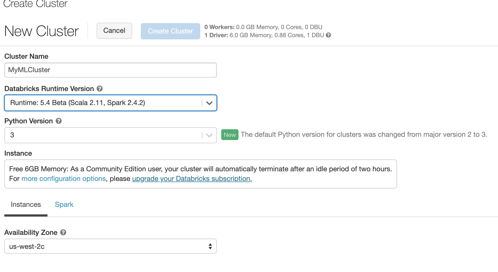
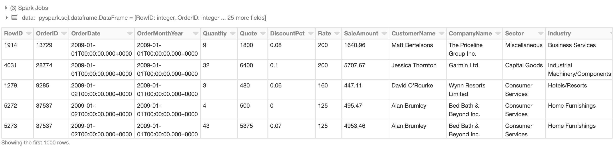
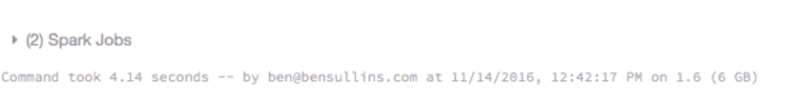
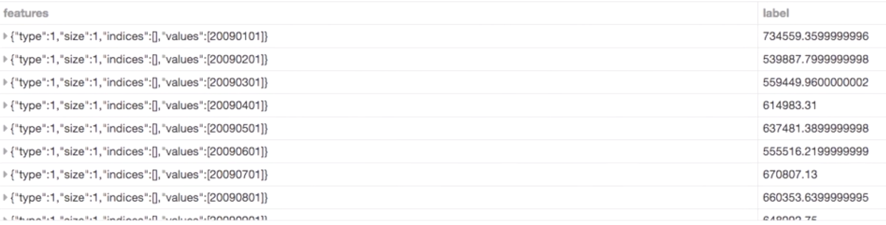
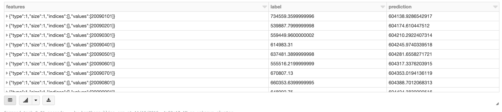
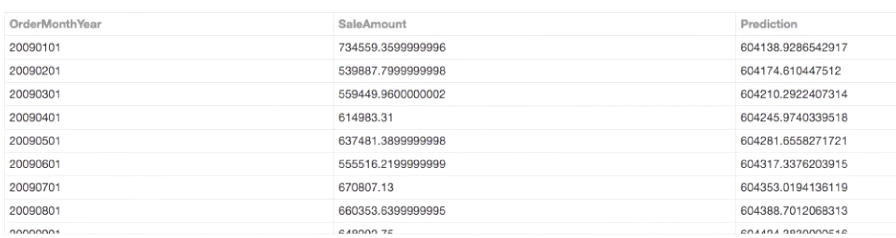
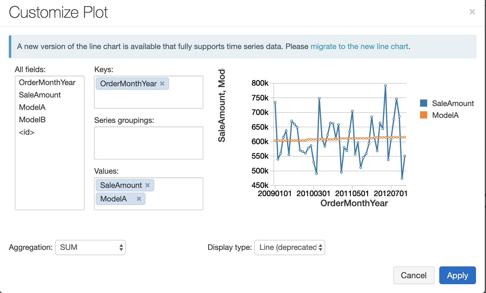

# Running Machine Learning Algorithms Using MLlib

## Introduction to machine learning with Spark

### What is Machine Learning

Repeatable and automated processes for producing expected output from given data. 

Typically used to **find hidden patterns in data** or **make predictions**. 

### Types of  Machine Learning


#### Supervised learning

Supervised learning is when you **train the algorithm to know what the expected output is** and then **let it figure out which model, which statistical model, best produces that output**. 


A classic example here is looking at sales forecasts. Let's say you have the last three years' sales data by month and you want to predict next year's sales. 

What you could do is give Spark a sample of this data from years past and ask it to predict the remainder of the known results you have. 

Once it does that, you can then compare its prediction to what actually happened to figure out how accurate it was. Now as I mentioned, this is an automated process. So the way you use this is **you will actually have it run lots of different statistical models to try to come up with the most accurate prediction and then use that going forward**

#### Unsupervised learning

In unsupervised learning what you have is where you give Spark some data and ask it to go fishing. Ask it to go find something. **You don't give it an expected output.** You don't give it a sample set to go on. 

**It actually uses this to find things that maybe weren't totally obvious to you or you didn't even expect. **

So one of the **key use cases here is to identify these hidden patterns within the data without adding your bias as to where the patterns might be**. 

This is a more abstract application of machine learning, but you can yield really interesting results and use it for things such as recommendations for new movies to watch or even things like which planets in the solar system might be habitable to humans.

### Classification

* Categorizing data into groups
* Spam vs. not Spam
* Groups provided by user
* **Supervised**

### Regression

* Variable relationship
* Prediction vs. forecasting
* **Supervised**

### Clustering

* Inputs to groups
* Group are not known
* **Unsupervised**


## Preparing data for machine learning

### Create my own cluster



### Download the file with curl

```
%sh curl -O 'https://raw.githubusercontent.com/bsullins/bensullins.com-freebies/master/CogsleyServices-SalesData-US.csv'
# saves file to file:/databricks/driver/CogsleyServices-SalesData-US.csv
```

**output**

```
  % Total    % Received % Xferd  Average Speed   Time    Time     Time  Current
                                 Dload  Upload   Total   Spent    Left  Speed

  0     0    0     0    0     0      0      0 --:--:-- --:--:-- --:--:--     0
  0 2111k    0  1916    0     0   5069      0  0:07:06 --:--:--  0:07:06  5068
100 2111k  100 2111k    0     0  4894k      0 --:--:-- --:--:-- --:--:-- 4888k
```

### Read in and Cleanse Data

```
path = 'file:/databricks/driver/CogsleyServices-SalesData-US.csv'
# path = "/databricks-datasets/samples/population-vs-price/data_geo.csv"

# Use the Spark CSV datasource with options specifying:
# - First line of file is a header
# - Automatically infer the schema of the data
data = sqlContext.read.format("csv")\
  .option("header", "true")\
#  .option("inferSchema", "true")\
  .load(path)
data.cache() # Cache data for faster reuse
data = data.dropna() # drop rows with missing values
 
# Register table so it is accessible via SQL Context
# For Apache Spark = 2.0
# data.createOrReplaceTempView("data_geo")

display(data)
```

* `sqlContext.read.format("csv").load()` Use the Spark CSV datasource
* `.option("header", "true")` First line of file is a header
* `.option("inferSchema", "true")` Automatically infer the schema of the data, and will automatically change data tyoe
* `data.cache()` Cache data for faster reuse
* `data.dropna()` drop rows with missing values



### Aggregate and Convert

```
# Get monthly sales totals
summary = data.select("OrderMonthYear", "SaleAmount").groupBy("OrderMonthYear").sum().orderBy("OrderMonthYear").toDF("OrderMonthYear","SaleAmount")

# Convert OrderMonthYear to integer type
results = summary.rdd.map(lambda r: (int(r.OrderMonthYear.replace('-','')), r.SaleAmount)).toDF(["OrderMonthYear","SaleAmount"])
```

* `summary = data.select().groupBy().sum().orderBy().toDF()`
* `summary.rdd.map(lambda r: () )`



### Convert DataFrame to Features and Labels

```
# convenience for specifying schema
from pyspark.mllib.regression import LabeledPoint
 
data = results.select("OrderMonthYear", "SaleAmount")\
  .rdd.map(lambda r: LabeledPoint(r[1], [r[0]]))\
  .toDF()
  
display(data)
```


## Building a linear regression model

```
# Import LinearRegression class
from pyspark.ml.regression import LinearRegression
 
# Define LinearRegression algorithm
lr = LinearRegression()
 
# Fit 2 models, using different regularization parameters
modelA = lr.fit(data, {lr.regParam:0.0})
modelB = lr.fit(data, {lr.regParam:100.0})

# Make predictions
predictionsA = modelA.transform(data)
predictionsB = modelB.transform(data)

display(predictionsA)
```



## Check Models for Accuracy

**Calculate `root-mean-square error`(RMSE)**

```
from pyspark.ml.evaluation import RegressionEvaluator
evaluator = RegressionEvaluator(metricName="rmse")

RMSE = evaluator.evaluate(predictionsA)
print("ModelA: Root Mean Squared Error = " + str(RMSE)) 

RMSE = evaluator.evaluate(predictionsB)
print("ModelB: Root Mean Squared Error = " + str(RMSE))
```

#### output

```
ModelA: Root Mean Squared Error = 70038.3200417
ModelB: Root Mean Squared Error = 70038.3202721
```

## Visualizing a linear regression model

### Create Tables with Predictions

```

# define column names
cols = ["OrderMonthYear", "SaleAmount", "Prediction"]

# use parallelize to create an RDD
# use map() with lambda to parse features
tableA = sc.parallelize(\
            predictionsA.map(lambda r: (float(r.features[0]), r.label, r.prediction)).collect()\
         ).toDF(cols) 

# repeate for modelB
tableB = sc.parallelize(\
            predictionsB.map(lambda r: (float(r.features[0]), r.label, r.prediction)).collect()\
         ).toDF(cols) 

# check results
# display(tableA)

# save results as tables
tableA.write.saveAsTable('predictionsA', mode='overwrite')
print "Created predictionsA table"

tableB.write.saveAsTable('predictionsB', mode='overwrite')
print "Created predictionsB table"
```

#### Output

```
Created predictionsA table
Created predictionsB table
```



### Simple Visualization

```
%sql 
select 
    a.OrderMonthYear,
    a.SaleAmount,
    a.prediction as ModelA,
    b.prediction as ModelB
from predictionsA a
join predictionsB b on a.OrderMonthYear = b.OrderMonthYear
```



## Quiz

1. What are the two types of machine learning? **supervised and unsupervised**
2. In Spark 1.6, which PySpark library is used to convert data to features and labels for regression analysis?  **LabeledPoint**
3. In Spark 1.6, which PySpark library can you use to calculate the Root Mean Squared Error (RMSE) of your regression model?  **RegressionEvaluator**


