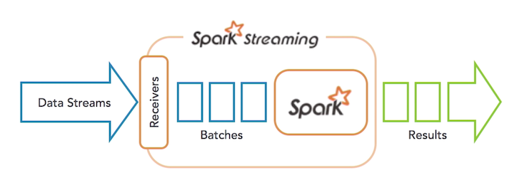
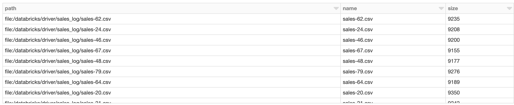
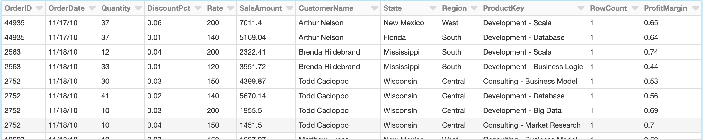
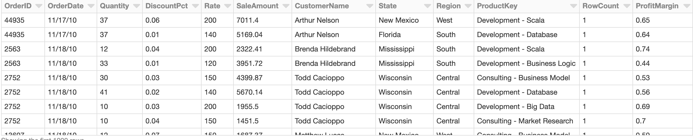
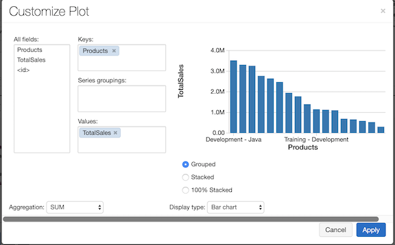
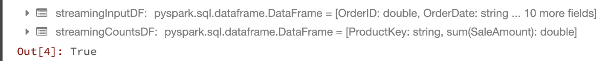
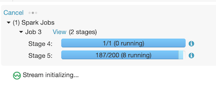
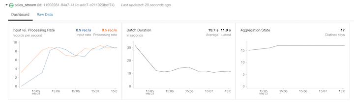
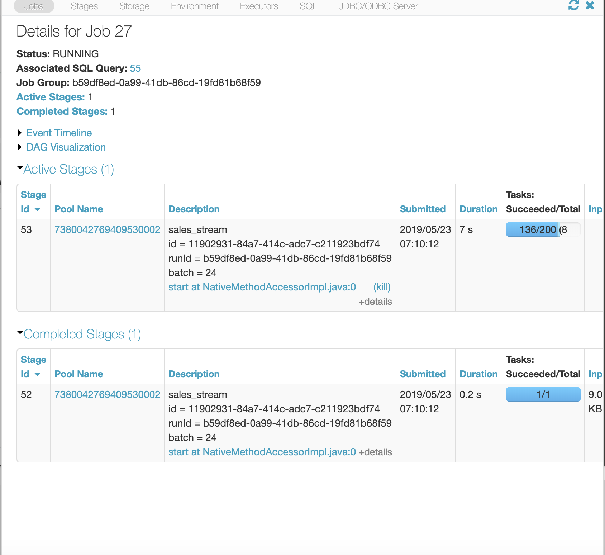
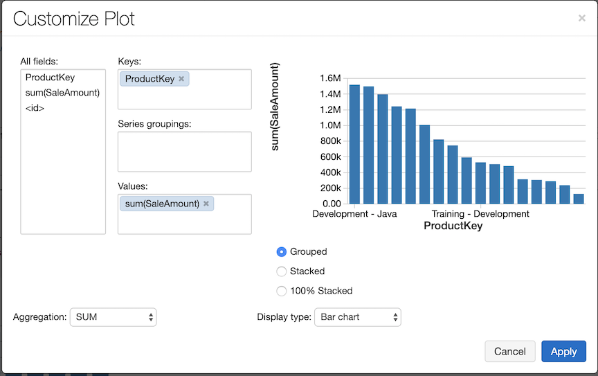

# Real-Time Data Analysis with Spark Streaming

## Introduction to streaming analytics


1. Doing real-time processing here, and in Spark terms, we call this **streaming analytics**.
2. Inside of **Spark Streaming**, you can execute both **machine learning queries**, using **MLlib**, as well as interactive queries, using **Spark SQL**.
3. Data is processed and then **exported to** either a storage engine or to your analytics platform. 
4. Some common use cases are **streaming ETL**, **where data is continuously cleansed and aggregated before being stored**; **detecting anomalies in your data** ; a**ugmented user experience** ; **performing real-time analytics**



1. Streams of data would come in and be handled by the receivers.
2. These receivers would **generate micro batches**.
3. Spark would then process these jobs and then produce the results based on whatever the jobs were defined as. Two components are **Spark MLlib or Spark SQL.**


## Setting up Streaming Context

### Download Sales Data

```
%sh 
curl -O 'https://raw.githubusercontent.com/bsullins/bensullins.com-freebies/master/sales_log.zip'
file sales_log.zip
```

#### output

```
  % Total    % Received % Xferd  Average Speed   Time    Time     Time  Current
                                 Dload  Upload   Total   Spent    Left  Speed

  0     0    0     0    0     0      0      0 --:--:-- --:--:-- --:--:--     0
  0     0    0     0    0     0      0      0 --:--:-- --:--:-- --:--:--     0
100  245k  100  245k    0     0   574k      0 --:--:-- --:--:-- --:--:--  574k
sales_log.zip: Zip archive data, at least v1.0 to extract
```

```
%sh unzip sales_log.zip

Archive:  sales_log.zip
   creating: sales_log/
  inflating: sales_log/.DS_Store     
   creating: __MACOSX/
   creating: __MACOSX/sales_log/
  inflating: __MACOSX/sales_log/._.DS_Store  
  inflating: sales_log/sales-1.csv   
  inflating: sales_log/sales-10.csv  
  inflating: sales_log/sales-11.csv  
  inflating: sales_log/sales-12.csv  
  inflating: sales_log/sales-13.csv  
  inflating: sales_log/sales-14.csv  
  inflating: sales_log/sales-15.csv  
...
```

```
%fs ls 'file:/databricks/driver/sales_log/'
```



### Read in Data

```
from pyspark.sql.types import *

path = "file:/databricks/driver/sales_log/"

# create schema for data so stream processing is faster
salesSchema = StructType([
  StructField("OrderID", DoubleType(), True),
  StructField("OrderDate", StringType(), True),
  StructField("Quantity", DoubleType(), True),
  StructField("DiscountPct", DoubleType(), True),
  StructField("Rate", DoubleType(), True),
  StructField("SaleAmount", DoubleType(), True),
  StructField("CustomerName", StringType(), True),
  StructField("State", StringType(), True),
  StructField("Region", StringType(), True),
  StructField("ProductKey", StringType(), True),
  StructField("RowCount", DoubleType(), True),
  StructField("ProfitMargin", DoubleType(), True)])

# Static DataFrame containing all the files in sales_log
data = (
  spark
    .read
    .schema(salesSchema)
    .csv(path)
)


# create table so we can use SQL
data.createOrReplaceTempView("sales")

display(data)
```


### Check Table

```
%sql select * from sales
```


### Build a Chart

```
%sql 
select 
  ProductKey as Products,
  round(sum(SaleAmount)) as TotalSales
from sales
group by ProductKey
order by 2 desc
limit 100
```

### Streaming Setup

**Now we'll try to convert the above analysis we completed to a streaming solution, by reading in each file one by one.**

```
%md # Streaming Setup
Now we'll try to convert the above analysis we completed to a streaming solution, by reading in each file one by one.
```


```
from pyspark.sql.functions import *

# Similar to definition of staticInputDF above, just using `readStream` instead of `read`
streamingInputDF = (
  spark
    .readStream                       
    .schema(salesSchema)              # Set the schema for our feed
    .option("maxFilesPerTrigger", 1)  # Treat a sequence of files as a stream by picking one file at a time
    .csv(path)
)

# Same query as staticInputDF
streamingCountsDF = (                 
  streamingInputDF
    .select("ProductKey", "SaleAmount")
    .groupBy("ProductKey")
    .sum()
)

# Is this DF actually a streaming DF?
streamingCountsDF.isStreaming
```


## Querying Streaming Data

1. Recreate basic analysis
2. Create an in-momery SQL table
3. Query Data

### Create Streaming Table

```
query = (
  streamingCountsDF
    .writeStream
    .format("memory")        # memory = store in-memory table (for testing only in Spark 2.0)
    .queryName("sales_stream")     # counts = name of the in-memory table
    .outputMode("complete")  # complete = all the counts should be in the table
    .start()
)
```

**For streaming data, store them in-memory table**




 


```
%sql 
select *  
from sales_stream
order by 2 desc
limit 100
```


## Quiz

1. What method does Spark use to perform streaming operations? **Micro-Batches**
2. Using PySpark, what command will return TRUE if you have setup a Streaming job correctly? **isStreaming**


