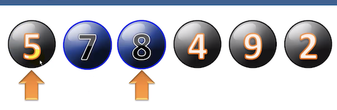
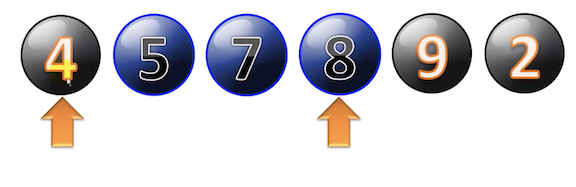
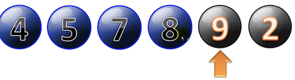
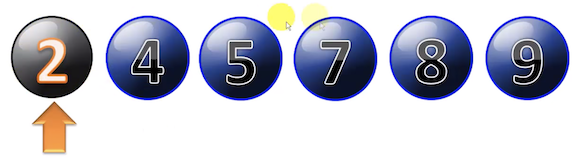
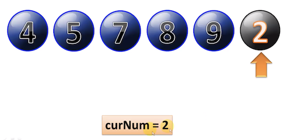

# Insertion Sort

### Detailed look at how Insertion Sort works

```
7 8 5 4 9 2
```


```
7 < 8  don't change
```



```
5 < 7 < 8
```




```
4 < 5 < 7 < 8
```


```
4 < 5 < 7 < 8 < 9
```



```
2 < 4 < 5 < 7 < 8 < 9
```



### Detailed look at how Insertion Sort works

1. **Insertion Sort is not a fast sorting algorithm because it used nested loops to sort**
2. It's useful only for small data sets 
3. **It runs in O(n²)**

### Python Insertion Sort code

####  Not optimized, equiv to while version below, but uses for loop

```
def insertion_sort1(A):
	for i in range(1, len(A)):  
		for j in range(i-1, -1, -1):
			if A[j] > A[j+1]:
				A[j], A[j+1] = A[j+1], A[j]
			else:
				break
```

1. First loop covers a range from 1 which is 2nd item inside list
2. Inner loop variable, that covers from `i-1` 
3. Loops through all the items to left, to walk way to zero the left item in the list, with step the `-1`
4. Do the comparison if the item of right is less than the item in left 
5. They will swap the places
6. if not, break this inner loop, because that the items already found it's correct position
7. Go to the next item of i loop

**Swap the places**

```
temp =x
x = y
y = temp
```

#### Not optimized, equiv to break version, but uses while loop

```		
def insertion_sort2(A):
	for i in range(1, len(A)):
		j = i-1
		while A[j] > A[j+1] and j >= 0:
			A[j], A[j+1] = A[j+1], A[j]
			j -= 1
```

#### optimized - shifts instead of swapping

1. Copying `2` into into a temp variable called `curNum` (current Number)
2. Do the comparison, if `2` is less than `9`, simply write `9` over the top of the `2`
3. `2` is less the `8`, write `8` over the top of `9` 
4. Until find the correct position, and write CurNum over the top of that number
5. Save a lot of swapping, use one one assignment in place of three assignments
6. **shifting is 2 times faster**




```
def insertion_sort3(A):
	for i in range(1, len(A)):
		curNum = A[i]
		k = 0
		for j in range(i-1, -2, -1):
			k = j
			if A[j] > curNum:
				A[j+1] = A[j]
			else:
				break
		A[k+1] = curNum
```


