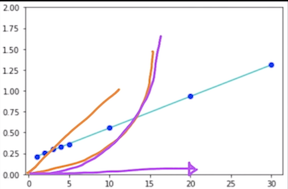
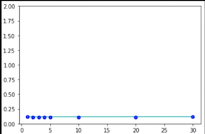
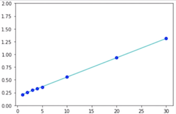

# Introduction to Big O Notation and Time Complexity and Space Complexity

## Time Complexity

* **Operations**
* **Comparaisons**
* **Loop Stuff**
* **Pointer Reference**
* **Function calls to outside**

### Time Complexity = a way of showing how the runtime of a function increases as the size of input increase

```
give_array = [1, 2, 3, 4, ... 10]

def find_sum(given_array):
	total = 0
	for each i in given_array:
		total =+ i
	return total
```

**So how does the runtime of this function grow**

**`give_array = [1, 2, 3, 4, ... 10]`**

* **linear time**: O(n)
* **constant time**: O(1)
* **quadratic time**: O(n²)




### 1. Find the fastest growing term 👍
### 2. Take out the coefficient      👍


```
T = an + b    =  O(n)
```

```
T = cn² + dn + e  = O(n²)
```

### Time complexity:

* linear time
* constant time
* quadratic time


### Big O Notation

```
give_array = [1, 2, 3, 4, ... 10]

def find_sum(given_array):
	total = 0
	for each i in given_array:
		total =+ i
	return total
```

```
give_array = [1, 2, 3, 4, ... 10]

def stupid_function(give_array):
	total = 0
	return total
```

**`T = c = 0.115*1 = O(1)`** => **Constant time**


### O(1)



```
give_array = [1, 2, 3, 4, ... 10]

def stupid_function(give_array):
	total = 0                       => O(1)
	return total                    => O(1)
```

`T = O(1) + O(1) = c1 + c2 = c3 = c3*1 = O(1)`

`O(1) + O(1) = O(1)`


### O(n)



```
def find_sum(given_array):
	total = 0
	for each i in given_array:
		total += i                   => O(1) * n
	return total                    => O(1)
```

**`T2 = O(1) + n*O(1) + O(1) = c4 + n*c5 = O(n)`**


### O(n²)

```
array_2d = [[1, 4, 3],
           [3, 1, 9],
           [0, 5, 2]]

def find_sum_2d(array_2d):
	total = 0
	for each row in array_2d:
		for each i in row:
		    total += i         =>   O(1) * n * n  
	return total               =>   O(1)
```

`T3 = O(1) + n²*O(1) + O(1) = c6 + n²*c7 = O(n²)`


**IF: O(2n²)**

```
T4 = O(2n²) = O(2n²)
```

```
T4 = 2n² * c + ... = 2n² * c +c2n + c3
= (2c) * n² + c2n + c3 = O(n²)
```


```
somefunc(int x):
	int y = 5                        =>   constant
	y = 1 + 2                        =>   A O(1)
	
	for ( i = 0, i < x, i++)         =>   B
		someother()                   =>  C
		int z = 9
		y++                           =>  D (n times)
	
	return y
```

`A + nB + nC + nD = A + n(B+C+D) = k1 + nk2 = O(n)`

## Space Complexity 
 
 
* **Variables**
* **Data structure** 
* **Allocations**
* **Function call**

```
somefunc(int x):                    =>  A: somefunc() B: int x
	int y = 5                        =>  c: int y = 5
	y = 1 + 2                       
	
	for ( i = 0, i < x, i++)         
		someother()                   
		int z = 9                    => D: int z = 9 
		y++                           
	
	return y
```

`A + B + C + n(D) = k1 + nk2 = O(n)`