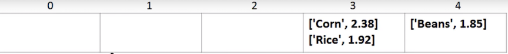

# Hashmap

* A hashmap is set of key-value pairs
* No duplicate keys
* O(1) for add, get, delete functions
* Also called dictionary, map, hash table, associate array
* In python, use **dict**(short for dictionary) 

**for example**

```
Beans -> 1.85
Corn -> 2.38
Rice -> 1.92
```

## Components of hashmap

* **Array** - data structure used to store data
* **Hash function** - function to convert key into an array index
* **Collision handling**


### The basic function: count of letter in the word as index of hashmap

```
index = len(key) - 1
```



### A better hash function 

```
index = sum(ASCII value for each letter in key) % 5
```

```
for char in key:
	hash += ord(char)
hash %=5
```

**`ord(c)`**

**Given a string representing one Unicode character, return an integer representing the Unicode code point of that character**. For example, `ord('a')` returns the integer `97` 


### Example

**HashMap.py**

```
# Hash Map

class HashMap:
	def __init__(self):
		self.size = 6
		self.map = [None] * self.size
		# Constructor has two simple variable:
		# Size of array, set it as 6 to show the collision, in real world may be 64
		# Map is the array to store the data in

		
	def _get_hash(self, key):
		hash = 0
		for char in str(key):
			hash += ord(char)
		return hash % self.size
		# Private get hash function
		# Get index of hash and return index
		
	def add(self, key, value):
		key_hash = self._get_hash(key)
		key_value = [key, value]
		# key value is basically constructing the list from the key and value we passed in
		
		if self.map[key_hash] is None:
			self.map[key_hash] = list([key_value])
			return True
		# First check that cell is empty
		# If it contains none, we can simply add to our map that index for key hash
		# We'll add new list and put key value pair in it
		
		else:
			for pair in self.map[key_hash]:
				if pair[0] == key:
					pair[1] = value
					return True
			self.map[key_hash].append(key_value)
			return True
		# If not empty
		# 1. Iterate through each pair in this cell of the map
		# 2. check the key is already exist, if it is, just update value
		# 3. It's not existing, we'll append it to the list
		# 4. return true
			
	def get(self, key):
		key_hash = self._get_hash(key)
		if self.map[key_hash] is not None:
			for pair in self.map[key_hash]:
				if pair[0] == key:
					return pair[1]
		return None
	# 1. Get hash given the key
	# 2. Locate the cell and if that cell is not none
	# 3. Iterate through each pair in this cell
	# 4. Find the value match that key, return that value
	# 5. If dont find that key return none
			
	def delete(self, key):
		key_hash = self._get_hash(key)
		
		if self.map[key_hash] is None:
			return False
		for i in range (0, len(self.map[key_hash])):
			if self.map[key_hash][i][0] == key:
				self.map[key_hash].pop(i)
				return True
		return False
    
    # 1. get hash given the key
    # 2. locate the cell and if that cell is none means that key pairs doesn't exist, return false
    # 3. Iterate items through the map
    # 4. Use range, because need the index in order to to remove something from a list
    # 5. Use pop function when locate the item that want to remove, pop item of the list return true
    # 6. If self.map[key_hash] is not empty, and no pair in self.map[key_hash] list match our key. In this case, the delete function will not return anything

	def print(self):
		print('---PHONEBOOK----')
		for item in self.map:
			if item is not None:
				print(str(item))
			
h = HashMap()
h.add('Bob', '567-8888')
h.add('Ming', '293-6753')
h.add('Ming', '333-8233')
h.add('Ankit', '293-8625')
h.add('Aditya', '852-6551')
h.add('Alicia', '632-4123')
h.add('Mike', '567-2188')
h.add('Aditya', '777-8888')
h.print()		
h.delete('Bob')
h.print()
print('Ming: ' + h.get('Ming'))
```
#### output

```
---PHONEBOOK----
[['Mike', '567-2188']]
[['Alicia', '632-4123']]
[['Aditya', '777-8888']]
[['Bob', '567-8888'], ['Ming', '333-8233'], ['Ankit', '293-8625']]
---PHONEBOOK----
[['Mike', '567-2188']]
[['Alicia', '632-4123']]
[['Aditya', '777-8888']]
[['Ming', '333-8233'], ['Ankit', '293-8625']]
Ming: 333-8233
>>> 
```