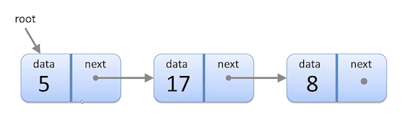

# Linked Lists

### Every node has `2` parts

**data** and a pointer to the **next** Node


### Set first one as root node




### Node Operations

* get_next()
* set_next(node)
* get_data()
* set_data(data)
* has_next()
* to_string()

### List Operations

* get_size()
* find(data)
* add(data)
* remove(data)
* print(list)
* sort()

### `add(10)`


### `remove(10)`


### Code Example

```
class Node(object):

	def __init__ (self, d, n = None):
		self.data = d
		self.next_node = n
# Passing data and next node
# If next node is empty, set it as none

# Getter and setter for next node
	def get_next (self):
		return self.next_node

	def set_next (self, n):
		self.next_node = n
	
# Getter and setter for data value
	def get_data (self):
		return self.data

	def set_data (self, d):
		self.data = d

# Check if there is next node or not		
	def has_next (self):
		if self.get_next() is None:
			return False
		return True
# Return Node value		
	def to_string (self):
		return "Node value: " + str(self.data)
		
class LinkedList (object):

# Construct the linkedlist, if the linkedlist is empty, set root as none
	def __init__ (self, r = None):
		self.root = r
		self.size = 0

	def get_size (self):
		return self.size

	def add (self, d):
		new_node = Node (d, self.root)   
# create new node with that data
# Using self.root as the next node
		self.root = new_node
# root point to this new node, new node become to the root
		self.size += 1

	def add_node (self, n):
		n.set_next(self.root)
		self.root = n
		self.size += 1
		
	def remove (self, d):
# Get the data and find it and remove it
		this_node = self.root
# Set previous node as none 
		prev_node = None

		while this_node is not None:
# while not at the end of list
			if this_node.get_data() == d:
# If the data equals to the data we're looking for
				if prev_node is not None:
# If not at the root node	
					prev_node.set_next(this_node.get_next())
# Set previous node next node equals to this node next node, bypass this node
				else:
					self.root = this_node.get_next()
# If this data in the root node
# Node point to the node after the root
				self.size -= 1
# Decrement the size by one
				return True     # data removed
			else:
				prev_node = this_node
				this_node = this_node.get_next()
		return False  # data not found

	def find (self, d):
		this_node = self.root
		while this_node is not None:
			if this_node.get_data() == d:
				return d
			elif this_node.get_next() == None:
				return False
			else:
				this_node = this_node.get_next()
				
	def print_list (self):
		print ("Print List..........")
		if self.root is None:
			return
		this_node = self.root
		print (this_node.to_string())
		while this_node.has_next():
			this_node = this_node.get_next()
			print (this_node.to_string())
			
	def sort (self):
		if self.size > 1:
			newlist = [];
			current = self.root;
			newlist.append(self.root);
			while current.has_next():
				current = current.get_next();
				newlist.append(current);
			newlist = sorted(newlist, key = lambda node: node.get_data(), reverse = True);
			newll = LinkedList();
			for node in newlist:
				newll.add_node(node);
			return newll;
		return self;
		
def main():
	myList = LinkedList()
	myList.add(5)
	myList.add(9)
	myList.add(3)
	myList.add(8)
	myList.add(9)
	print("size="+str(myList.get_size()))
	myList.print_list()
	myList = myList.sort()
	myList.print_list()
	myList.remove(8)
	print("size="+str(myList.get_size()))
	print("Remove 15", myList.remove(15))
	print("size="+str(myList.get_size()))
	print("Find 25", myList.find(25))
	myList.print_list()
	
main()
```

```
size=5
Print List..........
Node value: 9
Node value: 8
Node value: 3
Node value: 9
Node value: 5
Print List..........
Node value: 3
Node value: 5
Node value: 8
Node value: 9
Node value: 9
size=4
Remove 15 False
size=4
Find 25 False
Print List..........
Node value: 3
Node value: 5
Node value: 9
Node value: 9
```

