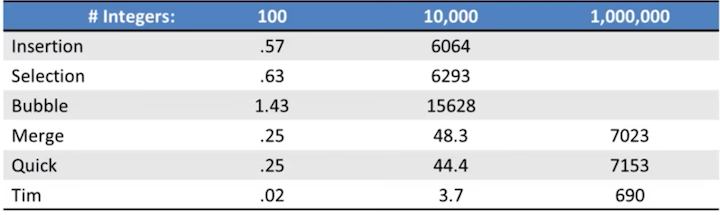
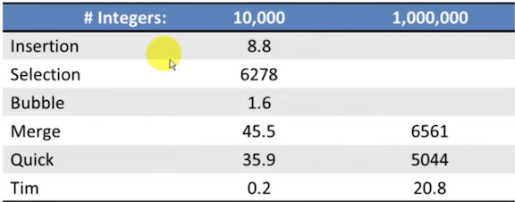
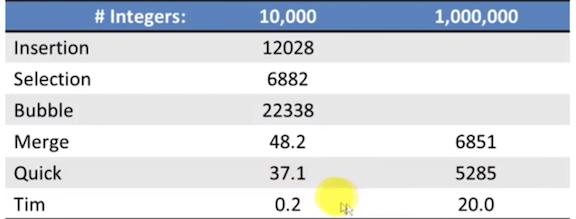
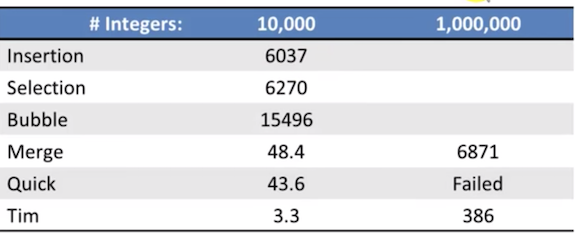

# Sorting Algorithms Benchmarks Comparison

## Test Conditions 
* All input was integers ranging 0 to 1,000,000 
  * Except Many Duplicates test, ranged 0 to n/10 
* All units in milli-seconds 
* Used optimized algorithms where possible 
  * Insertion Sort used shifting rather than swapping 
  * Bubble Sort exits if no swaps are made in a pass 
  * **Merge and Quick sorts used Selection sort for subLists <= 20 items**

## Randomly Ordered Input

**Time in milli-Seconds**

## Already Sorted Input

## Reverse Sorted Input

## Random Ordered Input with Many Duplicate Values

## Observations

* **Python's built-in Tim sort (built-in sorting algorithm hybrid of merge sort and insertion sort) is crazy fast in all tests** 
* Bubble sort is very slow in all tests except already sorted 
* **Insertion sort is faster than Selection sort except for reverse sorted input** 
* Quick sort is generally faster than Merge sort 
* You should understand the use cases before choosing the best sorting algorithm 

