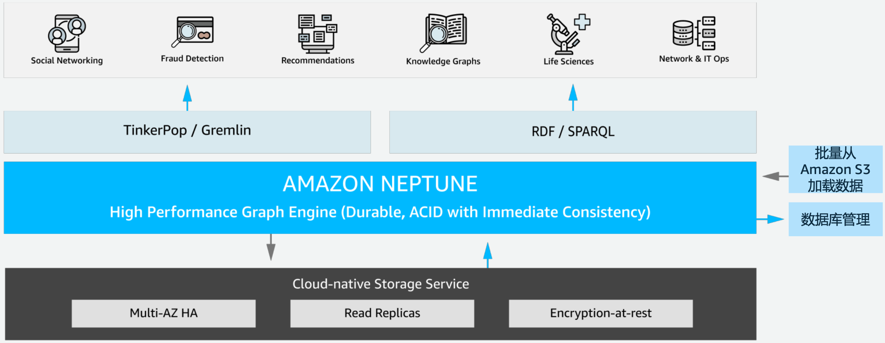

# 深入了解 Amazon Neptune 图数据库技术

* 图数据库概念、应用场景及数据建模
* Amazon Neptune 技术概览
* Amazon Neptune 部署架构及最佳实践
* Amazon Neptune Demo 演示及参考资源

## 图数据库概念、应用场景及数据建模

**图论 (Graph Theory)**

* 柯尼斯堡七桥问题
* 1736 年 莱昂哈德·欧拉 奠定了图论的基础

https://zh.wikipedia.org/wiki/%E5%9B%BE%E8%AE%BA


**数据结构:图(Graph)**

**图G 由两个集合构成**，记作 `G=<V,E>` 其中 `V` 是顶点的非空有限集合，`E` 是边的有限集合，其中边是顶点 的 **无序对** 或 **有序对** 集合。

```
G1=<V,E>
V = { v0 ,v1,v2,v3,v4 }
E = { (v0,v1),(v0,v3),(v1,v2),(v1,v4),(v2,v3)(v2,v4) }
```

**图的存储**

* 图的数组(邻接矩阵)
* 图的邻接表
* 有向图的十字链表存储表示
* 无向图的邻接多重表存储表示

**图的遍历**

* 深度优先遍历(DFS) 
* 广度优先遍历(BFS)

```
无序对(vi,vj):
用连接顶点vi、vj的线段 表示，称为无向边
```


### 什么是图数据库?

图数据库(`Graph Database`) **并非指存储图片** 的数据库，而是支持以 **图数据结构** 存储和查询数据的数据库。

图数据库是一种在线数据库管理系统，具有处理图数据模型的**创建、读取、更新和删除(CRUD)**操作。


**图存储**

一些图数据库使用 **原生图存储**，这类存储是经过优化的，并且是专门为了存储和管理图而设计的。**并不是所有图数据库都是使 用原生图存储，也有一些图数据库将图数据序列化，然后保存到关系型数据库或者面向对象数据库**，或其他通用数据存储中。

**图处理引擎**

原生图处理(也称为 无索引邻接)是处理图数据的最有效方法，因为连接的节点在数据库中物理地指向彼此。非原生图处理使 用其他方法来处理 **CRUD** 操作。

### 高度关联的数据


### 高度关联数据的应用场景

* 社交网络
* 推荐系统 
* 知识图谱
* 欺诈检测 
* 生命科学 
* 网络运维

### 知识图谱(Knowledge Graph)的应用

* 蒙娜丽莎的作者是?
* Alice 在巴黎应该参观哪个博物馆?
* 卢浮宫保存着哪些艺术家的作品?


### 图数据库的应用领域


随着社交、电商、金融、零售、物联网等行业的快速发展，现实社会织起了了一张庞大而复杂的关系网，传统数据库很难处理关 系运算。大数据行业需要处理的数据之间的关系随数据量呈几何级数增长，亟需一种支持海量复杂数据关系运算的数据库， 图数 据库应运而生。

* **社交领域**:
	* Facebook, Twitter，Linkedin 用它来管理社交关系，实现好友推荐
* **零售领域**: 
	* eBay，沃尔玛使用它实现商品实时推荐，给买家更好的购物体验
* **金融领域**: 
	* 摩根大通，花旗和瑞银等银行在用图数据库做风控处理
* **汽车制造领域**: 
	* 沃尔沃，戴姆勒和丰田等顶级汽车制造商依靠图数据库推动创新制造解决方案
* **电信领域**:
	* Verizon, Orange 和 AT&T 等电信公司依靠图数据库来管理网络
* **酒店领域:** 
	* 万豪和雅高酒店等顶级酒店公司依使用图数据库来管理复杂且快速变化的库存

### 高度关联数据的不同处理方法

**基于业务流程构建**


**基于关联关系查询构建**


### 关系型数据库面临的挑战 – 构建数据高度关联的应用

* 并非面向图查询设计
* 图处理效率低下 
* 修改 Schema 不够灵活

### 图 (Graph) 模型和框架

**属性图 (Property Graph)**
开源的 Apache TinkerPopTM Gremlin Traversal Language


**资源描述框架 RDF (Resource Description Framework)**


### 属性图 (Property Graph)

属性图是顶点、边及他们属性所构成的集合 

* **顶点** 表示实体/域
*  **边** 表示顶点之间方向性的关系. 
	* 每条边有一个关联关系的标签 
* 每个顶点和边有一个唯一的**标识符** 
* **顶点**和边可以有**属性**
* **属性**表示顶点和边非关系的信息


### 资源描述框架 (RDF)

* `RDF Graphs` 是由**主体、谓语和客体组成的一个三元组的集合**

```
主体: 	<http://www.socialnetwork.com/person#1> 
谓语: 	rdf:type contacts:User;
客体(文字): 	contact:name: ”Bill” 
```

* 国际资源标识符(IRI)唯一地识别主体

```
IRI		<http://www.socialnetwork.com/person#1>
```

* 客体可以是一个IRI 或者 文字.
	* 当为文字时，它相当于一个属性值，RDF支持XML的数据类型 
	* 当为一个IRI时，它表示图当中的一条边

```
主体 	<http://www.socialnetwork.com/person#1>
谓语 	contacts:friend
客体(IRI)	<http://www.socialnetwork.com/person#2> .
```

### 关系型数据库模型 vs 图模型


#### SQL 关系型数据库查询

* 找到购买Echo的公司名称

```
SELECT distinct c.CompanyName 
FROM customers AS c
	JOIN orders AS o ON 					/* Join the customer from the order */ 
		(c.CustomerID = o.CustomerID)
	JOIN order_details AS od		 		/* Join the order details from the order */ 
		ON (o.OrderID = od.OrderID)
	JOIN products as p 						/* Join the products from the order details */
	 ON (od.ProductID = p.ProductID)
	WHERE p.ProductName = ’Echo';	/* Find the product named ‘Echo’ */
```
 
#### Gremlin 遍历查询

```
/* All products named ”Echo” */
g.V().hasLabel(‘Product’).has('name',’Echo')
	.in(’HAS_PRODUCT') 	/* Traverse to order details */ 
	.in(‘HAS_DETAILS’) 	/* Traverse to order */ 
	.in(’HAS_ORDER’) 	/* Traverse to Customer */ 
	.values(’CompanyName’).dedup() 	/* Unique Company Name */
```

#### RDF SPARQL 查询

```
PREFIX sales_db: <http://sales.widget.com/> 
SELECT distinct ?comp_name WHERE {
	?customer sales_db:HAS_ORDER ?order ;       #customer graph pattern 
		sales_db:CompanyName ?comp_name .
	?order sales_db:HAS_DETAILS?order_d.          #ordersgraphpattern
    ?order_d sales_db:HAS_PRODUCT ?product .   #order details graph pattern 
	?product sales_db:ProductName “Echo” .       #products graph pattern
}
```

##  Amazon Neptune 技术概览

### AWS 数据库托管服务


### 现有图数据库的问题

* 难以扩展 
* 难以保证高可用 
* 价格高昂 
* 开源标准支持不完整


**Amazon Neptune 完全托管的图数据库**

* 快速 
	* 毫秒级延迟内查询数以十亿计关联关系   
* 可靠 
	* 数据在 3 个可用区内有6个备份存储
* 简便
	* 支持 Gremlin 和 SPARQL查询
* 开源
	* 支持 Apache TinkerPop 和 W3C 图模型

### 完全托管的服务

* 通过控制台简便配置 
* 跨多可用区的高可用性 
* 支持最多 15 个 读副本 
* 支持静态加密 
* 支持传输过程加密 
* 备份、还原、时间点恢复


### Amazon Neptune 体系架构



### Amazon Neptune 部署方式

* 安全地部署在 Amazon VPC
* 在两个可用区的子网中部署增加可用性
* 集群会自动地扩展到三个可用区 存储以增加持久性
* 更多细节请见 Amazon Neptune 文档


### Amazon Neptune 云原生存储

* 数据以 6 个副本的形式存储在 3 个可用区
* 持续备份到 Amazon S3(拥有 11 个 9 的持 久性)
* 持续监控节点和磁盘是否损坏
* 10GB 段数据作为修复或者热平衡重新分配的单元
* 写四读三
* 副本数量的变化不会影响写入
* 存储容量最多能自动扩展到 64TB


### Amazon Neptune 高可用和容错

可以容忍的故障类型? 

* 段数据损坏(磁盘)
* 数据节点损坏(实例) 
* 可用区不可用(网络/数据中心)

优化

* 写入 6 份中的 4 份
* 当 6 份中的 3 份有效时就可以读取 
* 对等复制进行修复


### Amazon Neptune 只读副本

**可用性**

* 损坏的数据库节点会被自动检测和代替
* 损坏的数据库节点会被自动回收
* 在 Failover 的时候，副本会被自动提升 为主节点
* 用户可以自定义 Failover 顺序

**性能**

* 应用程序可以通过读副本扩展读取容量 
* 通过只读终端节点做读取的负载均衡
 


### Amazon Neptune 故障转移一般小于 30 秒
 
 
 
### Amazon Neptune 持续备份
 
* 定期、并行地对段数据拍摄快照，另外会持续地把日志流存到 Amazon S3 
* 备份不会影响 `Amazon Neptune ` 的性能和可用性
* 还原时会检索段快照和相应的日志流
* 以异步并行的方式把日志流重新应用到段快照

 
 
###  Amazon Neptune Clone 克隆

**创建数据库副本而无重复的存储成本**

* 创建克隆几乎是瞬间的-我们不复制数据
* 数据复制仅在写入时发生–当原始和克隆的卷数据不同时

**典型用例:**

* 克隆生产数据库以运行测试
* 执行工作负载密集型操作，例如导出数据或运行分析查询
* 保存时间点快照以进行分析，而不会影响生产系统

 
 
###  Amazon Neptune 数据加载

* API 调用` Insert`,`addVertex`,`addEdge` 等
* `Loader` 命令更快，占用资源少，为大数据集做了优化

 

> 注:所有文件必须采用 UTF-8 格式编码。如果非 UTF 格式，则Neptune 仍将其作为 UTF-8 数据加载

 
 
### Amazon Neptune 监控管理
 
**AWS CloudTrail**:

Log all Neptune API calls to S3 bucket

**Event Notifications**

Create AmazonSimple Notification Service (Amazon SNS) subscription via AWS Command Line Interface (AWS CLI) or AWS SDK

**Amazon CloudWatch**

 


##  Amazon Neptune 部署架构及最佳实践

**使用 NLB 从 VPC 外连接到 Amazon Neptune**

 
 
**使用 ALB 从 VPC 外连接到 Amazon Neptune**

 

### 最佳实践 - 从 S3 批量加载数据
 
* 非事务性的，专为仅 **附加导入** 而设计
*  加载程序可以在单个加载任务中从多个顶点文件和多个边缘文件加载
	*  使用大型 **gzip** 压缩文件
* 使用实例类型进行**在线扩展**
	* 暂时启动 r4.8xlarge，在初始加载完成后故障转移到所需的实例类型
* 可配置，譬如failOnError、updateSingleCardinalityProperties等
* 支持各种输入格式
	* Gremlin 的 CSV
	* 用于 SPARQL 的 NTriples / NQuads / Turtle / RDF + XML

### 最佳实践 – 在线查询 (读/写/插入操作) 

* 完全支持事务(**`READ COMMITTED`**)
* SPARQL 和 Gremlin 都支持只读查询与更改查询
* 写入在 **主节点** 上 **立即可见**(读取副本可能存在 **延迟** ) 
* 可以在 Gremlin 中使用长期会话

### 最佳实践 – 优化写操作的吞吐量

* 使用 **并行 写入/删除** 来优化吞吐量
* 大型事务支持 **最多 150MB** 的请求大小 
* 支持 **大批量删除**
	* **并行删除** 通常更可取(以最大限度地提高性能)
* 避免 **并发修改**(写 - 写冲突)
* 调整 `neptune_query_timeout` 以方便更长时间运行的查询
	* 默认值:**2 分钟**

### 最佳实践 – Neptune 内存优化

* 数据缓存在 **主节点** 的内存中
	* 可用的内存量随实例类型而增加
		* r4.large(15.25GB)高达 r5.12xlarge(384GB)
	* 增加 #CPU核心 => 扩展并行处理 

* 针对 **内存访问优化** 的查询评估
	* 从存储层获取数据 非常昂贵 
		* 延迟增加
		* IOPS 成本
	* 计划将热数据集填充到主内存
* 存储层 CloudWatch 指标
	* 在查询时关注**ReadThroughput**

### 最佳实践 – 多租户

* Gremlin
	* 目前支持**单图**
	* 可以在应用程序级别 **建模多个数据集**(例如标签和节点/边缘属性)

* SPARQL
	* 支持命名图形
	* 数据加载器支持命名图形格式(NQuads)或目标命名图形的规范
	* 命名图约束可以包含在 SPARQL 查询中

### 最佳实践 – 属性修改

**更改属性或添加属性(如果属性不存在)**

`g.V('1').property(single, 'name', 'marko') `: 

此处介绍如何更改上一步中顶点的 name 属性。这会从 name 属性删除现有值。
如果您未指定 single，则会改为将值附加到 name 属性(如果尚未附加)。

**添加属性，但在属性已有值时附加属性**

`g.V('1').property('age', 29)` 

Neptune 使用集基数`set cardinality`作为默认操作。 此命令添加值为 29 的 age 属性，但不替换任何现有值。

如果 age 属性已有值，此命令将 29 附加到属性。例如，如果 age 属性是 27，则 新值将为 [ 27, 29 ]。

##  Amazon Neptune 在线演示及参考资源

**Visualize data in Amazon Neptune using VIS.js library**

 
 
### User与Tweet的数据

 