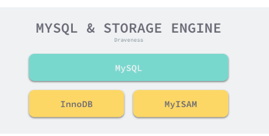
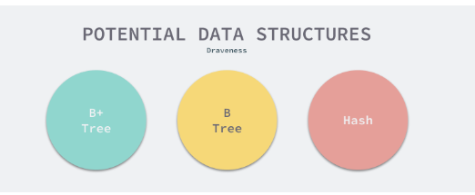
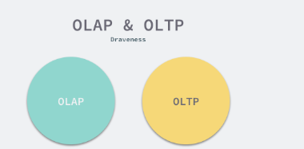
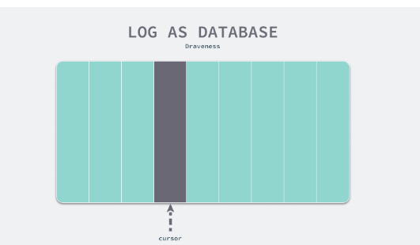
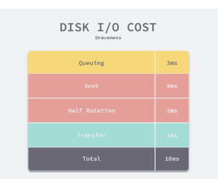
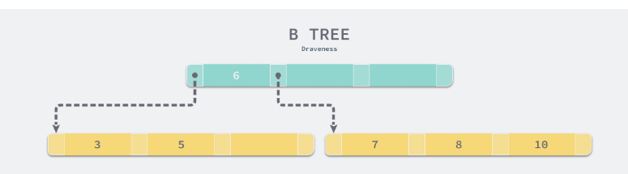
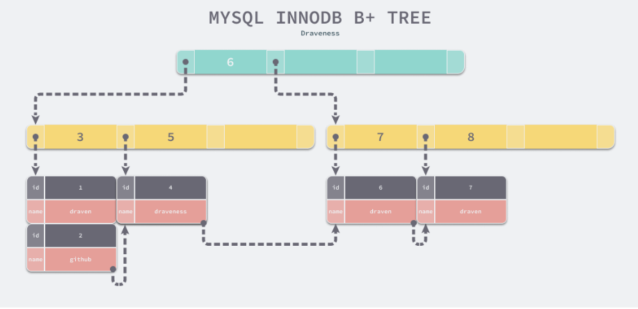

# "Shallow Dive" MySQL 为何使用 `B+` 树而非哈希或者`B`树


为什么 MySQL 使用 B+ 树是面试中经常会出现的问题，很多人对于这个问题可能都有一些自己的理解，但是多数的回答都不够完整和准确，大多数人都只会简单说一下 B+ 树和 B 树的区别，但是没什么真正回答 MySQL 为什么选择使用 B+ 树这个问题，我们在这篇文章中就会深入分析 MySQL 选择 B+ 树背后的一些原因。

## 概述


首先需要澄清的一点是，**`MySQ`L 跟 `B+` 树没有直接的关系，真正与 `B+` 树有关系的是 `MySQL` 的默认存储引擎 `InnoDB`**，

`MySQL` 中存储引擎的主要作用是负责数据的存储和提取，除了 `InnoDB` 之外，`MySQL` 中也支持 `MyISAM` 作为表的底层存储引擎。




我们在使用 `SQL` 语句创建表时就可以为当前表指定使用的存储引擎，你能在 MySQL 的文档 [Alternative Storage Engines](https://dev.mysql.com/doc/refman/8.0/en/storage-engines.html) 中找到它支持的全部存储引擎，例如：`MyISAM`、`CSV`、`MEMORY` 等，

然而默认情况下，使用如下所示的 SQL 语句来创建表就会得到 InnoDB 存储引擎支撑的表：

```
CREATE TABLE t1 (
    a INT,
    b CHAR (20), 
    PRIMARY KEY (a)) ENGINE=InnoDB;
```

我们今天最终将要分析的问题其实还是，为什么 MySQL 默认的存储引擎 InnoDB 会使用 MySQL 来存储数据，相信对 MySQL 稍微有些了解的人都知道，

无论是表中的数据（主键索引）还是辅助索引最终都会使用 `B+` 树来存储数据，其中前者在表中会以 `<id, row>` 的方式存储，而后者会以 `<index, id>`的方式进行存储，这其实也比较好理解：

* 在主键索引中，`id` 是主键，我们能够通过 `id` 找到该行的全部列；
* **在辅助索引中，索引中的几个列构成了键**，我们能够通过索引中的列找到 `id`，如果有需要的话，可以再通过 `id` 找到当前数据行的全部内容；


**对于 `InnoDB` 来说，所有的数据都是以键值对的方式存储的，主键索引和辅助索引在存储数据时会将 `id` 和 `index` 作为键，将所有列和 `id` 作为键对应的值**。




在具体分析 `InnoDB` 使用 `B+` 树背后的原因之前，我们需要为 `B+` 树找几个『假想敌』，因为如果我们只有一个选择，那么选择 `B+` 树也并不值得讨论，找到的两个假想敌就是 B 树和哈希，相信这也是很多人会在面试中真实遇到的问题，我们就以这两种数据结构为例，分析比较 B+ 树的优点。


## 设计

到了这里我们已经明确了今天待讨论的问题，也就是为什么 MySQL 的 InnoDB 存储引擎会选择 B+ 树作为底层的数据结构，而不选择 B 树或者哈希？在这一节中，我们将通过以下的两个方面介绍 InnoDB 这样选择的原因。

* `InnoDB` 需要支持的场景和功能需要在特定查询上拥有较强的性能；
* `CPU` 将磁盘上的数据加载到内存中需要花费大量的时间，这使得 `B+` 树成为了非常好的选择；


**数据的持久化以及持久化数据的查询其实是一个常见的需求，而数据的持久化就需要我们与磁盘、内存和 CPU 打交道**；

`MySQL` 作为 `OLTP` 的数据库不仅需要具备事务的处理能力，而且要保证数据的持久化并且能够有一定的实时数据查询能力，这些需求共同决定了 `B+` 树的选择，接下来我们会详细分析上述两个原因背后的逻辑。

## 读写性能 (Hash is bad)

很多人对 OLTP 这个词可能不是特别了解，我们帮助各位读者快速理解一下，与 `OLTP` 相比的还有 `OLAP`，它们分别是 `Online Transaction Processing` 和 `Online Analytical Processing`，从这两个名字中我们就可以看出，

* `OLTP`前者指的就是**传统的关系型数据库**，主要用于处理基本的、日常的事务处理，
* `OLAP` 而后者主要在**数据仓库中使用**，用于支持一些复杂的分析和决策。




作为支撑 `OLTP` 数据库的存储引擎，我们经常会使用 InnoDB 完成以下的一些工作：

* 通过 `INSERT`、`UPDATE` 和 `DELETE` 语句对表中的数据进行增加、修改和删除；
* 通过 `UPDATE` 和 `DELETE` 语句对符合条件的数据进行批量的删除；
* 过 `SELECT` 语句和主键查询某条记录的全部列；
* 通过 `SELECT` 语句在表中查询符合某些条件的记录并根据某些字段排序；
* 通过 `SELECT `语句查询表中数据的行数；
* 通过唯一索引保证表中某个字段或者某几个字段的唯一性；

如果我们使用 `B+` 树作为底层的数据结构，

**那么所有只会访问或者修改一条数据的 `SQL` 的时间复杂度都是 `O(log n)`，也就是树的高度**

**但是使用哈希却有可能达到 `O(1)` 的时间复杂度，看起来是不是特别的美好。但是当我们使用如下所示的 `SQL` 时，哈希的表现就不会这么好了**

```
SELECT * FROM posts WHERE author = 'draven' ORDER BY created_at DESC
SELECT * FROM posts WHERE comments_count > 10
UPDATE posts SET github = 'github.com/draveness' WHERE author = 'draven'
DELETE FROM posts WHERE author = 'draven'
```

如果我们使用哈希作为底层的数据结构，遇到上述的场景时，使用哈希构成的主键索引或者辅助索引可能就没有办法快速处理了，它对于处理范围查询或者排序性能会非常差，只能进行全表扫描并依次判断是否满足条件。全表扫描对于数据库来说是一个非常糟糕的结果，这其实也就意味着我们使用的数据结构对于这些查询没有其他任何效果，最终的性能可能都不如从日志中顺序进行匹配。




**使用 `B+` 树其实能够保证数据按照键的顺序进行存储，也就是相邻的所有数据其实都是按照自然顺序排列的**，使用哈希却无法达到这样的效果，**因为哈希函数的目的就是让数据尽可能被分散到不同的桶中进行存储**，所以在遇到可能存在相同键 `author = 'draven` 或者排序以及范围查询 `comments_count > 10` 时，**由哈希作为底层数据结构的表可能就会面对数据库查询的噩梦 —— 全表扫描**。


B 树和 B+ 树在数据结构上其实有一些类似，它们都可以按照某些顺序对索引中的内容进行遍历，对于排序和范围查询等操作，B 树和 B+ 树相比于哈希会带来更好的性能，当然如果索引建立不够好或者 SQL 查询非常复杂，依然会导致全表扫描。

* 与 B 树和 B+ 树相比，哈希作为底层的数据结构的表能够以 `O(1)` 的速度处理单个数据行的增删改查，但是面对范围查询或者排序时就会导致全表扫描的结果，
* 而 `B` 树和 `B+` 树虽然在单数据行的增删查改上需要` O(log n) `的时间，但是它会将索引列相近的数据按顺序存储，所以能够避免全表扫描。


## 数据加载 (B tres is bad)

既然使用哈希无法应对我们常见的 `SQL` 中排序和范围查询等操作，而 `B` 树和 `B` 树和 `B+` 树都可以相对高效地执行这些查询，那么为什么我们不选择 `B` 树呢？

这个原因其实非常简单 —— **计算机在读写文件时会以页为单位将数据加载到内存中。页的大小可能会根据操作系统的不同而发生变化，不过在大多数的操作系统中，页的大小都是 `4KB`，你可以通过如下的命令获取操作系统上的页大小:**


```
$ getconf PAGE_SIZE
4096
```
当我们需要在数据库中查询数据时，

* `CPU` 会发现当前数据位于磁盘而不是内存中，
* 这时就会触发 `I/O` 操作将数据加载到内存中进行访问，
* 数据的加载都是以页的维度进行加载的，然而将数据从磁盘读取到内存中所需要的成本是非常大的，普通磁盘（非 `SSD`）加载数据需要经过队列、寻道、旋转以及传输的这些过程，大概要花费 `10ms` 左右的时间。




我们在估算 `MySQL` 的查询时就可以使用 `10ms` 这个数量级对随机 `I/O` 占用的时间进行估算，这里想要说的是随机 `I/O` 对于 `MySQL` 的查询性能影响会非常大，而顺序读取磁盘中的数据时速度可以达到 `40MB/s`，这两者的性能差距有几个数量级，由此我们也应该尽量减少随机 I/O 的次数，这样才能提高性能。


`B` 树与 `B+` 树的最大区别就是，**`B` 树可以在非叶结点中存储数据**，**但是 `B+` 树的所有数据其实都存储在叶子节点中**，当一个表底层的数据结构是 `B` 树时，假设我们需要访问所有`『大于 4，并且小于 9 的数据』`：



如果不考虑任何优化，**在上面的简单 `B` 树中我们需要进行 `4` 次磁盘的随机 `I/O` 才能找到所有满足条件的数据行**：


1. 加载根节点所在的页，发现根节点的第一个元素是 6，大于 4；
2. 通过根节点的指针加载左子节点所在的页，遍历页面中的数据，找到 5；
3. 重新加载根节点所在的页，发现根节点不包含第二个元素；
4. 通过根节点的指针加载右子节点所在的页，遍历页面中的数据，找到 7 和 8；


当然我们可以通过各种方式来对上述的过程进行优化，不过 B 树能做的优化 B+ 树基本都可以，所以我们不需要考虑优化 B 树而带来的收益，直接来看看什么样的优化 B+ 树可以做，而 B 树不行。




**由于所有的节点都可能包含目标数据，我们总是要从根节点向下遍历子树查找满足条件的数据行，这个特点带来了大量的随机 `I/O`，也是 `B` 树最大的性能问题。**


**`B+` 树中就不存在这个问题了，因为所有的数据行都存储在叶节点中，而这`些叶节点可以通过『指针』依次按顺序连接`**，

当我们在如下所示的 `B+` 树遍历数据时可以直接在多个子节点之间进行跳转，这样能够节省大量的磁盘 `I/`O 时间，也不需要在不同层级的节点之间对数据进行拼接和排序；

通过一个 `B+` 树最左侧的叶子节点，我们可以像链表一样遍历整个树中的全部数据，当我们也可以使用双向链表保证倒序遍历时的性能。


有些读者可能会认为使用 `B+` 树这种数据结构会增加树的高度从而增加整体的耗时，

**然而高度为 3 的 `B+` 树就能够存储千万级别的数据，实践中 `B+` 树的高度最多也就 `4` 或者 `5`，所以这并不是影响性能的根本问题。**


## 总结


任何不考虑应用场景的设计都不是最好的设计，当我们明确的定义了使用 MySQL 时的常见查询需求并理解场景之后，再对不同的数据结构进行选择就成了理所当然的事情，当然 B+ 树可能无法对所有 OLTP 场景下的查询都有着较好的性能，但是它能够解决大多数的问题。

我们在这里重新回顾一下 MySQL 默认的存储引擎选择 B+ 树而不是哈希或者 B 树的原因：

* 哈希虽然能够提供 `O(1)` 的单数据行操作性能，**但是对于`范围查询`和`排序却无法很好地支持，最终导致全表扫描**；
* **`B` 树能够在非叶节点中存储数据**，但是这也导致在查询连续数据时可能会带来更多的随机 `I/O`，
* 而 `B+` 树的所有叶节点可以通过指针相互连接，能够减少顺序遍历时产生的额外随机 `I/O`；

如果想要追求各方面的极致性能也不是没有可能，只是会带来更高的复杂度，我们可以为一张表同时建 B+ 树和哈希构成的存储结构，这样不同类型的查询就可以选择相对更快的数据结构，但是会导致更新和删除时需要操作多份数据。


从今天的角度来看，B+ 树可能不是 InnoDB 的最优选择，但是它一定是能够满足当时设计场景的需要，从 B+ 树作为数据库底层的存储结构到今天已经过了几十年的时间，我们不得不说优秀的工程设计确实有足够的生命力。而我们作为工程师，在选择数据库时也应该非常清楚地知道不同数据库适合的场景，因为软件工程中没有银弹。

