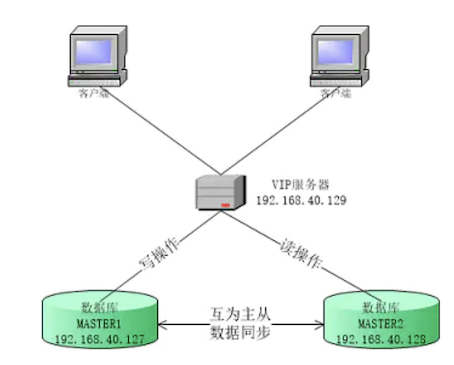

# Keepalived+MySQL高可用 双主热备

## 背景

结合系统业务、数据量大小和数据的重要性，目前常用的MySQL高可用方案有Keepalived+双主、MHA、MMM、PXC、MySQL Cluster和HeartBeat+DRBD,生产环境中常用的有Keepalived+双主、MHA和PXC,本文章的内容主要是搭建Keepalived+双主的环境。正常环境下写操作使用VIP连接数据库来做写操作，使用master2的地址来做读操作。若有其中的一个主机有异常，都切换还在vip上面。环境正常后再切换回来。

本章环境使用两个服务器和三个IP搭建而成，`vip`是绑定到`master1`和`master2`的网卡上的虚拟网卡。




### 1.环境准备

```
角色                  主机ip                  主机名           操作系统版本          安装软件及版本     
VIP                 192.168.40.129         虚拟地址                     
master1             192.168.40.127         xwmaster1        CentOS 7.5          mysql5.7.21+keepalived2.0.8         
master2             192.168.40.128         xwmaster2        CentOS 7.5          mysql5.7.21+keepalived2.0.8 
```

### 2.MySQL服务安装

从 `CentOS 7` 系统开始，`MariaDB` 成为 `yum` 源中默认的数据库安装包。在 `CentOS 7` 及以上的系统中使用 `yum` 安装`MySQL`包将无法使用，在安装之前先卸载`MariaDB`，查看`mariadb`的安装包情况并卸载

```
yum list installed | grep mariadb
yum -y remove mariadb*
```

下载`mysql`的`YUM`源

```
$ cd /usr/local/src
$ wget https://dev.mysql.com/get/mysql57-community-release-el7-11.noarch.rpm
```

安装`mysql`的`yum`源

```
rpm -ivh mysql57-community-release-el7-11.noarch.rpm
```

安装`mysql-server`

```
yum install -y mysql-server
```

启动`mysql`服务

```
server mysqld start
```

`mysql`获取`mysql`初始密码

```
cat /var/log/mysqld.log | grep 'A temporary password'
```

修改`mysql`密码由于`mysql5.7`安全性要求密码由小写字母大写字母数字和字符组成例如`Password@123`

```
mysql -u root -p
ALTER USER 'root'@'localhost' IDENTIFIED BY 'Password@123';
```

### 3.MySQL配置

在配置`mysql`之前要设置防火墙允许`3306`端口通过。

```
systemctl stop firewalld.service        #关闭firewalld防火墙

systemctl disable firewalld.service     #从开机启动中移除

yum install iptables-services -y        #iptables-services安装

vi /etc/sysconfig/iptables              #操作防火墙iptables文件  

-A INPUT -p tcp -m state --state NEW -m tcp --dport 3306 -j ACCEPT  #加入到防火墙

systemctl restart iptables.service      #重启防火墙
systemctl enable iptables.service       #加入开机启动
```

#### 1.master1的配置操作`/etc/my.cnf`

```
[mysqld]
# 数据存储文件指定
datadir=/data/mysql
# sock文件路径
socket=/var/lib/mysql/mysql.sock

# Disabling symbolic-links is recommended to prevent assorted security risks
symbolic-links=0

#错误日志文件路径
log-error=/var/log/mysqld.log
#进程文件路径
pid-file=/var/run/mysqld/mysqld.pid

# mysql服务id
server-id=1

#二进制日志 存储数据发生改变的sql语句
log-bin=mysql-bin

#增量值得起点
auto-increment-offset=1
#每次增量间隔
auto-increment-increment=2

#设置需要同步的数据库名称
#binlog_do_db=<dbname>
```

#### 2.数据同步授权

```
数据同步授权（iptables防火墙开启3306端口）这样I/O线程就可以以这个用户的身份连接到主服务器，
并且读取它的二进制日志。
mysql> grant replication slave,replication client on *.* to root@'192.168.40.%' identified by "Password@123";
Query OK, 0 rows affected, 1 warning (0.00 sec)

mysql> flush privileges;
Query OK, 0 rows affected (0.00 sec)

最好将库锁住，仅仅允许读，以保证数据一致性；待主主同步环境部署后再解锁；
锁住后，就不能往表里写数据，但是重启mysql服务后就会自动解锁！
注意该参数设置后，如果自己同步对方数据，同步前一定要记得先解锁！
mysql> flush tables with read lock; 
Query OK, 0 rows affected (0.01 sec)

查看下log bin日志和pos值位置
mysql> show master status;
+------------------+----------+--------------+------------------+-------------------+
| File             | Position | Binlog_Do_DB | Binlog_Ignore_DB | Executed_Gtid_Set |
+------------------+----------+--------------+------------------+-------------------+
| mysql-bin.000003 |     1106 |              |                  |                   |
+------------------+----------+--------------+------------------+-------------------+
1 row in set (0.00 sec)
```

#### 3.master2的配置操作`/etc/my.cnf`

```
[mysqld]

datadir=/data/mysql
socket=/var/lib/mysql/mysql.sock
symbolic-links=0
log-error=/var/log/mysqld.log
pid-file=/var/run/mysqld/mysqld.pid
server-id=2                         # changed
log-bin=mysql-bin
auto-increment-offset=2      # changed
auto-increment-increment=2

#设置需要同步的数据库名称
#binlog_do_db=<dbname>
```

#### 4.数据同步授权

```
mysql> grant replication slave,replication client on *.* to root@'192.168.40.%' identified by "Password@123";
Query OK, 0 rows affected, 1 warning (0.01 sec)

mysql> flush privileges;
Query OK, 0 rows affected (0.00 sec)

mysql> flush tables with read lock; 
Query OK, 0 rows affected (0.01 sec)

mysql> show master status;
+------------------+----------+--------------+------------------+-------------------+
| File             | Position | Binlog_Do_DB | Binlog_Ignore_DB | Executed_Gtid_Set |
+------------------+----------+--------------+------------------+-------------------+
| mysql-bin.000006 |      630 |              |                  |                   |
+------------------+----------+--------------+------------------+-------------------+
1 row in set (0.00 sec)
```

#### 5.`master1`做同步操作

```
先解锁步骤2中对master1的表解锁，为保持数据的一致性。
mysql> unlock tables;
Query OK, 0 rows affected (0.00 sec)

先去stop slave 以下报错是slave未开启
mysql> slave stop;
ERROR 1064 (42000): You have an error in your SQL syntax; check the manual that corresponds to your MySQL server version for the right syntax to use near 'slave stop' at line 1

mysql> change  master to master_host='192.168.40.128',master_user='root',master_password='Password@123',master_log_file='mysql-bin.000006',master_log_pos=630;
Query OK, 0 rows affected, 2 warnings (0.20 sec)

mysql> start slave;
Query OK, 0 rows affected (0.01 sec)

mysql> show slave status \G;
*************************** 1. row ***************************
               Slave_IO_State: Waiting for master to send event
                  Master_Host: 192.168.40.128
                  Master_User: root
                  Master_Port: 3306
                Connect_Retry: 60
              Master_Log_File: mysql-bin.000006
          Read_Master_Log_Pos: 630
               Relay_Log_File: xwmaster1-relay-bin.000002
                Relay_Log_Pos: 320
        Relay_Master_Log_File: mysql-bin.000006
             Slave_IO_Running: Yes
            Slave_SQL_Running: Yes
              Replicate_Do_DB: 
          Replicate_Ignore_DB: 
           Replicate_Do_Table: 
       Replicate_Ignore_Table: 
      Replicate_Wild_Do_Table: 
  Replicate_Wild_Ignore_Table: 
                   Last_Errno: 0
                   Last_Error: 
                 Skip_Counter: 0
          Exec_Master_Log_Pos: 630
```
 
#### 6.master2做同步操作

```
先解锁步骤4中对master2的表的锁
mysql> unlock tables;
Query OK, 0 rows affected (0.00 sec)

mysql> slave stop;
ERROR 1064 (42000): You have an error in your SQL syntax; check the manual that corresponds to your MySQL server version for the right syntax to use near 'slave stop' at line 1

mysql> change  master to master_host='192.168.40.127',master_user='root',master_password='Password@123',master_log_file='mysql-bin.000003',master_log_pos=1106;
Query OK, 0 rows affected, 2 warnings (0.03 sec)

mysql>  start slave;
Query OK, 0 rows affected (0.00 sec)

mysql> show slave status \G;
*************************** 1. row ***************************
               Slave_IO_State: Waiting for master to send event
                  Master_Host: 192.168.40.127
                  Master_User: root
                  Master_Port: 3306
                Connect_Retry: 60
              Master_Log_File: mysql-bin.000003
          Read_Master_Log_Pos: 1106
               Relay_Log_File: xwmaster2-relay-bin.000002
                Relay_Log_Pos: 320
        Relay_Master_Log_File: mysql-bin.000003
             Slave_IO_Running: Yes
            Slave_SQL_Running: Yes
              Replicate_Do_DB: 
          Replicate_Ignore_DB: 
           Replicate_Do_Table: 
       Replicate_Ignore_Table: 
      Replicate_Wild_Do_Table: 
  Replicate_Wild_Ignore_Table: 
                   Last_Errno: 0
                   Last_Error: 
                 Skip_Counter: 0
          Exec_Master_Log_Pos: 1106
```

#### 7.`master1`和`master2`两台服务器都要授权允许`root`用户远程登录，用于在客户端登陆测试！

```
mysql> grant all on *.* to root@'192.168.40.%' identified by "Password@123";
Query OK, 0 rows affected (0.00 sec)
     
mysql> flush privileges;
Query OK, 0 rows affected (0.01 sec)
```

## Keepalived的安装配置

本章的`keepalived `只配置一个`MASTER`和一个`BACKUP`,可以配置多个`BACKUP`,若`MASTER`挂掉，会从`BACKUP`中选举出一个新的`MASTER,`旧的`MASTER`恢复，系统又恢复如初。

### 1.Keepalived编译安装过程

```
#安装包下载
cd /usr/local/src
wget http://www.keepalived.org/software/keepalived-2.0.8.tar.gz         
tar zxvf keepalived-2.0.8.tar.gz
cd keepalived-2.0.8/
yum install -y openssl-devel libnl-devel libnl3-devel libnfnetlink-devel
yum groupinstall "Development Tools" 
./configure --prefix=/usr/local/keepalived  
```

### 2.将编译好的`keepalived`打包复制到`master1`和`master2`

```
tar zcvf keepalived.tar keepalived
cp keepalived/bin/* /bin/
cp keepalived/sbin/* /sbin/
cp keepalived/etc/keepalived/ /etc/ -rf
cp keepalived/etc/sysconfig/* /etc/sysconfig/
```

### 3.修改keepalived的配置文件

`vim /etc/keepalived/keepalived.conf`  master1与master底`keepalived`的基本配置一样，除了`state 和 `priority`，在配置文件中有说明。

```
! Configuration File for keepalived 
global_defs {
    notification_email {                #关于邮件的设置
        sachin_0906@183.com             #email send to
    }

    notification_email_from notice@keepalived.cn
        smtp_server 127.0.0.1 
        smtp_connect_timeout 30
        router_id MASTER-HA
}

vrrp_script chk_mysql_port {            #检测mysql服务是否在运行。有很多方式，比如进程，用脚本检测等等
    script "/opt/chk_mysql.sh"          #这里通过脚本监测
    interval 2                          #脚本执行间隔，每2s检测一次
    weight -5                           #脚本结果导致的优先级变更，检测失败（脚本返回非0）则优先级 -5
    fall 2                              #检测连续2次失败才算确定是真失败。会用weight减少优先级（1-255之间）
    rise 1                              #检测1次成功就算成功。但不修改优先级
}

vrrp_instance VI_1 {
    state MASTER                        #master1 设置为MASTER
    interface eno1                      #指定虚拟ip的网卡接口
    mcast_src_ip 192.168.40.127         #绑定的地址
    virtual_router_id 51                #路由器标识，MASTER和BACKUP必须是一致的
    priority 101                        #定义优先级，数字越大，优先级越高，在同一个`vrrp_instance`下，MASTER的优先级必须大于BACKUP的优先级。这样MASTER故障恢复后，就可以将VIP资源再次抢回来 
    advert_int 1         
    authentication {                    #认证类型PASS|AH(IPSEC)
        auth_type PASS 
        auth_pass 1111     
    }
    virtual_ipaddress {                 #虚拟IP的设置即vip
        192.168.40.129
    }

    track_script {                      #监控脚本
        chk_mysql_port             
    }
}
```

### 4.监控脚本 `/opt/chk_mysql.sh` 主要监控`3306`端口是否被监听，若不被监听关闭`keepalived`服务

```
#!/bin/bash
counter=$(netstat -na|grep "LISTEN"|grep "3306"|wc -l)
if [ "${counter}" -eq 0 ]; then
    service keepalived stop
fi
```

### 5.设置keepalived为服务并加入开机自动动

`vim /lib/systemd/system/keepalived.service` 生成`keepalived.service`文件

```
[Unit]
Description=Keepalived
After=syslog.target network.target remote-fs.target nss-lookup.target
 
[Service]
Type=forking
PIDFile=/var/run/keepalived.pid
ExecStart=/sbin/keepalived -D
ExecReload=/bin/kill -s HUP $MAINPID
ExecStop=/bin/kill -s QUIT $MAINPID
PrivateTmp=true
 
[Install]
WantedBy=multi-user.target  
```

**启动查看服务**

```
service keepalived start
service keepalived status
#systemctl enable keepalived.service
```

### 6.将keepalived应用加入防火墙允许

追加`/etc/sysconfig/iptables`

```
-A INPUT -s 192.168.40.0/24 -d 224.0.0.18 -j ACCEPT
-A INPUT -s 192.168.40.0/24 -p vrrp -j ACCEPT
```

重启`iptables`服务

```
service iptables restart
```

### 7.开机启动`mysqld`和`keepalived`服务脚本

取消开机自启动服务`mysqld` 和`keepalived`，原因是系统开机自启动`mysqld`和`keepalived`的先后顺序不能确定，所以使用`rc.local`中的`sh`脚本启动服务。

#### a.取消开启自启服务：

```
systemctl disable mysqld.service    
systemctl disable keepalived.service
```

#### b.创建`sh`脚本加入如下内容，`vim /opt/start_services.sh`

```
#!/bin/bash
service mysqld start 
while true
do
    counter=$(netstat -na|grep "LISTEN"|grep "3306"|wc -l)
    if [ "${counter}" -ne 0 ]; then
        service keepalived start
        exit 0
    fi

done
```


#### c. `/etc/rc.d/rc.local ` 文件末尾追加`sh /opt/start_services.sh`,并修改 `/opt/start_services.sh`和`/etc/rc.d/rc.local`的执行权限

```
chmod +x /opt/start_services.sh
chmod +x /etc/rc.d/rc.local
```

##  测试keepalived+双主mysql的可用性

```
1.用过虚拟IP连接数据库（实际是连接优先级高master1），创建数据库、创建表和添加数据，在master上查看数据是否同步成功。
2.关闭master1 keepalived或者mysqld服务，通过虚拟IP是否仍然可以访问数据库。
3.添加一条数据，自增id是不是按偶数方式增长（是说明一切换到master2上面）
4.恢复master1的keepalived服务，添加一条数据自增ID是不是奇数方式增长（是说明已经切换为master1）
```


