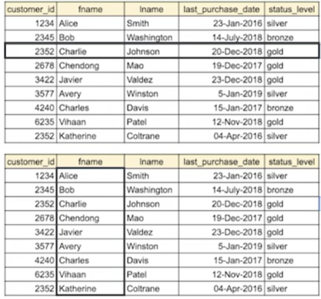
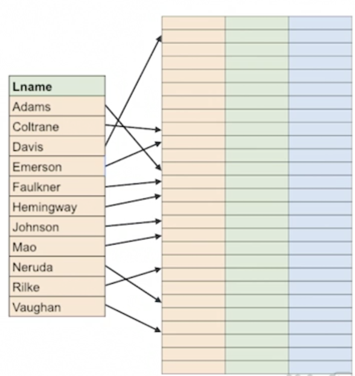
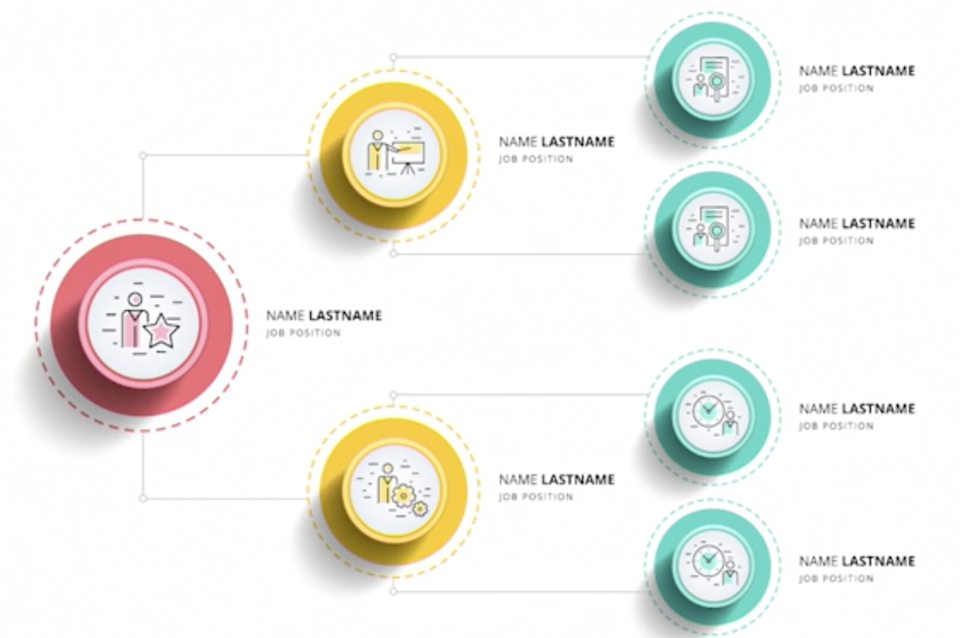
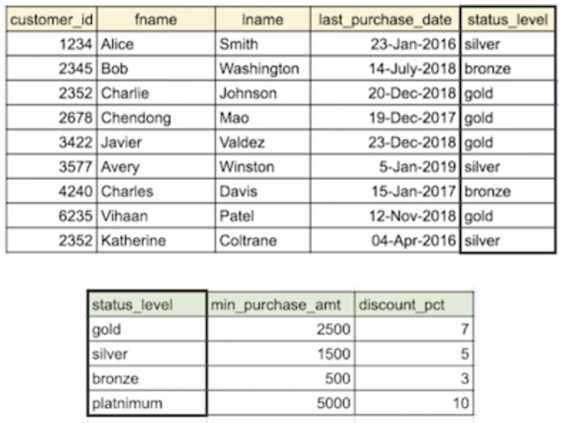
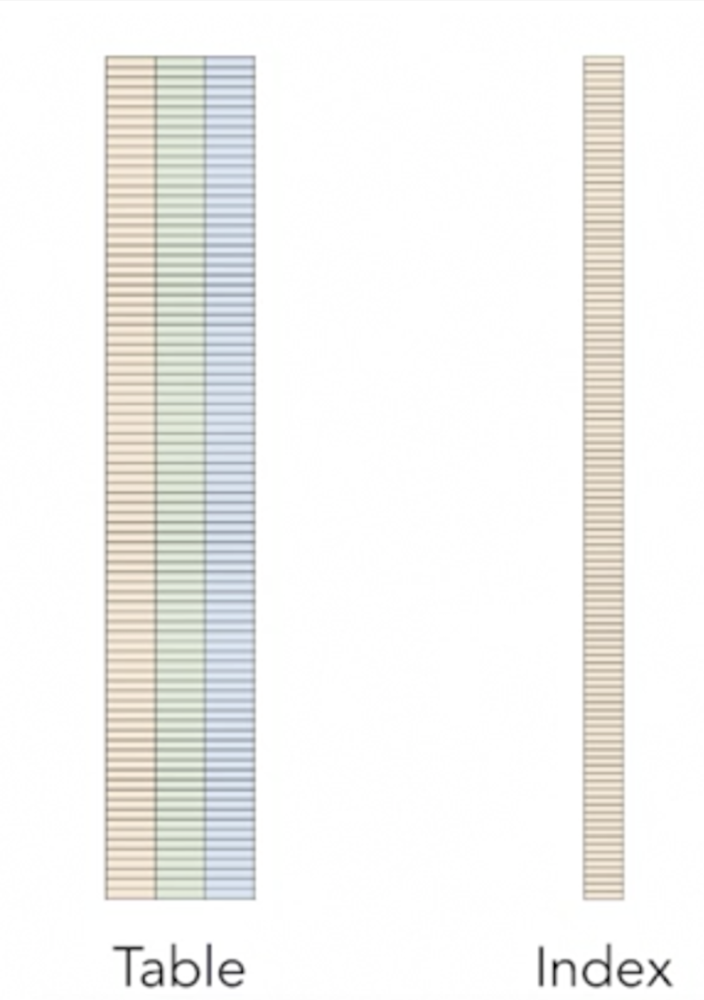
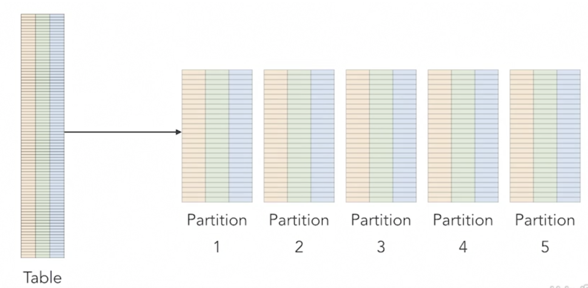
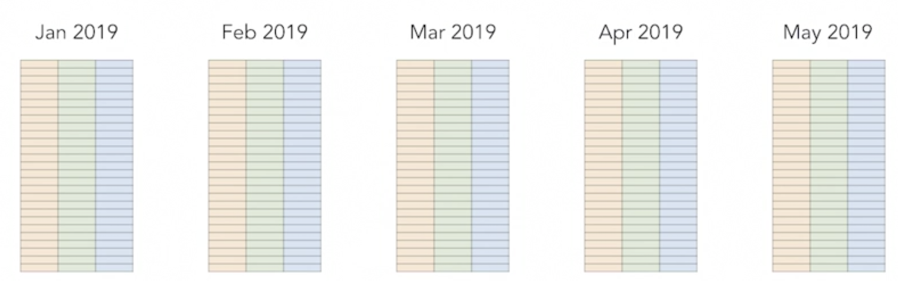
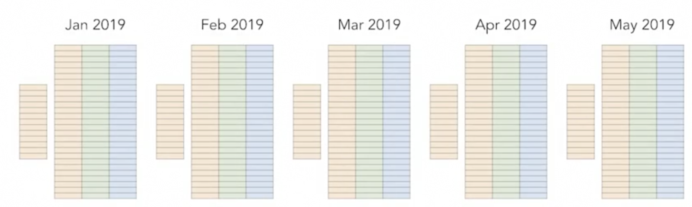
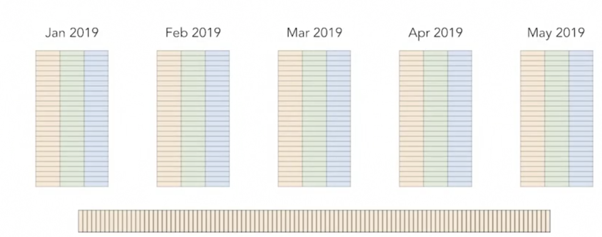

# How SQL Executes a Query

## Advanced SQL for Query Tuning and Performance Optimization

### Efficient Executions Plans

* Execution plans can be efficient ot inefficient
* **Inefficient**: Scanninig a table of 10000000 rows to find 100 rows that have `customer_id` staring with 3014
* **Efficient**: Using an index to find exactily where `cutomer_ids` that start with 3014 are located

## Scanning tables and indexes

### What is Scanning

Scanning is a linear operation, moving from one row to the next, and performing some operation, **like applying a filter to implement a `WHERE` clause.**

Scanning is simple. **The database fetches data blocks from persistent storage or cache, applies a filter, join, or other operation on the row, and then moves on to the next row.**

**The time it takes to finish the scan is based on the number of rows in the table**

### Scanning is simple 

* Scanning looks at each row
* Fetch data block containing row
* Apply filter or condition
* Cost of query based on number of rows in table 

### But not that simple 

* We are assuming row data stored together in data blocks on disk 
* **Not the case with columar storage**
* **Used in data warehouse and big databases**

Data is not always stored in a row-based fashion. Column-based storage is used in data warehouse and other big data applications.

### Cost based on number of rows

* **Scanning small tables is efficient**
* Scanning large tables can be efficient is few queries
* Scanning large tables repeatly is inefficient

Scanning all rows in a table is called a full table scan.

### Indexes Save scanning

**Creating indexes is a good way to avoid full table scans and make execution plans more efficient**. 

* **Indexes are ordered subsets of data in a table**
* Faster to search index for an attribute value
* Points to location of row
* Example: Filter by checking index for match, then retrieve now 

**If your WHERE clause references the index value, you can use the index to find the rows that meet the criteria rather than scanning the entire table**

#### Indexes are optimized for search

### Types of indexes

* B-tree, for equality and range queries
* **Hash indexes, for equality**
* Bitmap, for inclusion
* Specialized indexes, for geo-spatial or user-defined indexing strategies

## Joining tables

### How to match rows

* Foregin keys in one table
* Primary key in another table
* How to find matching key?

#### 1.Nested Loop Join

Compare all rows in both tables to each other

#### 2.Hash join

**Calculate hash value of key and join based on matching hash values**

#### 3.Sort Merge Join

**Sort both tables and then join rows while taking advantage of order**

### Nested Loop Join

* Loop through one table
* For each row, **loop through the other table**
* **At each step, compare keys**
* Two advantages of `Nested Loop Join`
	* Simple to implement
	* Can be expensive

### Hash joins

#### What is hash join

1. Hash joins calculate hash value for a current key and use that to look up the corresponding row. 
2. Hash values for one table are calculated and stored in a hash table. 
3. And then the other table is scanned, calculating the hash value of each key as it goes. 
4. Hash joins could be used for joins that have an equality comparison.

#### Attribute of hash join

* Compute hash valuyes of key in smaller tables
* **Store in hash table, which has hash value and row attributes**
* Scan larger table; find rows from smaller hash table

### Sort Merge join

* **Sort both tables**
* Compare rows like netsted loop join, but..
* Stop when it is not poosible to find a match later in the table because of the sort order
* **Scan the driving table only once**

## Partitioning data

### What is partitioning?

* **Store table data in multipl sub-tables, known as partitions**
* **Used to improve query, load and delete operations**
* Used for large tables
* **When subset of data is accessed or changed can be expensive**

### How to deal with large tables

* We could scan the table, **but large tables take a long time to scan**
* We can improve upon full table scans by creating an index. 

### Large tables <=> large indexes.

* **hash index** then we will have **constant time access to the index.** 
* **Balance tree index, or B-tree index** then the **depth of the index will grow at a logarithmic rate**

### Partition

We can break the large tables down into smaller partition

**We can scan just that partition table. This means operations that require scans can be done more efficiently.**

### Partition Key 

To know if the data you are looking for is in a particular partition, we have to use a **partition key**. 

**This is a `column` in a table that is used to determine which partition will store the data of that particular row**

###  <mark>It's common for partition keys to be `based on time`</mark>

#### We can use indexes with partitions.

* **`Local indexes` are used to improve the access time to rows in a particular partition.** 

* **`Global indexes`, which can provide faster look-ups to any data in the table across all partitions. This kind of index is helpful if you need to filter data on something other than the partition key and when the data is spread across multiple partitin**

