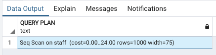
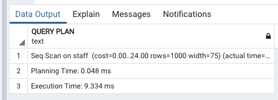
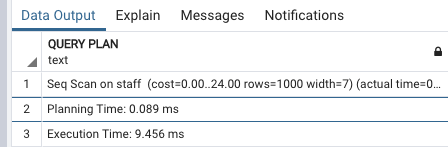
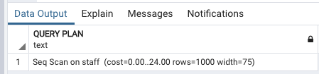
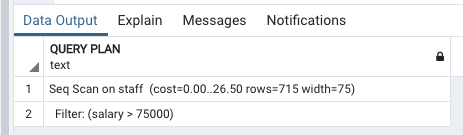
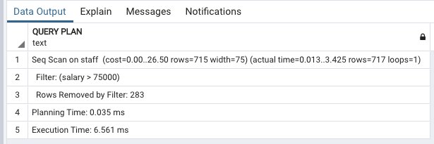
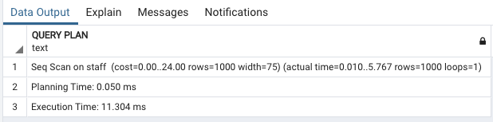
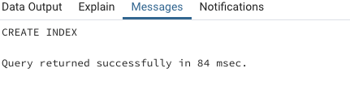
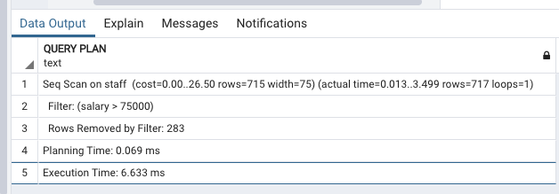
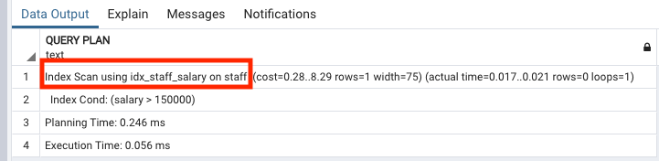

# Postgresql tools for tuning

## Explain and analyze

```
Explain select * from staff;
```




In this example, the cost spans from `00 to 24.00`. So the command starts at the first step of the execution time, or at time `0`. It completes after `24` units of computation


**Now this is just an internal metric, estimated by PostGres, it's not an actual measure of the time required to run the query.**

```
Explain Analyze select * from staff;
```




we also see the number of rows returned, and the width of the row.

**This gives us an indication of how much data is returned. We see in this example that we have a width of 75.** 

```
Explain Analyze select last_name from staff;
```



The width is only `7`, indicating less data is returned. 

If you're working with large data sets, or are concerned about how much data is returned by a query, you can use the row count and the width, to help guide you as you try to reduce the amount of data that's returned.

## Example plan: Selecting with a WHERE clause


```
explain select * from staff;
```



**Since this query has no WHERE clause, it must scan all the rows of the table, so the planner has chosen to use a simple sequential scan plan**. The numbers that are quoted in parentheses are (left to right):


* **Estimated start-up cost**. This is the time expended before the output phase can begin, e.g., time to do the sorting in a sort node.
* **Estimated total cost**. This is stated on the assumption that the plan node is run to completion, i.e., all available rows are retrieved. In practice a node's parent node might stop short of reading all available rows (see the LIMIT example below).
* **Estimated number of rows output by this plan node**. Again, the node is assumed to be run to completion.
* **Estimated average width of rows output by this plan node (in bytes)**.

因为这个查询没有WHERE子句，所以必须扫描表中的所有行，所以规划器选择使用简单的顺序扫描规划。括号中的数字从左到右依次是：

* 评估开始消耗。这是可以开始输出前的时间，比如排序节点的排序的时间。
* 评估总消耗。假设查询从执行到结束的时间。有时父节点可能停止这个过程，比如LIMIT子句。
* 评估查询节点的输出行数，假设该节点执行结束。
* 评估查询节点的输出行的平均字节数。

> It's about 24 units that were estimated it will require to fulfill this query
> So the total estimated time can actually be less when returning more data if there are fewer steps in the execution plan (than use `when`)

```
explain select * from staff where salary > 75000;
```

**Explain:** This will just estimate the cost. It's not actually going to execute it



**Estimate**:

Return about 715 rows. And the width is about 75


**Analyze:**

```
explain analyze select * from staff where salary > 75000;
```




```
explain analyze select * from staff;
```




## Indexes

**One common technique for improving query time performance is to use indexes. With indexes, we can avoid costly full table scans.** 

So let's create an index on the salary column in the staff table.

```
create index idx_staff_salary on staff(salary);
```



```
explain analyze select * from staff where salary > 75000;
```




**It appears that the index is still not used. We have a full table scan, and our filter, but we haven't used the index.** 

So the question is, so why wasn't an index used? **The reason is that there are so many rows with a salary greater than `75000`, that the query execution builder determined it would actually be faster to simply scan the while table rather than look up those rows in the index, and then actually read the table**. 

This is a case where our where clause is not selective enough to warrant using an index

```
explain analyze select * from staff where salary > 150000;
```



