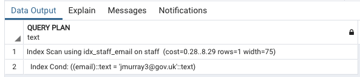

# Types of Indexing

* Indexing
* B-tree indexes
* B-tree index example plan
* Bitmap indexes (few distinct values and low-cardinality values)
* Bitmap index example plan
* Hash indexes
* Hash index example plan
* PostgreSQL-specific indexes

## Indexing

### Example Data Model


### Purpose of indexes

* Speed up access to data
* Help enforece constraints
* **Indexes are ordered**
* **Typically smaller than tables**

#### Help enforece constraints

For example, if we have a **unique constraint** on a column, then we can add a new row to the table and we can see if the value of the index column is already in the index. **This is faster than scanning the table to see if any row has a duplicate val**

### Indexing reduce scanning

* **The big advantage of indexes is that they reduce the need for full-table scans**. 
* Another factor that makes indexes so helpful with querying is that **indexes tend to be smaller than their corresponding tables**
* **This means that they're more likely to fit into memory**. That's great news for querying, because reading data from memory is much faster than reading data from a hard disk, or even from solid state drives, or SSD


### Index Features

* Indexes hold the value of the index column or columns and pointers to the location of corresponding rows. 
* **Indexes are not always unique, so there can be duplicates in the index**
* **Indexes are ordered** and that's an important difference from tables, which are usually unordered

### Implementing Index

* Data Structure separate from table
* Sometimes duplicates some data, for example, key
* Organized differently than table data

### Index Types

* **B-tree**
	* B-trees, or balance trees, are commonly used 
* **Bitmap**
	* Bitmap indexes are used when columns have **few distinct values**. This is known as **low cardinality**. Bitmaps are also used when our queries filter on these **low-cardinality values**
* Hash
  * Hash indexes are used when **we need to look up a value in a key value form**. 
* Special purpose indexes
	* **Postgres has specialized indexes**, which are designed for specific data types, like **geospatial data.**


## B-tree indexes

**In this example, we are looking for the value `15`** 

* so we make three comparisons at the nodes 50, 25, and 13 before finding the node with a value of 15. 
* Once we reach the node we want, we can find the reference to where the corresponding row is stored. 
* For example, the index may store the address of a datablock. 


### B-tree summary

* **Most common type of index** 
* Used when a large number of possib e values in a column (high cardinality) 
* **Rebalances as needed** 
* Time to access is based on depth of the tree (logarithmic time) 

## B-tree index example plan

**Full table scane without index**

```
explain select * from staff where email='jmurray3@gov.uk';
```


So now, let's create a B tree index on the `E-mail` column. 

**Now B tree is a default type of index, so we can use a basic create index command without specifying the B tree specifically**

```
create index idx_staff_email on staff(email);

explain select * from staff where email='jmurray3@gov.uk';
```



**The computationl units drop down from `26.5` to `8.29`**

## Bitmap indexes (few distinct values and low-cardinality values)

**Bitmap Indexes store a series of bits for indexed values**. 

**The number of bits used is the same as the number of distinct values in a column**.


### Bitmap Operations

```
(is_union_member = 'yes') AND (PAY_TYPE = 'Hourly')
```


### Bitmap Uses

* **Used when small number of possible values in column**(low cardinality)
* **Filted by bitwise operations, such as AND, OR, and NOT**
* Time to access is based on time to perform bitwise operations
* **Read-intensive use cases, few writes**


**Bitmap operations are fast, updating Bitmap Indexes can be more time consuming than other indexes. They tend to be used in read-intensive use cases, like data warehouses.**

### Bitmap Index availability

* Some databases allow you to create bitmap indexes explicitly(Oracle) 
* PostgreSQL does not 
* **But PostgreSQL builds bitmap indexes on the fly as needed**


## Bitmap index example plan
 

```
select distinct job_title from staff order by job_title;
```
 


### Full table scane

```
select * from staff where job_title='operator';
```


### With bitmap index

```
create index index_staff_job_title on staff(job_title);
```


**Now bitmap indexes are created on the fly by Postgres when it thinks it will be useful.**

```
explain select * from staff where job_title='Operator';
```


Again, the important thing here is, to keep your indexes up to date, so that you give the most information to the query planner and give it a number of different paths to get to the data that actually needs to be retrieved.

## Hash indexes

### Hash function

The basis of this kind of index is a function called the hash function.

* Function for **mapping arbitrary length data to a fixed-size string** 
* **Hash values virtually unique** 
* Even slight changes in input produce new hash 

```
f(x) = y
```

### Hash values

* **Size of hash value depends on algorithm used** 
* **No ordering preserving with hash functions** 
* **Similar inputs have vastly different outputs**


### Hash Features

* **Equality Only:**
	* **Hash indexes used when "=" is used, but not for ranges of values.**
* **Smaller Size Than B-Tree** 
	* Latest versions of PostgreSQL (10+) have improved hash indexes. 
* **As Fast as B-Tree** 
	* Builds and lookups are comparable; advantage is size; may fit in memory. 


## Hash index example plan

```
create index index_staff_email on staff using hash(email);
```

```
explain select * from staff where email='jmurray3@gov.uk';
```
 


## PostgreSQL-specific indexes

### Specialized Indexes 

Used in PostgreSQL, but may not have equivalents in other relational databases 

* GIST 
* SP-GIST 
* GIN 
* BRIN 

### GIST 

* **Generalized Search Tree**
* Not a single type of index 
* Framework for implementing custom indexes 

### SP-GIST 

* **Space-partitioned GIST** 
* Supports partitioned search trees 
* Used for nonbalanced data structures 
* Partitions do not hace to be same size

### GIN 

* **Used for text indexing** 
* Lookups are faster then GIST 
* Builds are slower then GIST 
* Indexes are 2-3 times larger than GIST 

### BRIN 

* **Block range indexing** 
* Used for large data sets 
* Divides data into ordered blocks 
* Keeps min and max values 
* Search only blocks that may have match 


