# Tuning Join

## What affects joins performance?

### Joins 

* INNER JOIN 
* LEFT OUTER JOIN 
* RIGHT OUTER JOIN 
* FULL OUTER JOIN 

### INNER JOIN 

* Most common join 
* Return rows from both tables that have corresponding row in other table 
* **Performed when joining in `WHERE` clause** 


```
select * 
from 
	company_region cr,
inner join 
	staff s
on
	cr.region_id = s.region_id
```

### LEFT OUTER JOIN 

* **Returns all rows from left table** 
* Returns rows from **right table** that have matching key 

```
select * 
from 
	company_region cr,
left outer join
	staff s
on
	cr.region_id = s.region_id
```

### RIGHT OUTER JOIN 

* **Returns all rows from right table** 
* Returns rows from **left table** that have matching key 

```
select * 
from 
	company_region cr,
right outer join
	staff s
on
	cr.region_id = s.region_id
```

### FULL OUTER JOIN 

* Returns all rows from both tables

```
select * 
from 
	company_region cr,
fuller outer join
	staff s
on
	cr.region_id = s.region_id
```

### Join features

#### Prefer inner joins

* Often fastest

#### Outer and Full Joins

* Require additional steps in addition to **INNER JOIN**


#### When need to NULLs

LEFT, RIGHT and FULL OUTER JOINS used when need to NULLs


## Nested loops


**Nested loops are a naive approach to joining tables**, but their big advantage is that they will work with any kind of join, using either **`equality`, `inequality`, or `range operators`**


* Two loops 
* **Outer loop iterates over one table, `the driver table`** 
* **Inner loop iterates over other table, `the join table`** 
* Outer loop runs once 
* **Inner loop runs once for each row in join table**

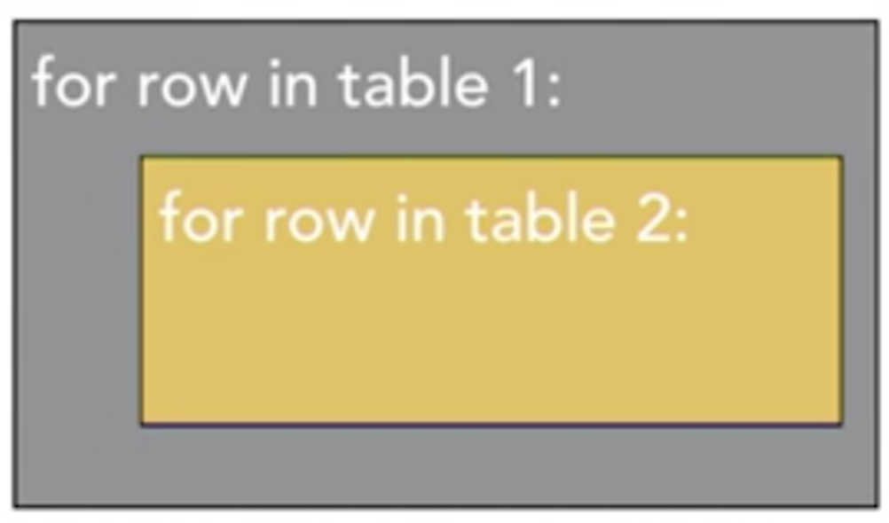 

### Nesr Loop Example

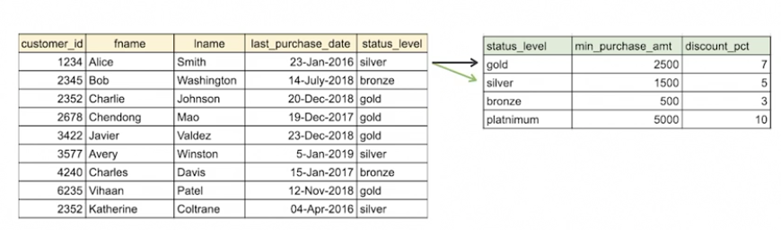 

###  Nested Loops Advanatge

* **Works with all join conditions** 
* **Low overhead**: **We don't need to create other data structures or sort tables** before looking for matches between foreign keys and primary keys. 
* Works well with **small tables** 
* Works well with small driver tables, and **joined column is indexed** 

###  Nested Loops Disadvantage

* **Can be slow**
* **If tables do not fit in memory, even slower performance because rows will have to read from SSD or hard disk drives**
* Indexes can improve the performance of nested loop joins, especially covered indexes 

## Nested loop example plan

### Join example

```
select s.id, s.last_name, s.job_title, cr.country
from 
    staff s 
inner join
    company_regions cr 
on 
    s.region_id = cr.region_id;
```

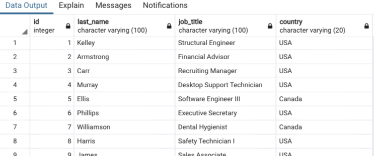 

### Explain the join sentense => it acutally is `hash join`

```
explain select s.id, s.last_name, s.job_title, cr.country
from 
    staff s 
inner join
    company_regions cr 
on 
    s.region_id = cr.region_id;
```

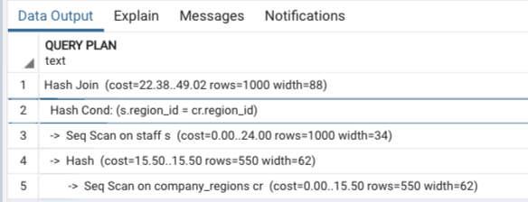 

**Why its hash join:**

In this case the Query Plan Builder has determined that a **hash join is the most efficient way to join these tables**. 

Now, that seems logical since there are a few distinct `company_regions` and we're using an equality operation on the join


### Use nest loop join


```
set enable_nestloop=true;
set enable_hashjoin=false;
set enable_mergejoin=false;

explain select s.id, s.last_name, s.job_title, cr.country
from 
    staff s 
inner join
    company_regions cr 
on 
    s.region_id = cr.region_id;
```

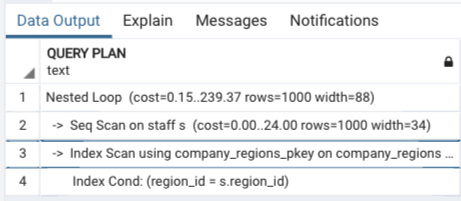 

## Hash joins

### Hash Functions 

* Function for mapping arbitrary length data to a value that can act as an index into an array 
* Hash values virtually unique 
* ven slight changes in input produce new hash 

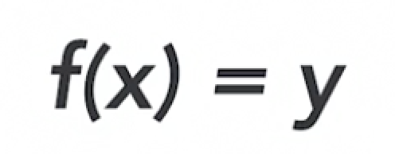 

### Build Hash Table 

* <mark>**Use the smaller of the two tables**</mark> 
* **Compute has value of primary key value** 
* **Store in table**

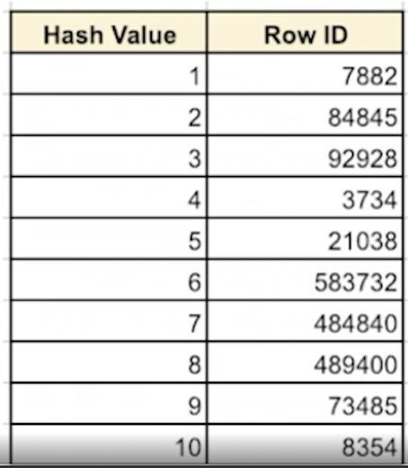 

### Probe hash Table

1. The **smaller of the two tables** is used. 
2. For each key value in the smaller table, **we compute a hash value and store that in the table**. 
3. The next step is called the **probe phase**. In this step, we **calculate the hash value of each row**, and then look up the corresponding value in the **hash table**. 
4. **The hash table contains a pointer, or reference to the location of the row we are joining to** 


#### Probe hash Table

* Step through large table 
* Compute Has value of primary or foreign key value 
* Lookup corresponcin value in hash table 

> The hash table contains a pointer, or reference to the location of the row we are joining to

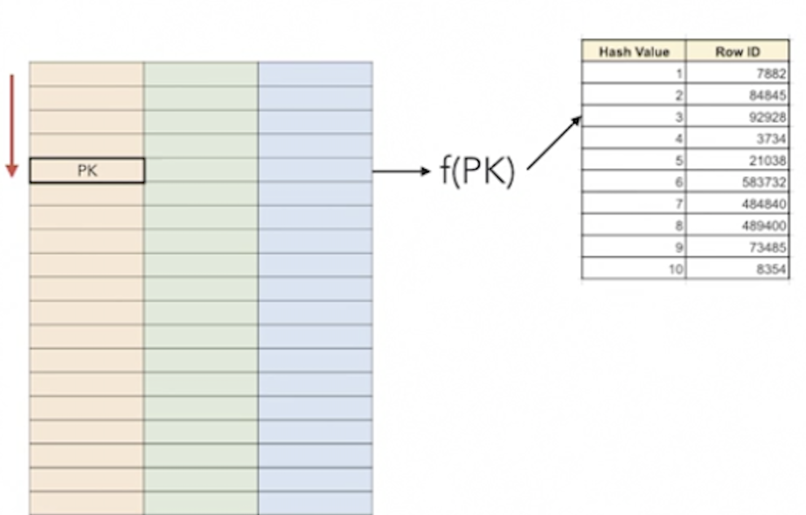 

### Hash joins Features

**Equality Only** 

> Hash joins used when "=" is used, but not other operators 

**Time Based on Table Size** 

> Rows in smaller table for build; 
> 
> rows in larger table for probe table 

**Fast Lookup** 

Hash value is index into array of row identifiers 


## Hash join example plan

```
set enable_nestloop=false;
set enable_hashjoin=true;
set enable_mergejoin=false;

explain select s.id, s.last_name, s.job_title, cr.country
from 
    staff s 
inner join
    company_regions cr 
on 
    s.region_id = cr.region_id;
```


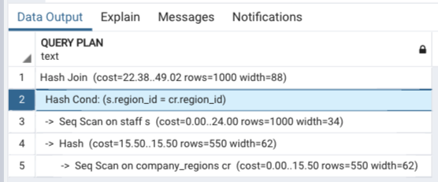 

* Row 2 in the explain plan indicates **the hash table is built on the company regions table（smaller table）**. 
* Row 3 indicates we're scanning the staff table and calculating a hash value, which is compared in Row 2. 
* The total cost of this join is just under 24 computational units.

## Merge joins

### Sorting
 
* **Merge join also known as `sort merge`** 
* **First step is sorting tables** 
* Takes advantage of ordering to reduce the number of rows checked 

### Merging

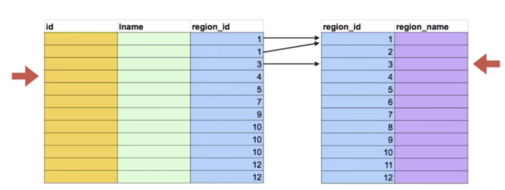 


* The first row of both tables, has a region-id of 1 so we have a match and we can return the row. 
* Next, **move to the second row of the larger table**. Again, we have a match on the first row of the smaller table so we can stop after the first row in the other table. 
* Now, we move our focus to the third row. 
	* There is no match with the first row of the second table, 
	* So we advance to the next row of the second table. Now there's no match here on the second row either. 
	* We advance to the third row of the second table and here we find a match. 
* And now, we advance to the fourth row of the first table and continue the process. 
  * However, we know that the value we're looking for in the second table must be equal to or greater than the last matched value. 
  * In this case we have a value of 4 in the larger table, and the last value we saw in the smaller table is 3. There's no reason to consider any rows before the 3 in the smaller table. 
  * So we can start looking for a match from the row with a value of 3


### Merge joins Features

**Equality Only** 

> Hash joins used when "=" is used, but not other operators 

**Time Based on Table Size** 

> Time to sort and time to scan

**Fast Lookup** 

Works while when tables do not fit in memory

## Merge join example

```
set enable_nestloop=false;
set enable_hashjoin=false;
set enable_mergejoin=true;

explain select s.id, s.last_name, s.job_title, cr.country
from 
    staff s 
inner join
    company_regions cr 
on 
    s.region_id = cr.region_id;
```

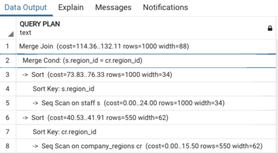 


* **Rows 3 to 6**: Sorting of the `staffs` table 
* **Rows 7 to 8**: Sorting of the `company_regions table`. 
* **Rows 1 and 2**: show the merge part of the join using the condition to match rows. 


### Join computational units compare

* The cost of this mergejoin is about `114/132` computational units. 
* The hash join took about 24 computational units 
* The nested loop join was 249 computational units 

### How to Choose Join types

#### Trust `Query Plan Builder`(automatically join method)

In general the Query Plan Builder will choose the optimal join method. You can use directives to compare costs between join methods. If you believe the Builder is not choosing the best method, you can use the `Explain` Plans to understand why. 

## Subqueries vs. joins

* Same logical outcome 
* SQL queries specify "what" 
* More than one way to express the same thing 


### How to choose

**Conventional Wisdom:**
 
> Always use joins; they are more efficient. 

**Improved Query Plans** 

> Query plan builders are more effective at optimizing subqueries. 

**Maximize Clarity** 

> Both will work well in many cases. Opt for what makes intention clear. 
