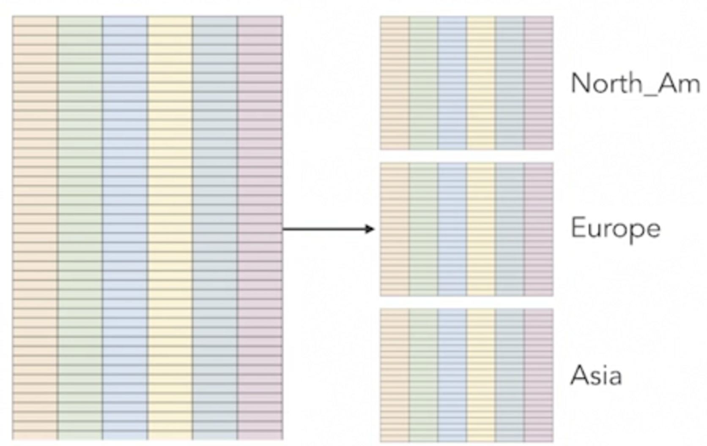

# partitioning Data

## Horizontal vs. vertical partitioning

### Horizontal Partitioning

* Large tables can difficult to query efficiently
* **Split tables by rows into partitions**
* Treat each partition like a table

 

### Benefits of Horizontal Partitioning 
 
* Limit scans to subset of partitions 
* **Local indexes for each partition**
* Efficient adding and deleting 

### Feautres of Horizontal Partitioning 

**Data Warehouses:** 

* Partition on time 
* Query on time 
* Delete by time 

**Timeseries:** 

* **Most likely query latest data** 
* Summarize data in older partitions 

**Naturally Partition Data:** 

* Retailer, by geography 
* Data science, by product category 


### Vertical Partitioning

* Implement as **separate tables** 
* No partitioning-specific definitions are required
* **Separate columns into multiple tables** 
* Keep frequently queried columns together
* **Use same primary key in all tables** 
 
### Vertical Partitioning Features

**Data Warehouses:** 

* Partition on groups of attributes

**Many Attributes:** 

* Wide variety of products, ecah with different attributes

**Data Analytics:** 

* Statistics on subsets of attributes; fater factor analysis

## Partition by range

### Range Partition 

 

* Type of horizontal partitioning 
* **Partition on non-overlapping keys**
* Partition by date is common 
* **Numeric range** 

### Range Partition Features

**Partition Key:**
 
Determines which partition is used for data

**Partition Bounds** 

Minimum and maximum values allowed in the partition 

**Constraints** 

**Each partition can have its own indexes, constraints**, and defaults 
 
### IoT Example on Partition

```
CREATE TABLE iot_measurement 
	(location_id int not null, 
	measure_date date not null, 
	temp_celcius int, 
	rel_humidity_pct int) 
	PARTITION BY RANGE (measure date); 
```

```
CREATE TABLE iot_measurement_wk1_2019 
PARTITION OF iot_measurement FOR VALUES 
FROM ('2019-01-01') TO ('2019-01-08');
 
CREATE TABLE iot_measurement_wk2_2019  
PARTITION OF iot_measurement FOR VALUES 
FROM ('2019-01-08') TO ('2019-01-15'); 

CREATE TABLE iiot_measurement_wk3_2019  
PARTITION OF iot_measurement FOR VALUES 
FROM ('2019-01-15') TO ('2019-01-22'); 
```

### When to use Partition by range

* **Query latest data** 
* **Comparative queries**, for example, same time last year 
* **Report within range**, for example, numeric identifier range 
* **Drop data after a period of time** 

## Partition by range example

```
CREATE TABLE iot_measurement 
	(location_id int not null, 
	measure_date date not null, 
	temp_celcius int, 
	rel_humidity_pct int) 
	PARTITION BY RANGE (measure_date); 
```

```
CREATE TABLE

Query returned successfully in 51 msec.
```

```
CREATE TABLE iot_measurement_wk1_2019 
PARTITION OF iot_measurement FOR VALUES 
FROM ('2019-01-01') TO ('2019-01-08');
 
CREATE TABLE iot_measurement_wk2_2019  
PARTITION OF iot_measurement FOR VALUES 
FROM ('2019-01-08') TO ('2019-01-15'); 

CREATE TABLE iiot_measurement_wk3_2019  
PARTITION OF iot_measurement FOR VALUES 
FROM ('2019-01-15') TO ('2019-01-22'); 
```

 

Each partition, we can define our own **constraints** and **rules** and **triggers** and **indexes**, so we can have our own constraints, indexes, rules and triggers with each partition. 

**Now notice there's no columns table and that's because the columns are inherited from the table definition and those can't be changed at the partition level**. 

So, that's why there's no columns listed.

## Partition by list

### List Partitioning 

* Type of horizontal partitioning 
* **Partition on non-overlapping keys** 
* **Partition on value or list of values** 


 

### List Partition Features

**Partition Key:**
 
Determines which partition is used for data

**Partition Bounds** 

List values for partition

**Constraints** 

**Each partition can have its own indexes, constraints**, and defaults 

### List Partition Example

```
CREATE TABLE products 
	(prod_id int not null, 
	prod_name text not null, 
	prod_short_descr text not null, 
	prod_long_descr text not null, 
	prod_category varchar) 
	PARTITION BY LIST (prod_category); 
```

```
CREATE TABLE product_clothing PARTITION OF products 
FOR VALUES IN ('casual_clothing', 'business_attire', 'formal_clothing'); 

CREATE TABLE product_electronics PARTITION OF products 
FOR VALUES IN ('mobile_phones', 'tablets', 'laptop_computers'); 

CREATE TABLE product_kitchen PARTITION OF products 
FOR VALUES IN ('food processor', 'cutlery', 'blenders'); 
```

### When to use Partition by list

 

* Data logically groups into subgroups
* **Often query within subgroups** 
* **Data not time oriented enough to warrant range oartition by time** 

 

## Partition by hash

### Hash Partition 

* Type of horizontal partitioning 
* **Partition on modulus of hash of partition key**

 


### Hash Partition Features

**Partition Key:**
 
Determines which partition is used for data

**Modulus** 

Number of partition

**Availability** 

PostgreSQL 11+, Oracle, MySQL

### Web Path Analysis Example

```
CREATE TABLE customer_interaction 
	(ci_id int not null, 
	ci_url text not null, 
	time_at_url int not null, 
	click_sequence int not null) 
PARTITION BY HASH (ci_id); 
```

```
CREATE TABLE customer_interaction_1 PARTITION OF customer_interaction 
	FOR VALUES WITH (MODULUS 5, REMAINDER 0); 

CREATE TABLE customer_interaction_2 PARTITION OF customer_interaction 
	FOR VALUES WITH (MODULUS 5, REMAINDER 1); 

CREATE TABLE customer_interaction_3 PARTITION OF customer_interaction 
	FOR VALUES WITH (MODULUS 5, REMAINDER 2); 

CREATE TABLE customer_interaction_4 PARTITION OF customer_interaction 
	FOR VALUES WITH (MODULUS 5, REMAINDER 3); 

CREATE TABLE customer_interaction_5 PARTITION OF customer_interaction 
	FOR VALUES WITH (MODULUS 5, REMAINDER 4); 
```

### When to use Partition by Hash

* Data **does not** logically group into subgroups 
* Want even distribution of data across partitions 
* **No need for subgroup-specific operations, for example, drop a partition**

## Partition by hash example

 
 
