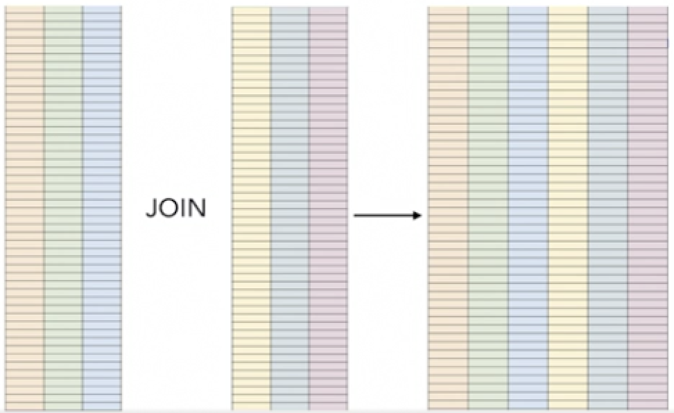

# Materialized views


**Materialized views combine some of the features of tables and views**. 

### Definition

Materialized views are disc-stored views that can be refreshed. Like views, they are defined by a database query. Unlike views, their underlying query is not executed every time you access them.

## Materialized views

* **Precomputed queries**
* Join and store results
* Apply other operations

 

### Materialized Features

**Duplicate Data**

Trading space for time

**Updates**

Updates to sources require updates to materialized views

**Potential Inconsistency**

refresh materialized view command

### Materialized views Example

```
CREATE MATERIALIZED VIEW my_staff AS 
	SELECT 
		s.last name, s.department, s.job_title, cr.company_regions 
	FROM 
		staff s 
	INNER JOIN 
		company_regions cr 
	ON 
		s.region_id = cr.region_id；  
```

### When and Why to use Materialized views

* **Time more important than storage space** 
* Can tolerate some inconsistencies 
* Or can refresh after each update to sources 

## Creating materialized views

 


## Refreshing materialized views

Now, **let's assume that our staff table has been updated. Those update operations will not update the materialized view**.

```
refresh materialized views my_staff
```

**This will rebuilds the entire view, the entire table.** 

**So even if you updated just a single row in one of the source tables, you're going to rebuild or reconstruct the materialized views and repopulate it with all of the rows.** 

So you just want to consider that in terms of the frequency of your refresh, you want to understand when you refresh, you will rebuild the entire table, so you may want to space out the refresh frequenc

