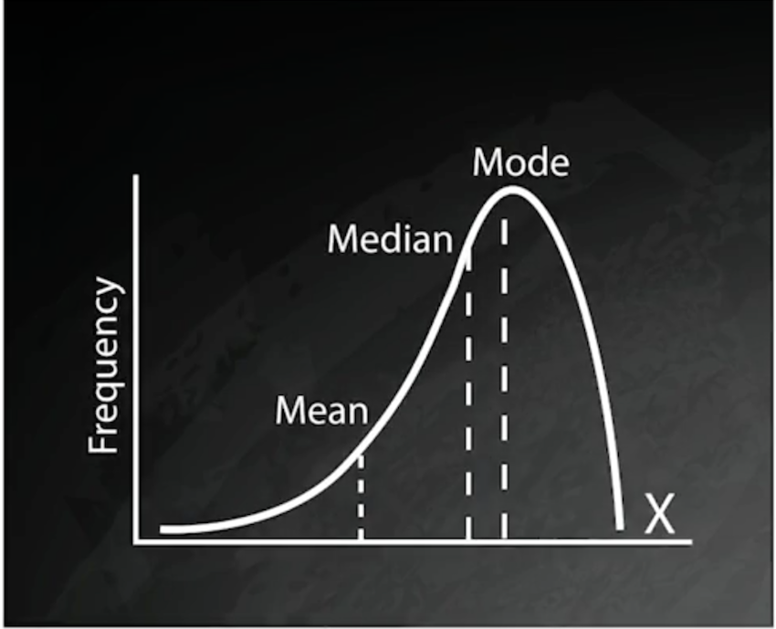

# Other Optimization Techniques

## Collect statistics about data in tables

### What Schemas Contain

* **Tables**
* **Indexes**
* **Constraints**
* **Views**
* **Masterialized Views**

**And statistics about the distribution of data in tables** 

### Statistics Features

**Size of Data**

Number of rows, amount oif storage used


**Frequency Data**

Fraction of nulls, number of distinct values, frequent values

**Distribution**

Histogram describing of data


### Normal Distribution

 

### Negative Skew Distribution

 

### Positive Skew Distribution

 

### Histogram Approximate Distribution

 


### Postgres `ANALYZE` Command 

* **Collect statistics** on columns, tables, or schemas 
* Not human readable/useful 
* Run automatically by `AUTOVACUUM` daemon or manually 


### Postgres `VACUUM` Command 

* Reclaim space of updated data 
* **VACUUM** reclaims space 
* **VACUUM(FULL) [tablename]** locks tables and reclaims more space 
* `VACUUM(FULL, ANALYZE) [tablename]` performs full vacuum and collects statistics

### Postgres `REINDEX` Command 

* Rebuilds corrupt indexes 
* Shouldn't be needed, but there are bugs 
* **Cleans up unused pages in `B-tree` indexes** 
* `REINDEX INDEX [indexname]` 
* `REINDEX TABLE [tablename]` 
* `REINIDX SCHEMA [tablename]`

 
## Hints to the query optimizer

* Some databases accept hints 
* Extra-SOL statements suggesting methods 
* Pushing boundary between declarative and procedural code 


```
SELECT /*+ INDEX(sales_transaction st_cust_idx)+*/ 
	c.last_name, c.city, c.postal_code, st.last_purchase_amt, st.total_purchase_amt_to_date 
	FROM 
		customers c 
	INNER JOIN 
		sales_transaction st 
	ON c.id = st.customer_id 
```

### Some Database support line hints

* Oracle 
* EnterpriseDB (based on Postgres) 
* MySQL 
* SQL Server 

 

### Postgres Uses Parameters

* SET Command
* SET enable_hashjoin=off
* SET enable_nestloop=on
* When using SSDs, trying setting `random_page_cost` and `sq_page_cost` to same value


### Some Caveats

* `ANALYZE` and `VACUUM` 
* Try other optimization techniques first 
* Verify query plan is consistently suboptimal 
* Watch for changes in amount or distribution of data 

### Parallel Execution 

* Query optimizer may determine all or part of a query can run in parallel 
* Executes parts of plan in parallel 
* Then gathers results 

### Parallel Query Details 

* `GATHER` or `GATHER MERGE` appears in query plan 
* All steps below `GATHER/GATHER MERGE` are executed in parallel 
* **Number of parallel processes limited by `max_parallel_workers` and `max_worker_processes` parameters** 

 

### In Order to Have Parallel Query 

* **`max_parallel_workers_per_gather` parameter must be greater than 0** 
* `dynamic_shared_memory_type parameter` must not be "none" 
* Database must not be running in **single-user mode**
* **Query does not `write data` or `lock rows`**
* **Does not use a function marked `PARALLEL UNSAFE` (e.g., user defined functions)**

### Parallel May Be Less Efficient 

* Parallel plans must exceed `parallel_setup_cost` and `parallel_tuple_cost` parameters 
* **Parallel index scans only supported for B-tree indexes** 
* Inner side of nested loop and merge join is `nonparallel` 
* Hash joins are parallel but each process creates a copy of the hash table 
 
## Improving SELECT Queries

### Indexing

* Create indexes on join columns, same for columns used in `WHERE` clauses 
* **Use covering indexes** 
* Don't filter on a column using equality to NULL (Example: `col1=NULL` use `IS NULL`) 
* Don't use functions in `WHERE` clauses unless you have a functional index 


### Index Range Scan
 
* If a plan uses `index ranger` scan, keep the range as small as possible 
* Use equality with conditions 
* **LIKE 'ABC%'** can use and index; **LIKE '%ABC'** cannot •
* Use indexes to avoid sorts with `ORDER BY`


### Filtering and Data Types 

* When **filtering on a range condition**, especially dates, use continuous conditions, such as `TRUNC(sysdate)` and `TRUNC(sysdate+1)` 
* **Don't separate date and time into separate columns**; use a `date time` datatype 
* **Don't store numeric data as char, varchar, or text**; use a `numeric` type 

