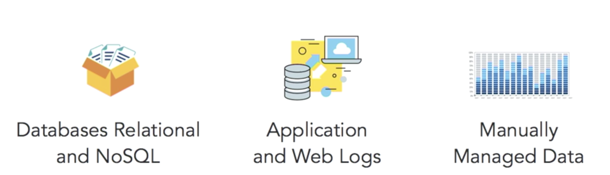
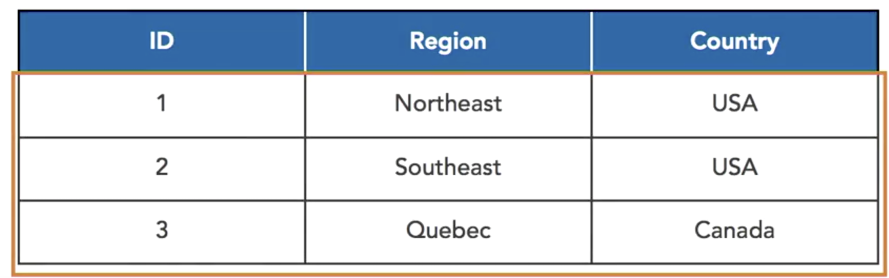
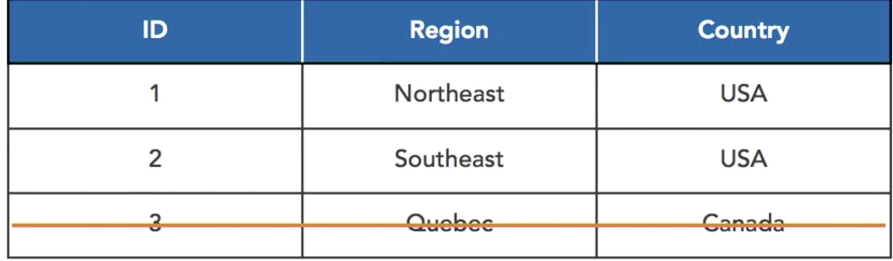

# SQL as Tool for Data Science

## Relational databases in data science


### Data Source

* Database Relational and NoSQL
* Application and Web Logs
* Manually Managed Data



## SQL data manipulation features

### Insert

```
insert into company_regions (region_id, region_name, country) values (1, 'Northeast', 'USA')
insert into company_regions (region_id, region_name, country) values (2, 'Southeast', 'USA')
insert into company_regions (region_id, region_name, country) values (3, 'Quebec', 'Canada')
```


### Update

The UPDATE command is used to change data that is already in a table.

**If a WHERE clause is not specified, then all rows in a table are updated.**

```
update company_regions set country='Unites States' where country = 'USA'
```

### Delete

The DELETE command is used to remove rows from a table. The command includes a table name, and an optional WHERE clause to determine which rows should be deleted from the table

```
delete from company_regions where country = 'Canada'
```



### Select

The SELECT command includes one or more table names, a list columns to retrieve, optionally one or more joins of tables, a WHERE clause, aggregate functions, and sorting and grouping commands.


```
select * from country_regions where id in (1,2)
```


Optionally, a WHERE clause can be used to filter the rows returned.

## SQL data definition features

* Tables
* Indexes
* Views
* Schemas

### Tables

Tables are used to organize related sets of data, like information about employees, products, and events. 

```
CREATE TABLE staff 
	(id INTEGER, 
	last name VARCHAR(30), 
	department name VARCHAR(25), 
	start_date DATE, 
	PRIMARY KEY (id) 
)
```

**The `CREATE TABLE` command has a clause called PRIMARY KEY**. 

This indicates which column or set of columns uniquely identifies each row. 

When a primary key is defined on a table, whenever a row is inserted into the table, it must have values in the primary key column or columns. Also, **that key can't already exist in the table. It has to be uniqe**


### Indexes

INDEX command lets us build an index to quickly look up rows and tables.

```
CREATE INDEX idx_staff_last_name 
ON staff 
USING (last_name) 
```

### Views

**Views are structures that help us focus on the most important data for a particular use.**

Views help make it easy to query data without including unneeded columns in our results. **Views also help retrieve data from multiple tables without having to repeatedly specify joins**

```
CREATE VIEW staff div AS 
 SELECT 
  s.id, 
  siast_name, 
  cd.company division 
FROM 
  staff s 
LEFT JOIN 
  company divisions cd 
ON 
  s.department = cd.department 
```

### Schemas

Schemas are like floor plans. **They organize groups of related structures such as database, tables, and views**

The CREATE SCHEMA command tells the database management system to create **an organizational space**, and in that space, we will keep related tables, indexes, views, and other structures

```
CREATE SCHEMA data sci 
```

* The top-level grouping is a schemas. 


**Schemas can have multiple tables and each table can have optional indexes**. 

Views can also be created to streamline querying, allowing developers and analysts to focus on the most important columns and easily retrieve data from multiple tables.

## ANSI standard SQL and variants

### ANSI Standard SQL

American National Standards Institute 

**Added features**

* Data science features 
* Objects 
* Advanced triggers 


### what does this mean for Data Scientist

Your database's SQL implementation may be different. Check your database documentation, especially: 

* Data types 
* Functions 


