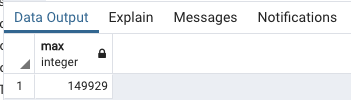
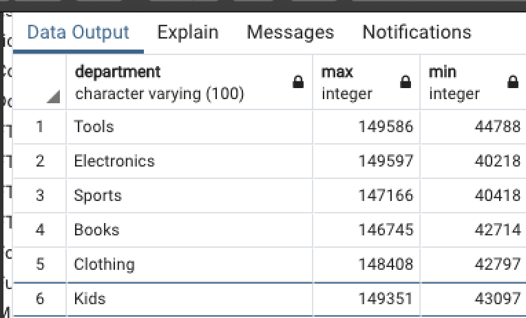

# Basic Statistics with SQL

## 1. CREATE TABLE and INSERT DATA

**`Query tool` to instert sql file**


`mock_staff.sql`

```
create table company_divisions (
    department varchar(100),
    company_division varchar(100),
    primary key (department)
  );

insert into company_divisions values ('Automotive','Auto & Hardware');
insert into company_divisions values ('Baby','Domestic');
insert into company_divisions values ('Beauty','Domestic');
...

create table company_regions (
   region_id int,
   company_regions varchar(20),
   country varchar(20),
   primary key (region_id)
  );
  
insert into company_regions values (1, 'Northeast', 'USA');
insert into company_regions values (2, 'Southeast', 'USA');
insert into company_regions values (3, 'Northwest', 'USA');
...

create table staff
  (
      id integer,
      last_name varchar(100),
      email varchar(200),
      gender varchar(10),
      department varchar(100),
      start_date date,
      salary integer,
      job_title varchar(100),
      region_id int,
      primary key (id)
  );

insert into staff values (1,'Kelley','rkelley0@soundcloud.com','Female','Computers','10/2/2009',67470,'Structural Engineer',2);
insert into staff values (2,'Armstrong','sarmstrong1@infoseek.co.jp','Male','Sports','3/31/2008',71869,'Financial Advisor',2);
...
```


```
INSERT 0 1

Query returned successfully in 200 msec.
```

**Right click tables `refrsh tables` will show all new tables**


```
select * from company_divisions;
```


```
select * from company_regions;
```


```
select * from staff;
```

## The COUNT, MIN, and MAX functions

### limit

**Show the first 10 rows of the staff table**

```
select * from staff limit 10;
```


### count

**Show the number of rows in the table staff**

```
select count(*) from staff;
```


**Show the number of staff members by gender**

```
select count(*) from staff GROUP BY gender;
```


**Now, show the number of staff member by gender and include the name of the gender**

```
select gender, count(*) from staff GROUP BY gender;
```


**Show the number of staff members in each department**

```
select department, count(*) from staff GROUP BY department;
```


**Show the maximum salary of all staff member**

```
select max(salary) from staff;
```




**Show the minimum salary of all staff member**

```
select min(salary) from staff;
```


**Show the minimum salary of all staff member**

```
select max(salary), min(salary) from staff;
```


**Show the minimum and maximum salary in each department**

```
select department, max(salary), min(salary) from staff GROUP BY department;
```



**Show the minimum and maximum salary by gender**

```
select gender, max(salary), min(salary) from staff GROUP BY gender;
```


## Statistical functions

**Sum the total amount of salary paid to staff**

```
select sum(salary) from staff;
```


**Sum the total amount of salary paid to staff by department**

```
select department, sum(salary) from staff group by department;
```


**Sum the total, and average (or mean) amount of salary paid to staff by department**

```
select department, sum(salary), avg(salary) from staff group by department;
```


**Sum the total, average (or mean) and `variance` of salary paid to staff by department**

```
select department, sum(salary), avg(salary),var_pop(salary) from staff group by department;
```


**Sum the total, average (or mean), `variance` and `standard deviation` of salary paid to staff by department**

```
select department, sum(salary), avg(salary),var_pop(salary), stddev_pop(salary) from staff group by department;
```


**Use round function to round to 2 decimal places**

```
select department, sum(salary), round(avg(salary),2),round(var_pop(salary),2), round(stddev_pop(salary),2) from staff group by department;
```


## Filtering and grouping data

**Filter based on numeric values**

```
select last_name, department, salary from staff where salary > 100000;
```


**Filter based on character values**

```
select last_name, department, salary from staff where department='Tools';
```


**Filter based on multiple attributes, all filters must be met**

```
select last_name, department, salary from staff where department='Tools' and salary>100000;
```


**Filter based on multiple attributes, at least one filter must be met**

```
select last_name, department, salary from staff where department='Tools' or salary > 100000;
```


**Filter based on patterns in character strings**

```
select department, sum(salary) from staff where department like 'B%' group by department;
```


```
select department, sum(salary) from staff where department like 'Bo%' group by department;
```


```
select department, sum(salary) from staff where department like 'B%y' group by department;
```


