# Data Munging with SQL

## Reformatting character data

**1.List each department name once**

```
select distinct
  department
from
  staff;
```

2.Convert the names of departments to **upper case**

```
select distinct upper(department) from staff;
```

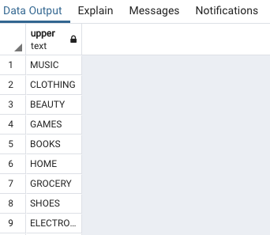

3.Convert the names of departments to **lower case**

```
select distinct lower(department) from staff;
```

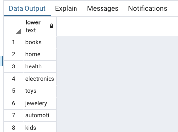

4.**Concatenate** two character strings

```
select job_title || '-' || department from staff;
```

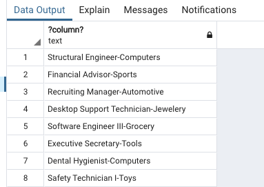


5.**Use alias to rename concatenated column**

```
select job_title || '-' || department title_dept from staff;
```

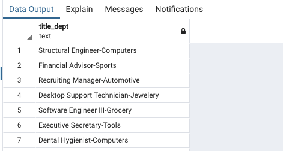

6.**Use trim to remove trailing and leading spaces**

```
select trim(' Software Engineer ');
```
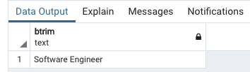

7.**Verify length of string with leading and trailing spaces**

```
select length(' Software Engineer ');
```

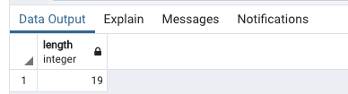


8...and now **verify length** is shorter when leading and trailing spaces are removed

```
select length(trim(' Software Engineer '));
```

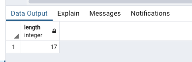

9.Show all job titles that **start wtih Assistant**

```
select job_title from staff where job_title like 'Assistant%'
```

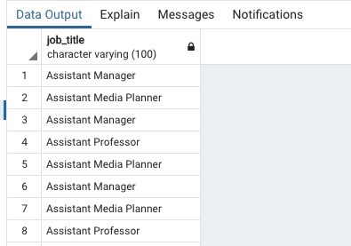

10.**Create a new boolean column** indicating if a staff person has the term Assistant anywhere in their title.

```
select job_title, (job_title like '%Assistant%') is_asst from staff
```

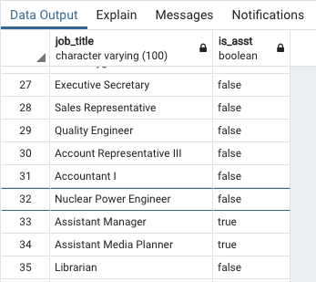

## Extracting or Replaccing strings from character data 


1.Use a string of 12 characters for experimenting with string extraction

```
select 'abcdefghijkl' test_string;

```
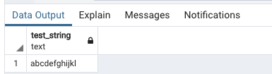

2.**Select the first three characters of the string**

```
select substring('abcdefghijkl' from 1 for 3) test_string;
```
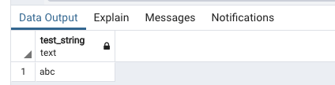


3.Select a **subset from the middle of the string**

```
select substring('abcdefghijkl' from 5 for 3) test_string;
```

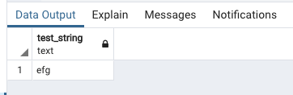

4.Select a substring **starting in the middle and going for the lenght of the string**

```
select substring('abcdefghijkl' from 5) test_string;
```
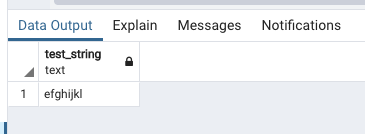

5.Select Assistant job tiltles, and **extract the main job category**

```
select substring(job_title from 10) from staff where job_title like 'Assistant%';
``` 

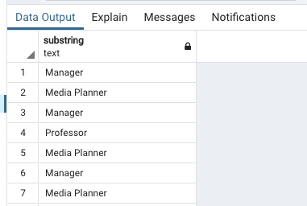

6.**Replace a substring with another string using overlay**

```
select overlay('abcdefghijkl' placing 'CDEF' from 3 for 4);
```


7.**Change Assistant to Asst in job title**

```
select overlay(job_title placing 'Asst.' from 1 for 9) from staff where job_title like 'Assistant%';
```

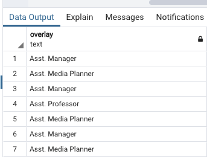

## Filtering with regular expressions

1.**Select lis of job titles that begin wiht Assistant**

```
select job_title from staff where job_title like '%Assistant%';
```

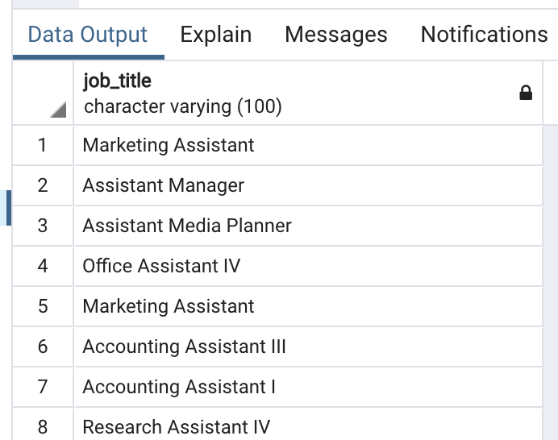

2.**Select a list of job titles that include Assistant III or IV**
> `|` is the regular expression OR operator 

```
select job_title from staff where job_title similar to '%Assistant%(III|IV)';
```
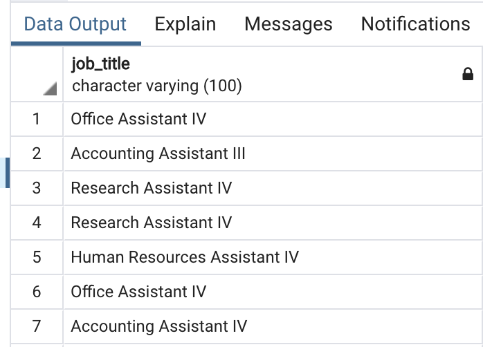

3.**Select a list of job titles that include Assistant II, IV or any other 2 character starting with `I`**

> `|` is the regular expression OR operator

```
select job_title from staff where job_title similar to '%Assistant I_';
```

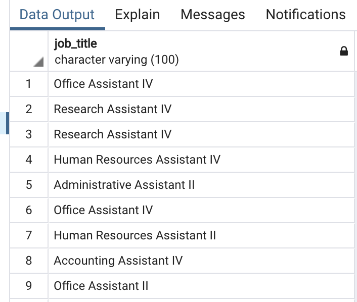

4.**Select a list of job titles that begin with `E`, `P`, or `S`**

> `|[]` are used to list characters that can match

```
select job_title from staff where job_title similar to '[EPS]%';
```

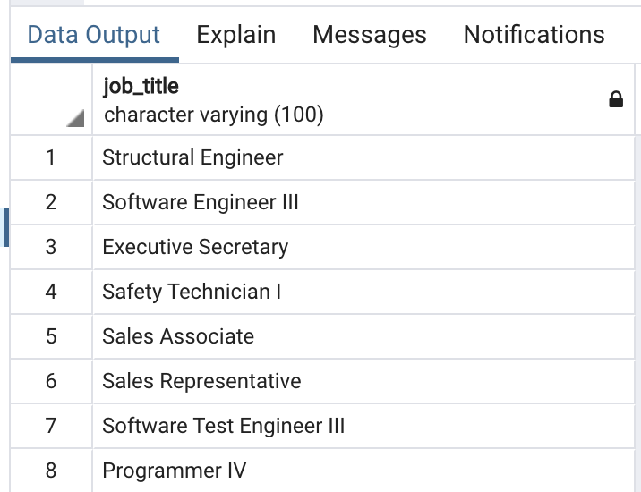

5.**Select a list of job titles that include Assistant I, II or III but not I;**

>  `|` is the regular expression OR operator

```
select job_title from staff where job_title similar to '%Assistant%(I)*';
```

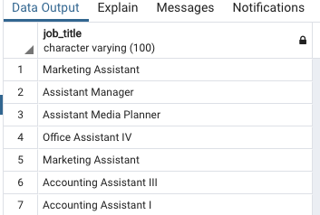


## Reformatting numeric data

* `ROUND` function used to round the number to the nearest 
* `TRUNC` used to `truncate/delete` the number from some position. Some cases both returns same result.

```
TRUNC(25.67)    ROUND(25.67)
————            ————
25              26
```

1.**truncate decimal values toward zero**

```
select department, avg(salary), trunc(avg(salary)) from staff group by department;
```

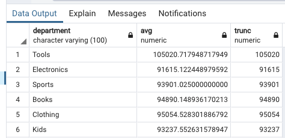

2.**Truncate decimal values toward zero and round up when decimal portion `> .5`**

```
select department, avg(salary), round(avg(salary)) from staff group by department;
```

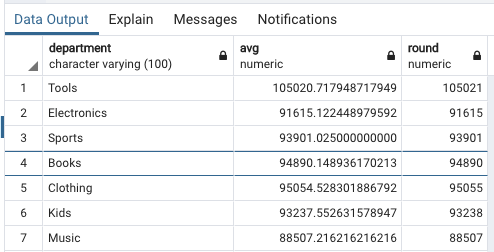

3.**Round can be used to round to a number of decimal places**

```
select department, avg(salary), round(avg(salary),2) from staff group by department;
``` 

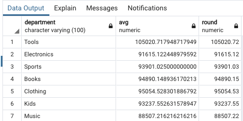

4.**Trunc can be used to truncate to a number of decimal places**

```
select department, avg(salary), round(avg(salary),2), trunc(avg(salary),2) from staff group by department;
```

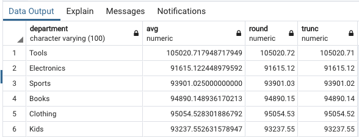


5.**Both round and trunc can be used to truncate to a variable number of decimal places**

```
select department, avg(salary), round(avg(salary),3), trunc(avg(salary),4) from staff group by department;
```

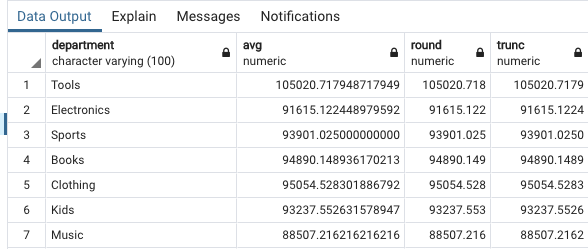

```
select department, avg(salary), trunc(avg(salary)), floor(avg(salary)) from staff group by department;
```
```
select department, avg(salary), trunc(avg(salary)), ceil(avg(salary)) from staff group by department;
```
