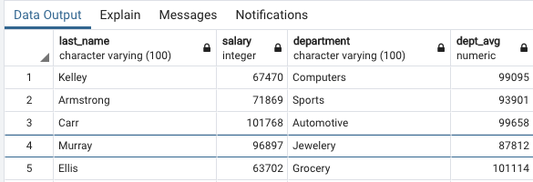
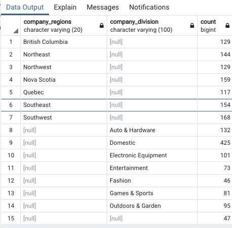

# Filtering, Join, and Aggregation

## Subqueries in SELECT clauses


* Include department's average salary in each row with staff 
* Use an alias on table names so that one table can be queried in subqueries and top level queries

```
select s1.last_name, s1.salary, s1.department, 
    (select round(avg(salary)) from staff s2 where s2.department = s1.department)
from staff s1;
```


```
select s1.last_name, s1.salary, s1.department, 
    (select round(avg(salary)) from staff s2 where s2.department = s1.department) dept_avg 
from staff s1;
```




## Subqueries in FROM clauses


* Select columns from a subquery instead of a table 

* Find the average of executive salaries, defined as salaries > 100,000

```
select department, round(avg(salary)) from
(select s2.department, s2.salary from staff s2 where salary > 100000) s1
group by department;
```


## Subqueries in WHERE clauses 

### Subqueries in WHERE clauses are useful for making comparisons within a single table

* Select the department that has the employee with the highest salary 

```
select s1.department from staff s1 where 
	(select max(salary) from staff s2) = s1.salary;
```


## Joining tables

> Join staff and department. If the staff department is not found in company_divisions, then no row will be returned. 

```
select s.last_name, s.department, cd.company_division 
    from staff s join company_divisions cd 
    on s.department = cd.department;
```


**The previous query did not return 1,000 rows. What rows are missing?**

```
select distinct department
from
   staff
where department not in
(select department from company_divisions);
```

>  Use an outer join to return all rows, even it a corresponding row in company_divsion does not exist.

```
select s.last_name, s.department, cd.company_division 
    from staff s left join company_divisions cd 
    on s.department = cd.department;
```


```
select s.last_name, s.department, cd.company_division 
    from staff s left join company_divisions cd 
    on s.department = cd.department where cd.company_division is NULL; 
```


> Since department occurs in both staff and `company_divisions` we need to use an alias to specify which table should be use

**`s.*, cd.company_division, cr.company_regions`**

```
select s.*, cd.company_division, cr.company_regions
    from staff s left join company_divisions cd 
    on s.department = cd.department left join  company_regions cr 
    on s.region_id = cr.region_id;
```


## Creating a view

###  Create a view to minimize the amount of typing and reduce the risk of making a mistake

```
create view staff_div_reg as 
select s.*, cd.company_division, cr.company_regions
    from staff s left join company_divisions cd 
    on s.department = cd.department left join  company_regions cr 
    on s.region_id = cr.region_id;
```


> Verify the view has 1,000 rows

```
select count(*) from staff_div_reg;
```


> Get the number of employees in each region

```
select company_regions, count(*) 
	from staff_div_reg group by company_regions 
	order by company_regions;
```


## Grouping and totaling

>  Get employee counts by division and by region

### If you want counts by both region and division we can use `GROUPING SETS` .


`GROUP BY GROUPING SETS` is equivalent to the `UNION` of two or more `GROUP BY` operations in the same result set:

* `GROUP BY GROUPING SETS((a))` is equivalent to the single grouping set operation `GROUP BY a`.
* `GROUP BY GROUPING SETS((a),(b))` is equivalent to `GROUP BY  a UNION ALL GROUP BY b`.

```
select company_regions,company_division, count(*) 
from staff_div_reg 
group by 
    grouping sets(company_regions, company_division)  
    order by company_regions, company_division;
```



```
select company_regions,company_division, gender, count(*) from staff_div_reg group by 
    grouping sets(company_regions, company_division, gender)  order by company_regions, company_division, gender;
```


> Now, add in gender to break down even further Get employee counts by division and by region 

```
create or replace view staff_div_reg_country as 
    select s.*, cd.company_division, cr.company_regions, cr.country
    from staff s
    left join company_divisions cd
    on s.department = cd.department
    left join company_regions cr
    on s.region_id = cr.region_id;
```


## ROLLUP and CUBE to create subtotals

>  Select nubmer of employees by company_region and country

```
select company_regions,country, count(*) from staff_div_reg_country 
group by company_regions, country 
order by company_regions,country;
```


###  Use `rollup` operation on the group by clause to create `hierarchical sums`

`GROUP BY ROLLUP `is an extension of the `GROUP BY` clause that produces sub-total rows (in addition to the grouped rows). Sub-total rows are rows that further aggregate whose values are derived by computing the same aggregate functions that were used to produce the grouped rows.

> ROLLUP grouping as equivalent to a series of grouping sets

```
select company_regions,country, count(*) from staff_div_reg_country 
group by rollup(company_regions, country) 
order by company_regions,country;
```


### Use cube operation on the group by clause to create `all possible combination` of sets of grouping columns 

```
select company_regions,country, count(*) from staff_div_reg_country group by 
    cube(company_regions, country)
```


## FETCH FIRST to find top results

**Now, fetch first works with the order by clause to sort and limit results. Fetch first is like the limit keyword,**

* **fetch first works with the order by clause to sort the results before selecting the rows to return**. 
* **Limit actually limits the number of rows, and then performs the operation**


> Use order by and fetch first to limit the number of rows returned


```
select last_name, job_title, salary from staff 
order by salary desc fetch first 10 row only;
```


> Select a simple column - aggregrate combination with a sort order

```
select company_division, count(*) from staff_div_reg_country 
group by company_division order by count(*);
```


> Set the sort order to descending 

```
select company_division, count(*) from staff_div_reg_country 
group by company_division order by count(*) desc;
```


> Use fetch first with order by to select top 5 divisions by staff count

```
select
   company_division, count(*)
from
   staff_div_reg
group by
   company_division
order by
   count(*) desc
fetch first
   5 rows only;
```


