# Window functions and ordered data

## Window functions: `OVER PARTITION`

**Window functions allow us to make SQL statements about rows that are related to the `current row` during processing.** 

This is somewhat like the way subqueries work. They let us do an operation that's related to the current row that SQL is processing.


For example, **instead of using a subquery to calculate an average salary for an employee's department**, we can use a windowing function on rows called `OVER PARTITION`.


>  Select individual salary and average department salary

Look at an average salary for each department. I can specify the average salary aggregate and then say I would like to have the average salary over a partition. And I use the phrase `PARTITION BY`

```
select department, last_name, salary, avg(salary) over (partition by department) from staff;
``` 

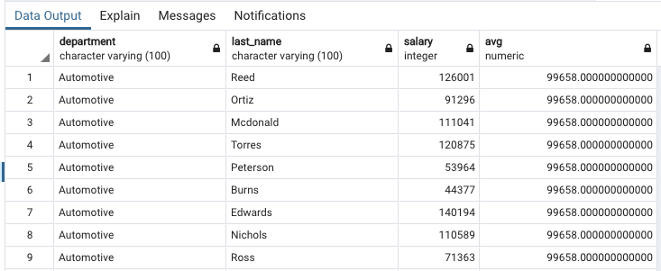


>  Use a windowing operation with a different aggregate function

```
select department, last_name, salary, max(salary) over (partition by department) from staff;
```

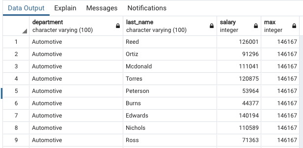

> Use a windowing operation with a different aggregate function and different grouping 

```
select company_region, last_name, salary, min(salary) over (partition by department) from staff_div_reg;
```

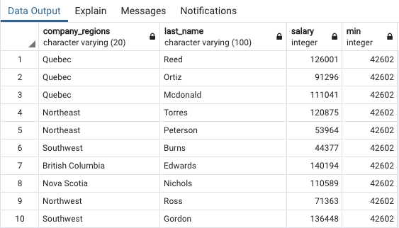

## Window functions: `FIRST_VALUE`


We could also select a set of attributes grouped by department and include the first value by department in each row using something called The `First Value` Function.

> Select a set of attributes grouped by department, include the first value by department in each row 

```
select department, last_name, salary, first_value(salary) 
over (partition by department order by salary DESC) 
from staff;
```

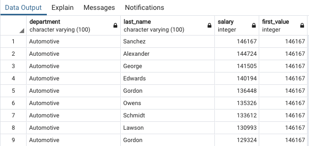

**`first_value` col** show based on first row in salary col

```
select department, last_name, salary, first_value(salary) 
over (partition by department order by last_name) from staff;
```

> order by `last_name` and `first_value` show the first `last_name(Adams)` salary

```
select department, last_name, salary, first_value(salary) 
over (partition by department order by last_name) 
from staff;
```


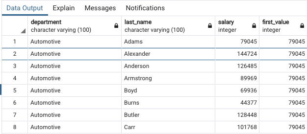


##  Window functions: `RANK`

Rank function. **It works with the partition operation to order results and assign a Rank value based on the way the partition data is sorted**


> Order results and include the relative rank by row 

```
select department, last_name, salary,
rank() over (partition by department order by salary desc) 
from staff;
```

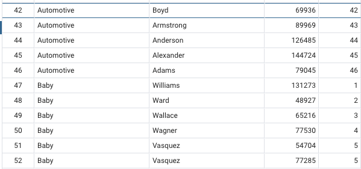


## LAG and LEAD

Newer versions of SQL provide additional features for operating on **rows related to the currently processed row.**


### Lag

For example, **if you want to know a person's salary and the next lower salary in the department**, we could use the **lag function** to reference rows relative to the currently processed rows


>  Use lag to reference rows behind

```
select department, last_name, salary, lag(salary) over (partition by department order by last_name desc) from staff;
```

> In Automotive department, no one's salary is higher than `146167`, so it's null

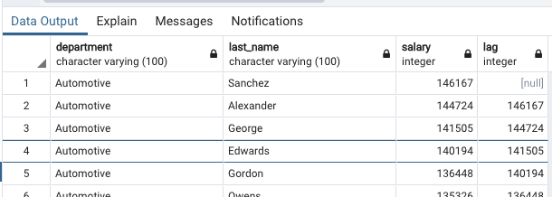


> In Baby department, no one's salary is higher than `148687`, so it's null


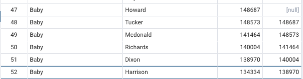


### Lead 

**Lead is essentially the opposite of lag. Because it refers to the column that comes after the currently processed column.**


> Use lead to reference rows ahead 

```
select department, last_name, salary, lead(salary) over (partition by department order by salary desc) from staff;
```

> In Automotive department, no one's salary is lower than `42602`, so it's null

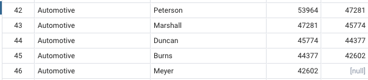

> In Automotive department, no one's salary is lower than `42924`, so it's null

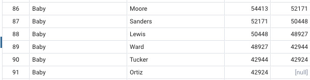


## NTILE functions


**Sometimes we want to group rows into some number of buckets or ordered groups.**

We can use the ntiles function to assign buckets to rows. This allows us to easily calculate statistics like core tiles over sets of row

>  Use ntiles to assign "buckets" to rows 
> Include quartiles in list of salaries by department

```
select department, last_name, salary, ntile(4) over (partition by department order by salary desc) from staff;
```

###  Ntile is the window function we use when we want to group rows into some number of buckets or ordered groups.


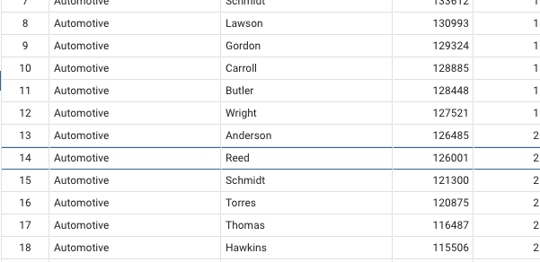

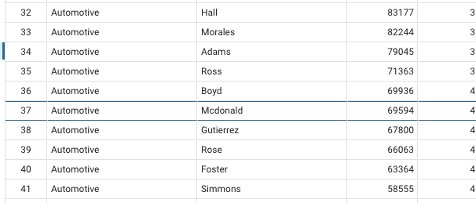

* In this case, the top earners in the automotive department are assigned number one. 
* Now, the second group is assigned the value of number two. So this is the second group based on the order of salary. 
* And the third group is assigned number three. 
* And then the fourth group has the lowest set of salaries and that's assigned number four.

> It is important to note, the number of rows in each group is the same, plus or minus one. If the total number of rows is not evenly divisible by the number of buckets, then some of the buckets will have one more row than othe


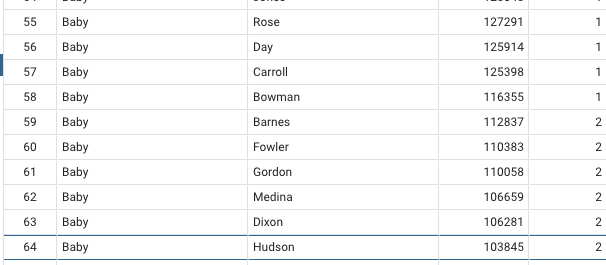
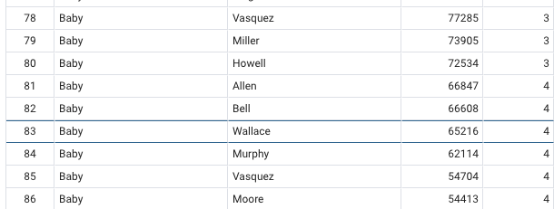

> Now also, as you notice, as we shift to a new department, we start the tiling again