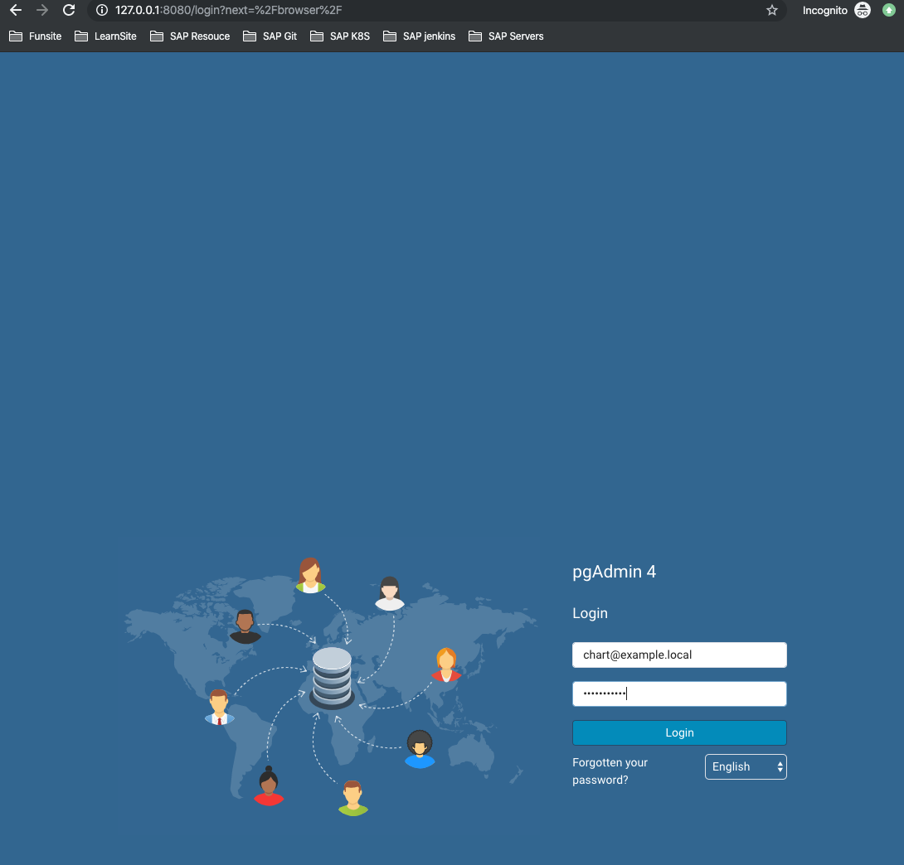
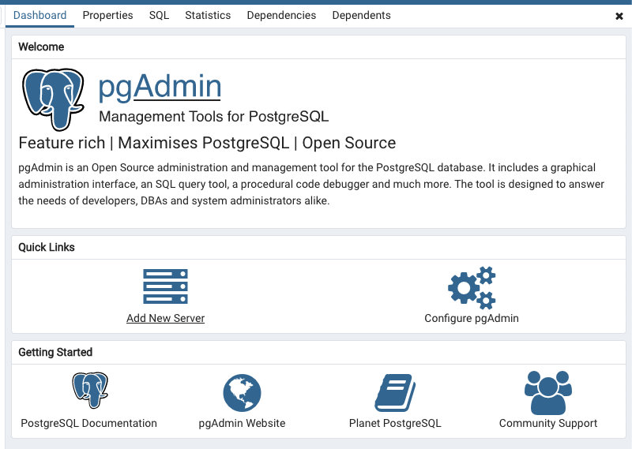
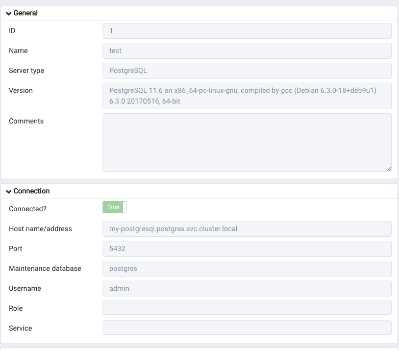
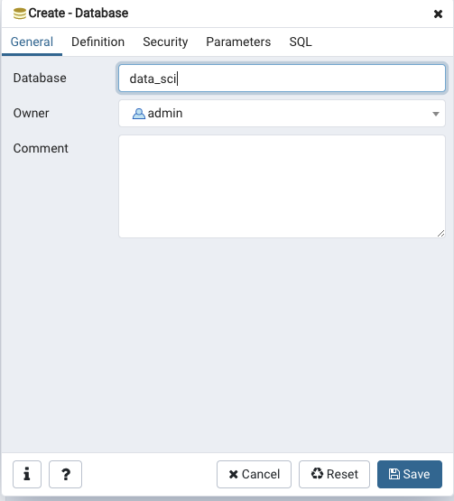
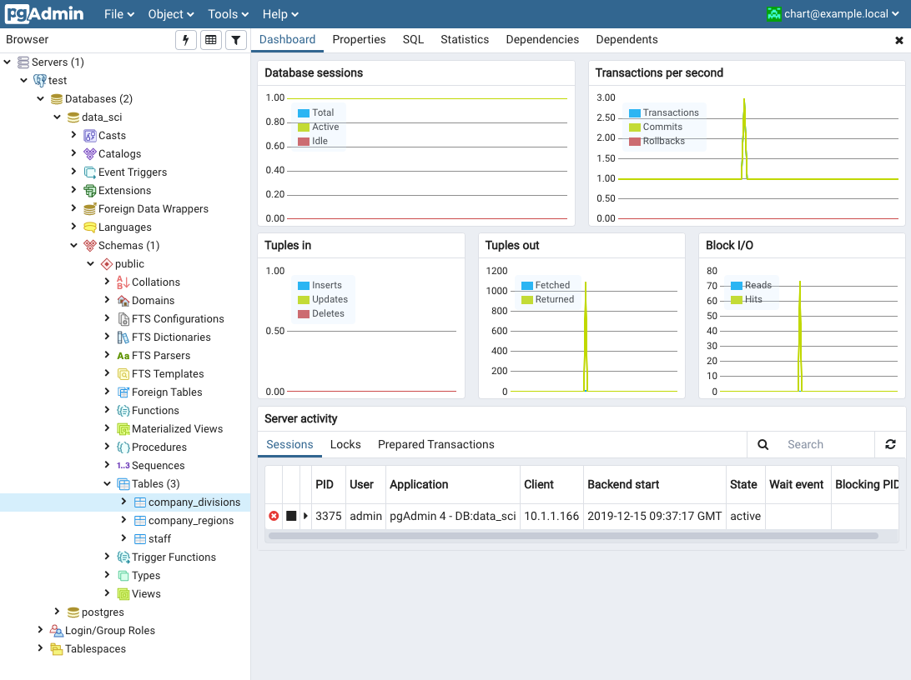

# Using Kubernetes to Deploy PostgreSQL and Pgadmin

## Traditional Way

[https://severalnines.com/database-blog/using-kubernetes-deploy-postgresql](https://severalnines.com/database-blog/using-kubernetes-deploy-postgresql)


## Helm Way 

* helm version : 3.0.0

```
$ helm version
version.BuildInfo{Version:"v3.0.0", GitCommit:"e29ce2a54e96cd02ccfce88bee4f58bb6e2a28b6", GitTreeState:"clean", GoVersion:"go1.13.4"}
```

### PostgreSQL Install

[https://github.com/helm/charts/tree/master/stable/postgresql](https://github.com/helm/charts/tree/master/stable/postgresql)

**`postgres_value.yaml`**

```
postgresqlUsername: admin
postgresqlPassword: admin
persistence:
  enabled: false
```

* Username: admin
* Password: admin

```
$ kubectl create ns postgres
namespace/postgres created
```

**Install PostgreSQL with helm**

```
$ helm install  my-postgresql -f postgres_value.yaml stable/postgresql -n postgres
NAME: my-postgresql
LAST DEPLOYED: Sun Dec 15 16:57:24 2019
NAMESPACE: postgres
STATUS: deployed
REVISION: 1
TEST SUITE: None
NOTES:
** Please be patient while the chart is being deployed **

PostgreSQL can be accessed via port 5432 on the following DNS name from within your cluster:

    my-postgresql.postgres.svc.cluster.local - Read/Write connection

To get the password for "admin" run:

    export POSTGRES_PASSWORD=$(kubectl get secret --namespace postgres my-postgresql -o jsonpath="{.data.postgresql-password}" | base64 --de
code)

To connect to your database run the following command:

    kubectl run my-postgresql-client --rm --tty -i --restart='Never' --namespace postgres --image docker.io/bitnami/postgresql:11.6.0-debian-9-r0 --env="PGPASSWORD=$POSTGRES_PASSWORD" --command -- psql --host my-postgresql -U admin -d postgres -p 5432


To connect to your database from outside the cluster execute the following commands:

    kubectl port-forward --namespace postgres svc/my-postgresql 5432:5432 &
    PGPASSWORD="$POSTGRES_PASSWORD" psql --host 127.0.0.1 -U admin -d postgres -p 5432
 
```

* **Postsql DNS**: ` my-postgresql.postgres.svc.cluster.local` This will be used in Pgadmin settup


**To connect to your database from outside the cluster**

* Step one: Install psql command tool

```
brew install libpq
echo 'export PATH="/usr/local/opt/libpq/bin:$PATH"' >> ~/.bash_profile
source ~/.bash_profile
```

* Step two: Open connection from `bash one`

```
kubectl port-forward --namespace postgres svc/my-postgresql 5432:5432
```

* Step three: Open connection from `bash two`

```
psql --host 127.0.0.1 -U admin -d postgres -p 5432
Password for user admin: 
psql (12.1, server 11.6)
Type "help" for help.

postgres=>

\list
                                  List of databases
   Name    |  Owner   | Encoding |   Collate   |    Ctype    |   Access privileges   
-----------+----------+----------+-------------+-------------+-----------------------
 postgres  | postgres | UTF8     | en_US.UTF-8 | en_US.UTF-8 | =Tc/postgres         +
           |          |          |             |             | postgres=CTc/postgres+
           |          |          |             |             | admin=CTc/postgres
 template0 | postgres | UTF8     | en_US.UTF-8 | en_US.UTF-8 | =c/postgres          +
           |          |          |             |             | postgres=CTc/postgres
 template1 | postgres | UTF8     | en_US.UTF-8 | en_US.UTF-8 | =c/postgres          +
           |          |          |             |             | postgres=CTc/postgres
(3 rows)

postgres-> \q
```


### Pgadmin  Install

[https://github.com/helm/charts/tree/master/stable/pgadmin](https://github.com/helm/charts/tree/master/stable/pgadmin)

**`pgadmin_values.yaml`**

```
persistence:
  enabled: false

# env:
#   email: chart@example.local
#   password: SuperSecret
```


```
$ helm install  my-pgadmin -f pgadmin_values.yaml stable/pgadmin -n postgres
NAME: my-pgadmin
LAST DEPLOYED: Sun Dec 15 17:23:52 2019
NAMESPACE: postgres
STATUS: deployed
REVISION: 1
NOTES:
1. Get the application URL by running these commands:
  export POD_NAME=$(kubectl get pods --namespace postgres -l "app.kubernetes.io/name=pgadmin,app.kubernetes.io/instance=my-pgadmin" -o jsonp
ath="{.items[0].metadata.name}")
  echo "Visit http://127.0.0.1:8080 to use you
```

```
$ kubectl get svc -n postgres
NAME                     TYPE        CLUSTER-IP     EXTERNAL-IP   PORT(S)    AGE
my-pgadmin               ClusterIP   10.107.67.77   <none>        80/TCP     30s
my-postgresql            ClusterIP   10.110.88.97   <none>        5432/TCP   26m
my-postgresql-headless   ClusterIP   None           <none>        5432/TCP   26m
```

```
$ kubectl port-forward -n postgres svc/my-pgadmin 8080:80
Forwarding from 127.0.0.1:8080 -> 80
Forwarding from [::1]:8080 -> 80
Handling connection for 8080
Handling connection for 8080
...
```



* email: chart@example.local
* password: SuperSecret

### Add new PostgreSQL Server to Pgadmin  

**Add New Sever**






* name: test
* Host name(DNS): `my-postgresql.postgres.svc.cluster.local`


**Add new database `data_sci`**




