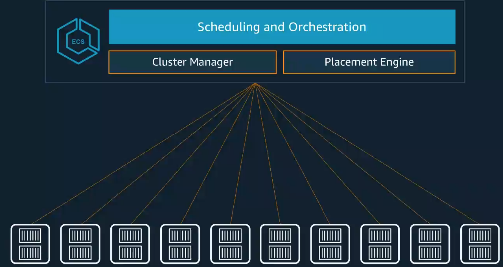

# AWS 上的容器服务概览

## 微服务架构

#### 云原生架构是小块，松散地链接在一起

### 什么是Serverless

* 无需预置基础设置，无需管理
* 自动扩容
* 为价值付费
* 高可用且安全

### Serverless是跨越许多不同类别服务的运营模型

#### Compute 

* AWS Lambda
* AWS Fargate

#### Data Stores

* Amazon S3
* Amazon Aurora Serverless
* Amazon DynamoDB

#### Integeration

* Amazon API Gateway
* Amazon SQS
* Amazon SNS
* AWS Step Functions
* AWS AppSync

## 软件交付的改变

### 微服务开发生命周期

### 最佳实践

* 解耦更敏捷
* 自动化一切
* 标准化工具
* 腰带和吊带 （治理，模板）
* 基础架构及代码

## 客户为什么喜欢容器服务？

### 典型使用场景

* 微服务： Java, Node.js, Go, Web Apps, etc.
* 持续集成与持续发表（CICD)
* 批处理与ETL
* 应用程序部署的常见`Paas`堆栈
* 传统应用程序迁移到云
* 混合工作负载
* `AI/ML`
* 规模测试
* `IoT`场景的后端

### AWS容器服务概念

#### 管理

容器化应用的部署，调度，扩展和管理

* Amazon Elastic Container Service
* Amazon Elastic Container Service for kubernetes

#### 主机

容器在哪里运行

* Amazon EC2	
* AWS Fargate

#### 镜像仓库 (Container Image Repository)

* Amazon Elastic Container Registry

#### ECS 

#### 麦当劳： 为何选择Amazon ECS

* 推向市场的速度
* 可伸缩性和可靠性
* 安全
* `DevOps-CICD`
* 监控

#### 没有Fargate, 您管理的不仅仅是容器

#### AWS Fargate

##### Run serverless containers for Amazon Elastic Container Service

* 由AWS管理

无需预置， 扩展或管理EC2实例

* 弹性

无缝伸缩，按使用fuf

* 集成

使用AWS生态系统： VPC网络， ELB， IAM权限， Cloudwatch等等

#### 使用AWS ECS + Fargate完全托管的容器环境

### AWS + Kubernetes

* 51% 在 Kubernetes 工作负载运行在AWS上

Kubectl + `mycluster.eks.amazonaws.com` + `AZ1+AZ2+AZ3`

#### 客户如何使用Amazon EKS

* 微服务
* platform-as-a-Service
* 企业营业迁移
* 机器学习

#### Amazon Container Service

* Amazon ECS
* Amazon EKS
* AWS Fargate
* Amazon ECR

## 新服务

### 新服务： AWS Cloud Map

**所有云资源的服务发现** 

* 持续监控每种资源的健启状况 
* 动态更新每个微服务的位置 

**提高开发人员生产力** 

* 所有应用资源的单一注册表 
* 使用用户友好的名称定义资源 

**与Amazon容器服务集成** 

* AWS Fargate 
* Amazon ECS 
* Amazon EKS

### 新服务：AWS App Mesh

**可观察性和流量管理**
 
* 轻松导出日志, 指标和跟踪 
* 客户端流一断路、重试
* 部署应用路由

**适用于集群和容器服务** 

* Amazon ECS 
* Amazon EKS 
* Kubernetes on EC2 
* AWS Fangate

**AWS构建并运行**

* 无需管理控制平台
* 易于运营
* 大规模

