# AWS EKS Introduction

## Amazon EKS 服务路线图摘要

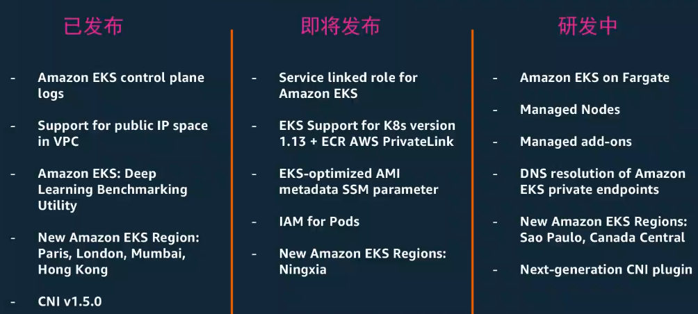

### eksctl - 安装管理Amazon EKS 集群的利器

* 最简单的命令行创建集群工具

```
eksctl create cluster -nodes=4
```

* 在Github上已开源 [https://eksctl.io/](https://eksctl.io/)
* 由 Weave 和 AWS 共同构建
* `Amazon EKS` 官方支持CLI工具


#### 自由一选择需要的实例类型 

* 标准的EC2计算实例类型 
* P2和P3的GPU加速实例 
* I3裸金属实例 
* **竞价实例**（Spot Instance interrupt handLer) 

#### 	自由一选择需要的AMI镜像 

* `Amazon EKS`已优化的`AMI` 

其中`GPU`优化`AMI`包含支持`NVIDIA`驱动的`P2`和`P3`实例镜像，使得`Amazon EKS`上可以轻松运行`TensorFiow`等`AI`框架。 

使用`Packer`轻松自定义`Amazon EKS AMI`

`https://github.com/awslabs/amazon-eks-ami`

#### 配置 Worker node

* AWS Cloudformation
* eksctl
* Terraform and Pulumi Rancher

#### Amazon VPC CNI Plugin 支持

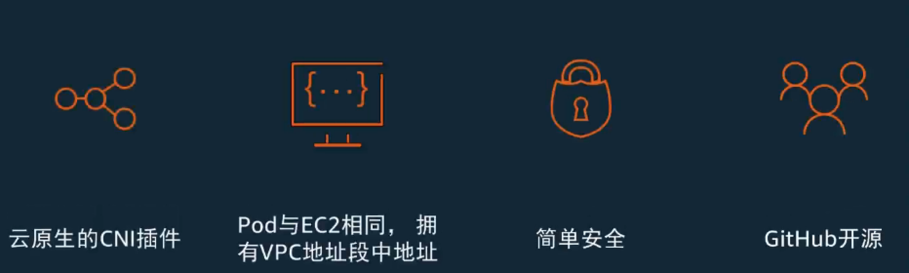

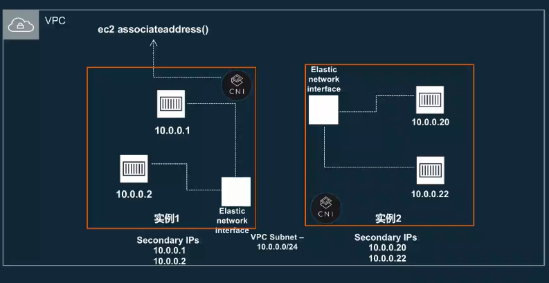

[https://github.com/aws/amazon-vpc-cni-k8s](https://github.com/aws/amazon-vpc-cni-k8s)

### 负载均衡

AWS云原生的三类弹性负载均衡服务全部支持 

* `NLB`和`CLB`由 `Kubernetes Service` 中 `type=LoadBatancer` 支持 

* (NLB支持方式 -> `annotations: servicebeta.kubernetes.io/aws-load-baLancer-type: "nlb"`) 

* 内部及外部`Load Batancer`支持（`internat LB`支持方式 -> annotation: `service.beta.kubernetes.io/aws-Load-balancer-internal: 0.0.0.0/0`) 

#### Service load balancer: Network Load Balancer

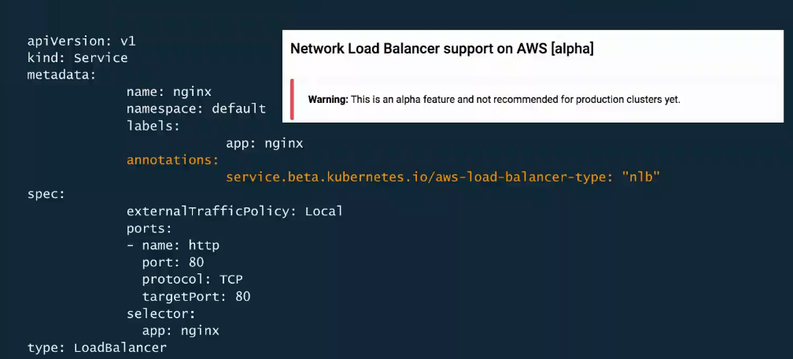


### Kubernetes ServiceType: LoadBalancer 

* 借助云原生的负载均衡能力暴露`Service` 
* 每个通过`LoadBatancer` (`ELB`或`NLB`)暴露出来的`Service`获得自己的访问地址 
* 可封装`L4 (TCP)`或`L7 (HTTP)`层`Service` 
* `NLB`支持客户端访问IP地址透传到后端节点 


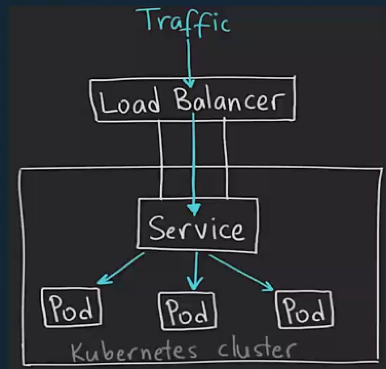

### Kubernetes Ingress

* 通过HTTP/HTTPS协议路由到集群内相关服务 
* 多种实现方式：`ALB`, `NGINX F5`, `HAProxy`等． 

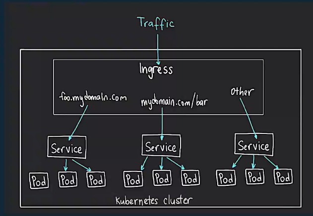

## 云端安全工具

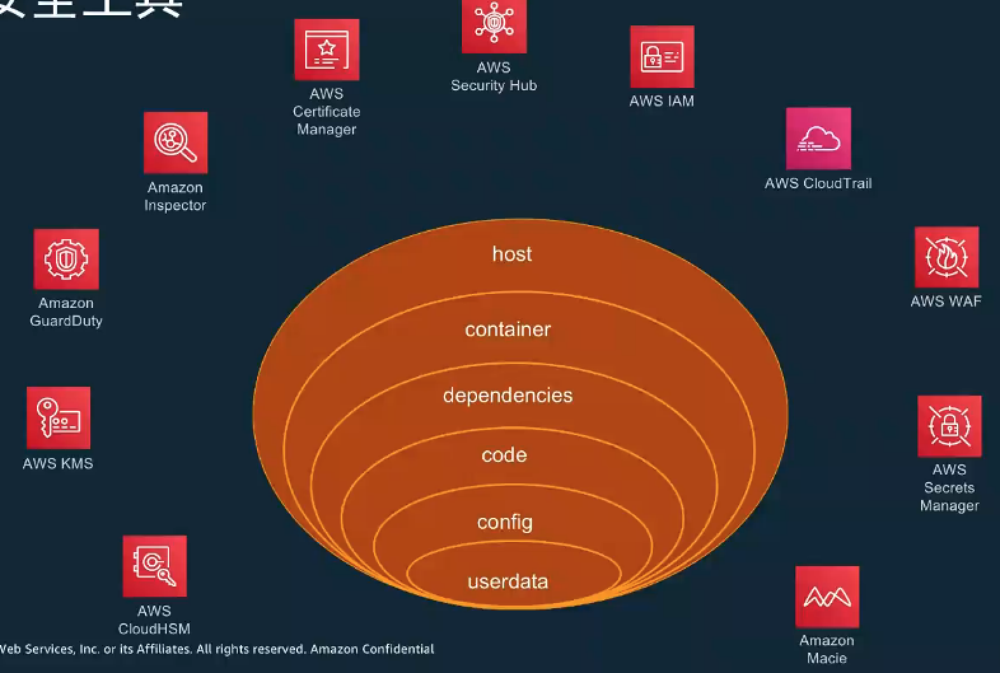

### AWS Identity and Access Management (IAM)

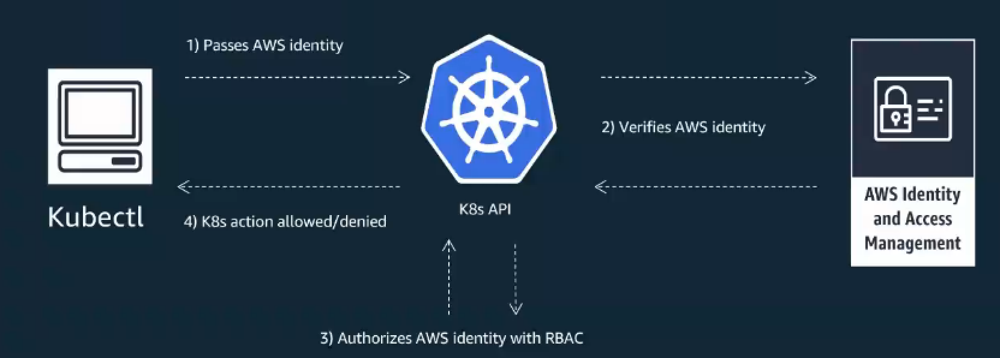

### IAM for pods（产品路线图中） 

* 在`pod`层面设置`IAM`访问控制权限 
* 在同一工作节点上为不同的`Pod`赋予不同的权限 
* 建立使用`Kubernetes`原则，最小化用户权限 

### AWS EKS logging

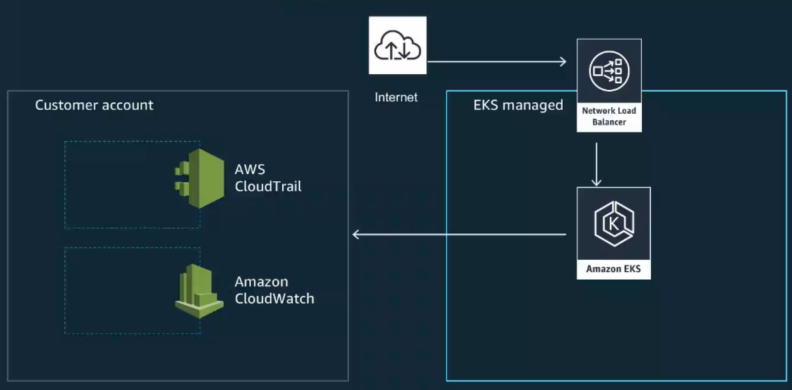


#### Kubectl logs

* ElasticSearch(Index)
* Fluentd（Store)
* Kibana (visualize)

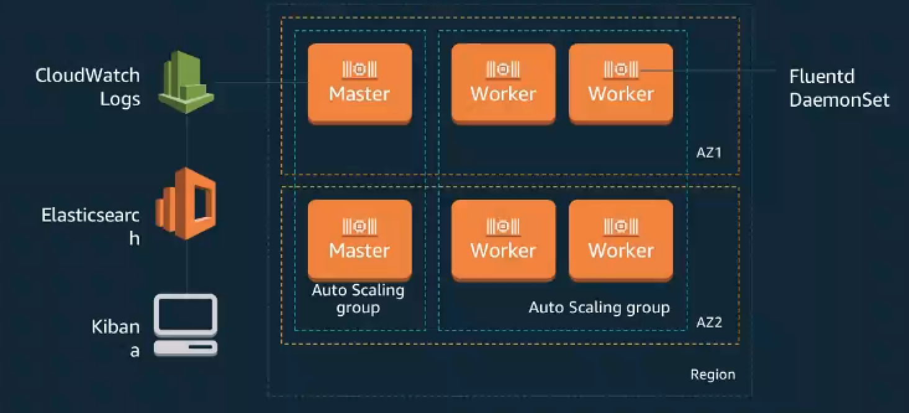

#### 借助FluenBit进行日志管理

* 新增·AWS FluentBi·t容器插件 
* 优化成本 `Route logs from Amazon EKS`和`Amazon ECS` 集群的日志会直接发送到`S3`, 并且通过`Amazon Athena`进行即席查询 
* 开源工具 
* 比`Ftuentd`效率更高，测试显示`Ftuentd`占用4倍CPU和6倍的内存资源 

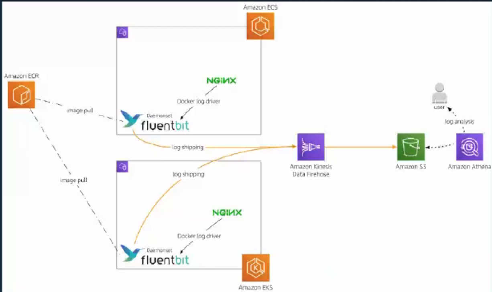


