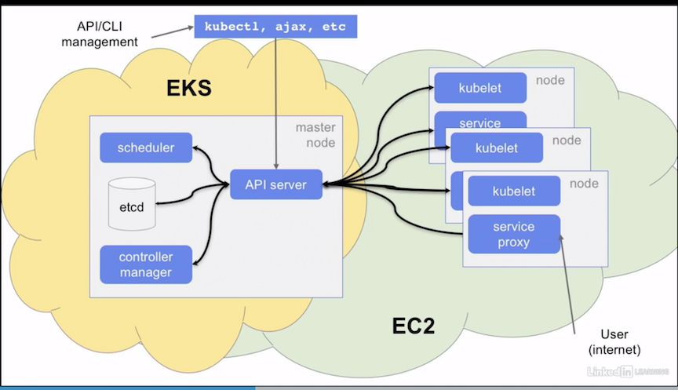
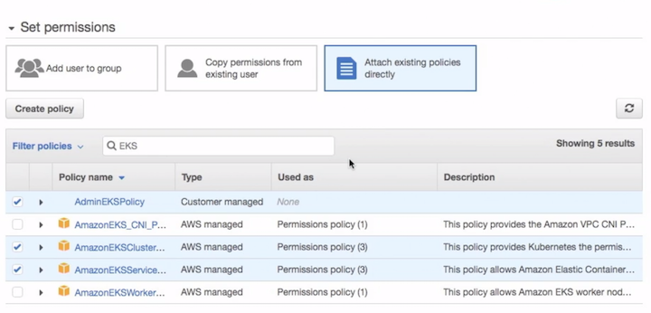
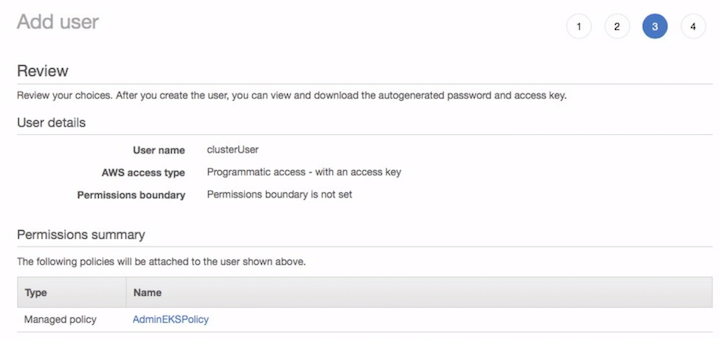

# Setting up Kubernetes on AWS

* Deployment models
* Requirements for EKS deployment
* Creating IAM roles and policies
* Create admin and Kubernetes users
* Build the EKS VPC
* Install kubectl for EKS auth
* Launch an EKS cluster master

## Deployment models

### K8S infrastructure 


### EKS infrastructure 



**Amazon EKS or elastic Kubernetes service. It actually works in conjunction with EC2, the elastic compute service**


## Requirements for EKS deployment

### 1. Pre-EKS Deployment

#### Proper IAM configuration

* Create a role defined with EKS permisssions
* EKS:* policy applied to user/group


#### VPC crated for EKS use

* Create EKS VPC with cloudformation


### 2. EKS Core Service

#### Create cluster control plane

 `https://us-west-2.console.aws.amazon.com/eks` 
 
#### Establish kubectl credentials 

* install **aws-iam-authenticator** and **kubectl** 
* **`aws eks update-kubeconfig -- name cluster name`**

#### Create worker nodes 

* **Create an autoscaling group of nodes with CloudFormation** 
* **Create node auth** with `kubectl apply -f was-auth-cm.yaml`  

### 3. Clean up and start using System

#### Wait for the nodes to register 

* `kubectl get nodes -w` 

#### Ensure you can create an ELB 

`aws iam create-service-linked-role -aws-service-name elasticloadbalancing.amazonaws.comaws `

#### Use your kubernetes environments


## Creating IAM roles and policies

In order to access the EKS cluster services (**CRUD operations**, and even just being able to connect to the cluster), an IAM policy is needed.  The following, while "open" only allows eks service access, and is appropriate for most users who need to manipulate the EKS service.

`https://console.aws.amazon.com/iam/`

Create a Policy with the following JSON object, and name it **AdminEKSPolicy**

**`iam_eks_policy.json`**

```
{
    "Version": "2012-10-17",
    "Statement": [
        {
            "Effect": "Allow",
            "Action": [
                "eks:*"
            ],
            "Resource": "*"
        }
    ]
}
```


We also need **CloudFormation** access which we can call **AdminCloudFormationPolicy**

**`iam_cf_policy.json`**

```
{
    "Version": "2012-10-17",
    "Statement": [
        {
            "Effect": "Allow",
            "Action": "*",
            "Resource": "*"
        }
    ]
}
```


### Create IAM role

Create a Role for EKS:

`https://console.aws.amazon.com/iam/`

Capture the Role ARN for use in your EKS deployment. there is an `output.txt` file that is a template for capturing these IDs that are needed for subsequent stages.

We can use the pre-defined EKS role "model" for this role, which we will call **`AdminEKSRole`**

This will have two Amazon defined policies:

* **AmazonEKSServicePolicy** 
* **AmazonEKSClusterPolicy** 


**Copy Role ARN for future use**


## Create admin and Kubernetes users

While we can add policy to our normal users in AWS, for this class we will create
two users, **an admin user** and **a second EKS system user**.


### User 1:

#### clusterAdmin

* **eks admin policy**
* **k8s admin "system:master" group**
* the following policies:
   * **AdminEKSPolicy**
   * **AdminCloudFormationPolicy**
   * **AmazonEKSServicePolicy** 
   * **AmazonEKSClusterPolicy** 


**Set permissions -> Attach existing polices**



**Review User**


### User 2:
 
#### clusterUser

* no IAM policies
* k8s admin "system:master" group



For both users, create programmatic credentials, and for the admin user, create a password credential as well.


## Build the EKS VPC

**NOTE:**

EKS is only supported in three regions:

* **us-east-1 (Northern VA)**
* **us-west-2 (Oregon)**
* **eu-west-1 (Ireland)**

Make sure you are in one of those regions when launching your VPC template

`https://console.aws.amazon.com/cloudformation/`

### Create cloudformation Stack


From S3 template:

[https://amazon-eks.s3-us-west-2.amazonaws.com/cloudformation/2018-08-30/amazon-eks-vpc-sample.yaml](amazon-eks-vpc-sample.yaml)


Specify Details: **classEKSVPC**


Capture (into an outputs file):

* VPC-ID:
* SECURITY-GROUP-ID:
* SUBNET-IDS:


## Install kubectl for EKS auth

### Install kubectl as normal from the instructions found here:

`https://kubernetes.io/docs/tasks/tools/install-kubectl/`

```
Linux:
curl -LO https://storage.googleapis.com/kubernetes-release/release/$(curl -s https://storage.googleapis.com/kubernetes-release/release/stable.txt)/bin/linux/amd64/kubectl

MacOS:
curl -LO https://storage.googleapis.com/kubernetes-release/release/$(curl -s https://storage.googleapis.com/kubernetes-release/release/stable.txt)/bin/darwin/amd64/kubectl

Windows:
curl -LO https://storage.googleapis.com/kubernetes-release/release/v1.12.0/bin/windows/amd64/kubectl.exe
```

### We also need the `aws-iam-authenticator` binary:

`https://docs.aws.amazon.com/eks/latest/userguide/configure-kubectl.html`

**You need the binary appropriate to your OS:**

```
Linux:
curl -sLO https://amazon-eks.s3-us-west-2.amazonaws.com/1.10.3/2018-07-26/bin/linux/amd64/aws-iam-authenticator

MacOS:
curl -sLO https://amazon-eks.s3-us-west-2.amazonaws.com/1.10.3/2018-07-26/bin/darwin/amd64/aws-iam-authenticator

Windows:
curl -sLO https://amazon-eks.s3-us-west-2.amazonaws.com/1.10.3/2018-07-26/bin/windows/amd64/aws-iam-authenticator.exe
```

### Make it executable 

**In both cases, make the binary executable if necessary (`chmod +x`), and copy it to a directory in the command PATH (`/usr/local/bin` or `%system32%/`)**

```
$ chmod +x kubectl aws-iam-authenticator
$ echo $PATH
$ sudo mv kubectl aws-iam-authenticator /usr/local/bin
```

**`$kubectl`**

**`$aws`**

```
$ aws
usage: aws [options] <command> <subcommand> [<subcommand> ...] [parameters]
To see help text, you can run:

  aws help
  aws <command> help
  aws <command> <subcommand> help
aws: error: the following arguments are required: command
```

## Launch an EKS cluster master

### Create Cluster

Once we have created our IAM roles policies, and generated our VPC we're ready to launch our EKS control plane.

We can launch via the EKS console: `https://console.aws.amazon.com/eks`

classname: **classCluster**


Once the cluster is "up" (which may take 10-15 minutes!) 


**we can configure out kubectl command with the `aws cli`:**

`$ aws configure --profile=clusterAdmin`


```
$ export AWS_PROFILE=clusterAdmin
$ aws eks update-kubeconfig --name classCluster
```


### Verify Kubernetes access

```
$ kubectl get pods
No resources found
$ kubectl get nodes
No resources found
```
And can even launch a manifest like a simple hostname response app:

[hostname.yaml](hostname.yaml)

```
$ kubectl apply -f hostname.yaml
service/hostname-v1 created
```

```
$ kubectl get pods
NAME                          READY STATUS   RESTARTS AGE 
hostname-v1-595b9884f7-w4n7w  0/1   Pending  0        6s 
```

**But there's one thing missing, no worker nodes!  We'll fix that next.**

