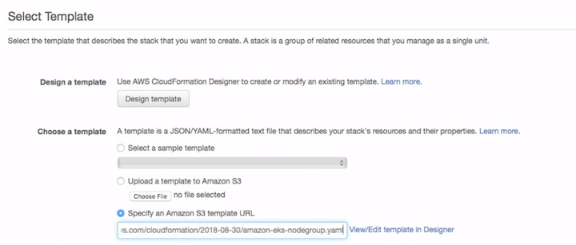
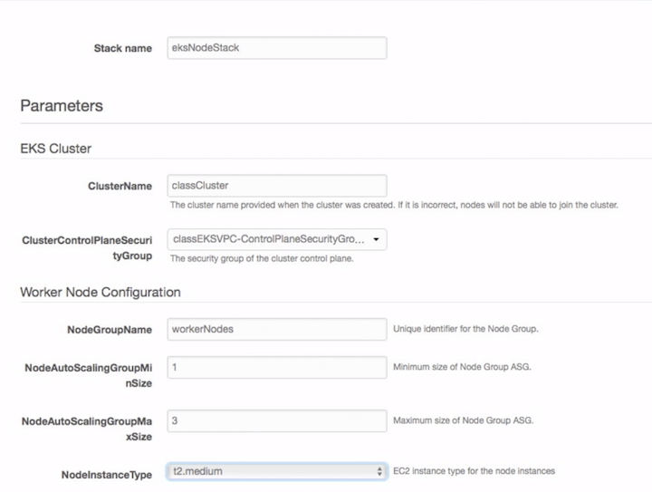
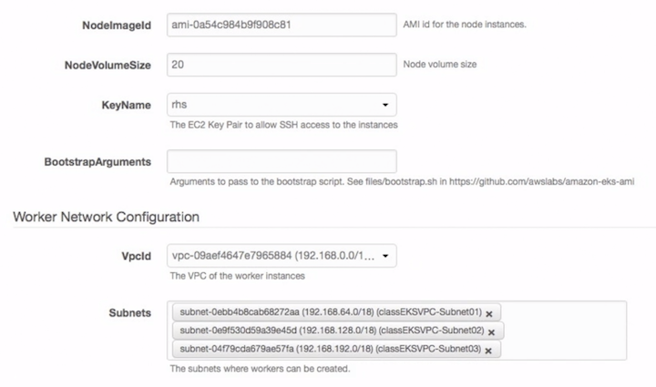
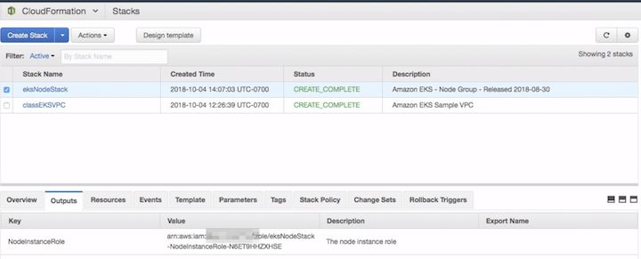
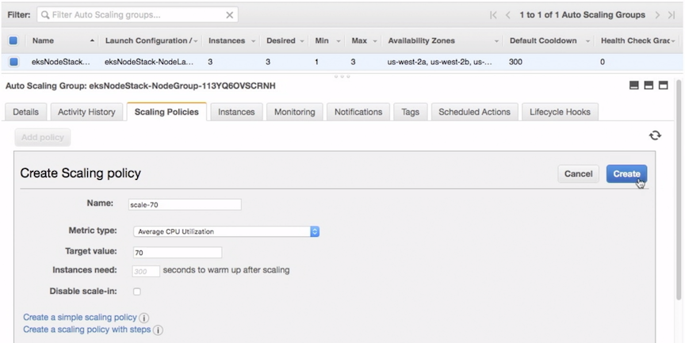
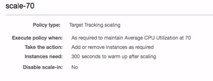
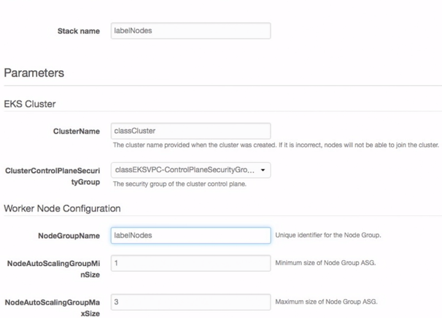
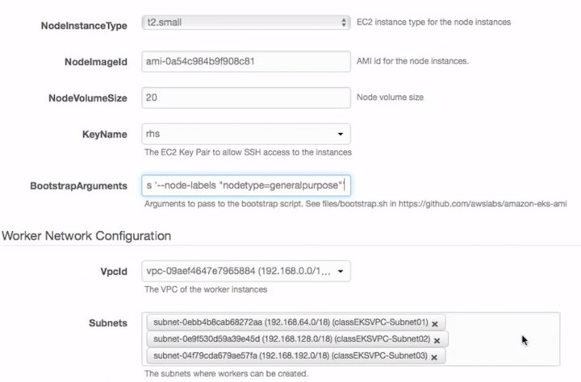
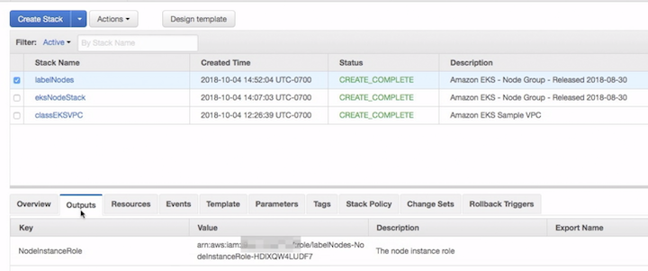

# Scaling EKS workers

* Selecting worker sizing
* Creating a worker scale policy
* Using labels to select pools(create node with k8s label)

## Selecting worker sizing

### Create worker nodes from cloudformation

`https://console.aws.amazon.com/cloudformation/`

**1.Select template from S3 template**


[https://amazon-eks.s3-us-west-2.amazonaws.com/cloudformation/2018-08-30/amazon-eks-nodegroup.yaml](amazon-eks-nodegroup.yaml)



**2.Specify details**

stack name: **eksNodeStack**





```
Region	                        Amazon EKS-optimized      AMI with GPU support
US West (Oregon) (us-west-2)  ami-0a54c984b9f908c81     ami-0731694d53ef9604b
US East (N. Va)  (us-east-1)	ami-0440e4f6b9713faf6     ami-058bfb8c236caae89
EU (Ireland)     (eu-west-1)	ami-0c7a4976cb6fafd3a     ami-0706dc8a5eed2eed9
```

Capture the worker `ARN (NodeInstanceRole)` from the CloudFormation output.
(store it in our outputs file)



We'll also be updating the `aws-auth-cm.yaml` document with that ARN so that the newly created workers have authorization to connect to our EKS control plane, and then installing the `configmap` to enable the authentication:


[aws-auth-cm.yaml](aws-auth-cm.yaml)

```
$ kubectl apply -f aws-auth-cm.yaml
configmap/aws-auth created
```
```
$ kubectl get nodes
NAME                                             STATUS   ROLES   AGE   VERSION
ip-192 168-125-174.us-west-2.computesinternal    Ready   <none>   28s   v1.10.3
ip-192 168-149-221.us-west-2.compute.internal    Ready   <none>   25s   v1.10.3
ip-192 168-237-184.us-west 2.computesinternal    Ready   <none>   30s   v1.10.3
```

```
$ kubectl get pods 
NAME                          READY STATUS   RESTARTS AGE 
hostname-vl-595b9884f7-w4n7w  0/1   Running  0        1h
```

## Creating a worker scale policy

In order to make use of the ASG that the default node `cloudformation` template creates, we need to add a policy to the group via the EC2 console.

### 1.Select Autoscaling Groups

**2.Create a Policy:**

Simple policy defines a target **CPU utilization**.  I find `70% `works well for many environments.





**Cooldown time: 5 minutes**

```
$ kubectl get nodes
NAME                                             STATUS   ROLES   AGE   VERSION
ip-192 168-125-174.us-west-2.computesinternal    Ready   <none>   28s   v1.10.3
ip-192 168-149-221.us-west-2.compute.internal    Ready   <none>   25s   v1.10.3
ip-192 168-237-184.us-west 2.computesinternal    Ready   <none>   30s   v1.10.3
```

#### In our unused cluster, the number of instances should start to shrink.

```
$ kubectl get nodes
NAME                                             STATUS   ROLES   AGE   VERSION
ip-192 168-125-174.us-west-2.computesinternal    Ready   <none>   28s   v1.10.3
ip-192 168-149-221.us-west-2.compute.internal    Ready   <none>   25s   v1.10.3
```

## Using labels to select pools (create node with k8s label)


In order to label the nodes, **we need to create another set of workers**, and we can then include an **"extra args"** parameter to add our unique label.  We could label nodes with:

```
$ kubectl label nodes <node-name> <label-key>=<label-value>
```

And then select the node group with a mapping like the following (which would be in the pod spec template):

```
  containers:
  - name: nginx
    image: nginx
    imagePullPolicy: IfNotPresent
  nodeSelector:
    <label-key>: <label-value>
```
But if the node is replaced or scaled into our out of an **autoscalegroup,** then we would loose that labeling.


To add labels by default when we create the ASG definition via cloudformation, we add:

```
--kubelet-extra-args '--node-labels "nodetype=generalpurpose"'
```

To the **`BootstrapArguments`** section when following the create worker process as before:

`https://console.aws.amazon.com/cloudformation/`

From S3 template

[https://amazon-eks.s3-us-west-2.amazonaws.com/cloudformation/2018-08-30/amazon-eks-nodegroup.yaml](amazon-eks-nodegroup.yaml)

```
Region	                        Amazon EKS-optimized      AMI with GPU support
US West (Oregon) (us-west-2)  ami-0a54c984b9f908c81     ami-0731694d53ef9604b
US East (N. Va)  (us-east-1)	ami-0440e4f6b9713faf6     ami-058bfb8c236caae89
EU (Ireland)     (eu-west-1)	ami-0c7a4976cb6fafd3a     ami-0706dc8a5eed2eed9
```
**1.Select template from S3 template**


**2.Specify details**

stack name: **labelNodes**





**BootstrapArguments = `--kubelet-extra-args '--node-labels "nodetype=generalpurpose"'`**



Capture the worker ARN (NodeInstanceRole) from the **CloudFormation output**.
(store it in our outputs file) and use it to update the `aws-auth-cm.yaml` document (note the version here needs the **ARN** from the original group of workers as well)


**`aws-auth-cm.yaml`**

```
apiVersion: v1
kind: ConfigMap
metadata:
  name: aws-auth
  namespace: kube-system
data:
  mapRoles: |
    - rolearn: arn:aws:iam::959612087337:role/eksNodeStack-NodeInstanceRole-N6ET9HHZXHSE
      username: system:node:{{EC2PrivateDNSName}}
      groups:
        - system:bootstrappers
        - system:nodes
    - rolearn: arn:aws:iam::959612087337:role/labelNodes-NodeInstanceRole-HDIXQW4LUDF7
      username: system:node:{{EC2PrivateDNSName}}
      groups:
        - system:bootstrappers
        - system:nodes
```
```
$ kubectl apply -f aws-auth-cm.yaml
configmap/aws-auth created
```

### nodes recreate

```
$ kubectl get nodes
NAME                                             STATUS     ROLES    AGE   VERSION
ip-192 168-125-174.us-west-2.computesinternal    NotReady   <none>   28s   v1.10.3
ip-192 168-149-221.us-west-2.compute.internal    Ready      <none>   25s   v1.10.3
ip-192 168-237-184.us-west 2.computesinternal    NotReady   <none>   30s   v1.10.3
```

**`hostname.yaml`**

```
apiVersion: extensions/v1beta1
kind: Deployment
metadata:
  name: hostname-v2
spec:
  replicas: 1
  template:
    metadata:
      labels:
        app: hostname-v2
        version: v2
    spec:
      containers:
      - image: rstarmer/hostname:v2
        imagePullPolicy: Always
        name: hostname
      nodeSelector:
        nodetype: generalpurpose
---
apiVersion: v1
kind: Service
metadata:
  labels:
    app: hostname-v2
  name: hostname-v2
spec:
  ports:
  - name: web
    port: 80
    protocol: TCP
    targetPort: 80
  selector:
    app: hostname-v2
```

```
$ kubectl apply -f hostname.yaml
service/hostname-v1 created
```

```
$ kubectl get pods
NAME                          READY STATUS   RESTARTS AGE 
hostname-v1-595b9884f7-w4n7w  1/1   Running  0        2h 
hostname—v2-6bfdf4c55f-5xmrm  1/1   Running  0        1m 
```

Once those nodes come online we can launch another version of our hostname that will only deploy onto the new nodes.


