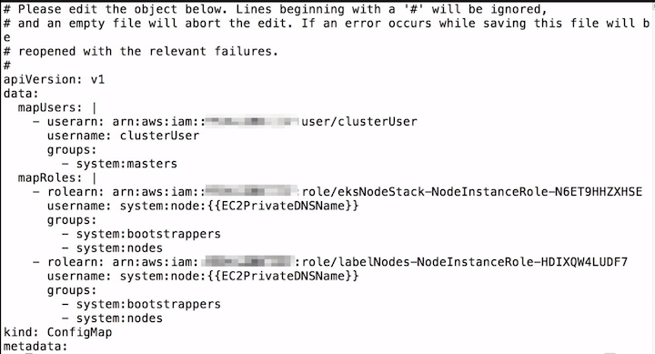

# AWS IAM and K8s RBAC

Users within the EKS environment are authenticated against AWS IAM, which provides enhanced security.  If we add our **'clusterUser'** credentials to the local aws client:

```
$ cat ~/Downloads/credentials-2.csv  #clusterUser
$ aws configure --profile=clusterUser
$ export AWS_PROFILE=clusterUser
```

We will see that kubernetes will still try to talk to the API, but will fail:

```
$ kubectl get pods
error: the server doesn't have a resource type "pods" 
```

### Switch back to admin

```
$ export AWS_PROFILE=clusterAdmin
$ kubectl get pods

NAME                           READY     STATUS     RESTARTS      AGE 
alpine-694f59c8cc—zhzcg        1/1       Running    0             50m
hostname—v1-595b9884f7—w4n7w   1/1       Running    0             3h
hostname—v2-6bfdf4c55f-5xmrm   1/1       Running    0             1h 
```

Adding additional users to the kubernetes cluster in EKS is done by adding new
users to the **`"system:masters"`** group which maps to the equivalent of the **`ClusterAdmin`** role in **Kubernetes RBAC rules**.

**The key parameter we need is the User's IAM ARN**, which can be pulled from the User IAM page in the AWS console:

```
data:
  mapUsers: |
    - userarn: USER-ARN
      username: admin
      groups:
        - system:masters
```

**`aws-auth-cm.yaml`**

```
apiVersion: v1
kind: ConfigMap
metadata:
  name: aws-auth
  namespace: kube-system
data:
  mapUsers: |
    - userarn: USER-ARN
      username: admin
      groups:
        - system:masters
  mapRoles: |
    - rolearn: NODE-ROLE-ARN
      username: system:node:{{EC2PrivateDNSName}}
      groups:
        - system:bootstrappers
        - system:nodes
    - rolearn: LABEL-NODE-ROLE-ARN
      username: system:node:{{EC2PrivateDNSName}}
      groups:
        - system:bootstrappers
        - system:nodes
```



```
$ kubectl edit configmap aws—auth —n kube—system 
configmap/aws—auth edited 
```

We need to add the mapUsers: section to the **`aws-auth-cm.yaml`** document, and we can do that either locally and "apply" the changes, or we can edit the document in place in the kubernetes service.

We will edit the file in place, as we don't want to have to recreate the worker node role mappings which are part of the same auth structure:

### Now switch back to clusterUser

Once we're done with the edit, we can switch back to our clusterUser and we should have access to the system:

```
$ export AWS_PROFILE=clusterUser
$ kubectl get pods

NAME                           READY     STATUS     RESTARTS      AGE 
alpine-694f59c8cc—zhzcg        1/1       Running    0             50m
hostname—v1-595b9884f7—w4n7w   1/1       Running    0             3h
hostname—v2-6bfdf4c55f-5xmrm   1/1       Running    0             1h 
```
Add the **`mapUsers: section`** right after the data: key, above the **`mapRoles: | line`**. It should look similar to the **`aws-auth-cm.yaml`** document.

