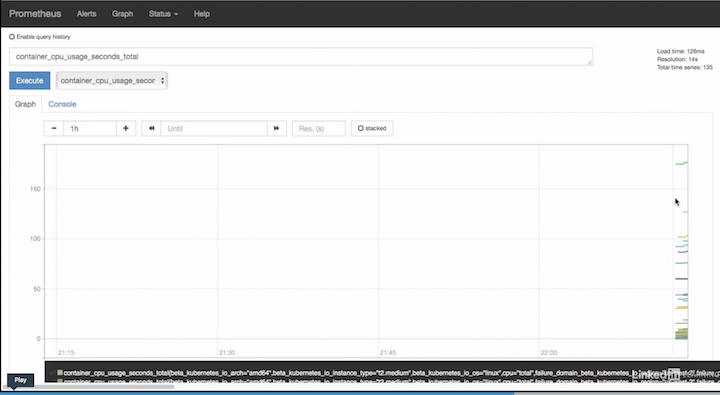

# K8s native: Prometheus

To add metrics to our Kubernetes environment, we'll use **Helm to install Prometheus**.

First we need helm installed as a client on our workstation, and then we can install the Kubernetes side component in our EKS system.  Get the helm binary for your environment here:

```
MacOSX:
https://storage.googleapis.com/kubernetes-helm/helm-v2.11.0-darwin-amd64.tar.gz

Linux:
https://storage.googleapis.com/kubernetes-helm/helm-v2.11.0-linux-amd64.tar.gz

Windows:
https://storage.googleapis.com/kubernetes-helm/helm-v2.11.0-windows-amd64.zip
```

Or use a package manager.

Then we can install the RBAC configuration for tiller so that it has the appropriate access, and lastly we can initialize our helm system:

```
$ curl —sL0 https://storage.googleapis.com/kubernetes—helm/helm—v2.11.0 darwin—amd64star.gz 
$ tar xfz helm—v2.11.0—darwin—amd64.taregz 
$ cd darwin—amd64/ 
$ sudo cp helm /usr/local/bin/ 
Password: 
$ cd ..
$ kubectl create —f helm—rbac.yaml 
serviceaccount/tiller created 
clusterrolebindingsrbac.authorization.k8s.io/tiller created 
$ helm init --service—account=tiller 
$HELM_HOME has been configured at /Users/***/.helm. 

Tiller (the Helm server—side component) has been installed into your Kubernetes Cluster. 

Please note: by default, Tiller is deployed with an insecure 'allow unauthenticated users ' policy. 
To prevent this, run `helm init` with the --tiller—tls—verify flag. 
For more information on securing your installation see: https://docs.helm.sh/using.helm/# securing—your—helm—installation 
Happy Helming! 
```

Once Helm is installed, launching Prometheus is a simple command, though note that we are defining the storage class that Prometheus should use to store it's metrics:

```
$ helm install --name promeks --set server.persistentVolume.storageClass=gp2 stable/prometheus
```


`$ kubectl get pods`


And lastly, we want to expose the **Prometheus UI** so that we can have a look at some of the Pod/Container level metrics:


```
$ kubectl --namespace default port-forward $(kubectl get pods --namespace default -l "app=prometheus,component=server" -o jsonpath="{.items[0].metadata.name}") 9090 &
```


Once the portforward is working, we can point a web browser at:

`http://localhost:9090`


### Look to see what metrics are being gathered.

**`container_cpu_usage_seconds_total`**



And we can also generate a little load if we'd like:


```
$ kubectl run --image rstarmer/curl:v1 curl
$ kubectl exec -it $(kubectl get pod -l run=curl -o jsonpath={.items..metadata.name}) -- \
sh -c 'while [[ true ]]; do curl -o - http://hostname-v1/version/ ; done'
v1
v1
v1
v1
...
```

