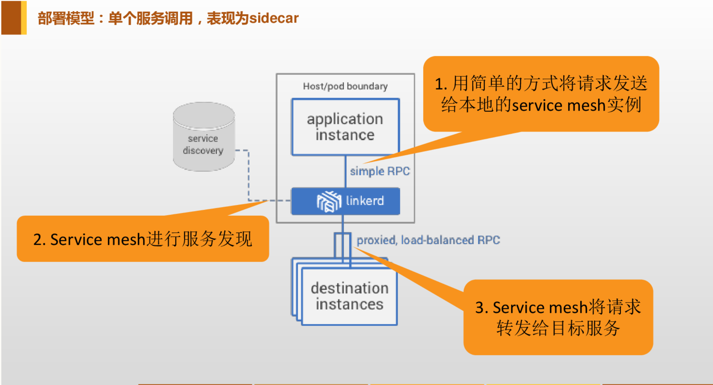
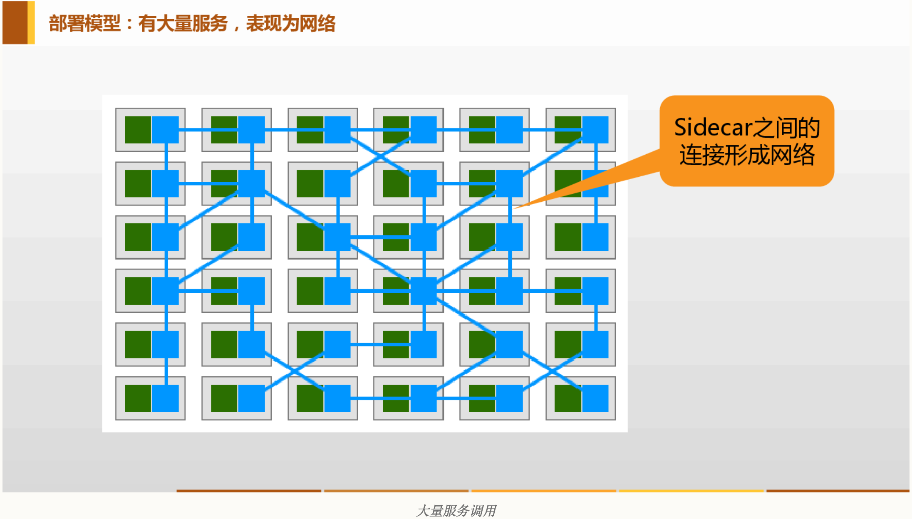
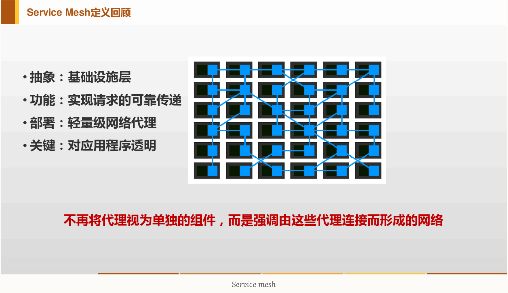

# 服务网格(Service Mesh)是什么?

现在最火的后端架构无疑是**微服务**了，微服务将之前的单体应用拆分成了许多独立的服务应用，每个微服务都是独立的，好处自然很多，但是随着应用的越来越大，微服务暴露出来的问题也就随之而来了，微服务越来越多，管理越来越麻烦，特别是要你部署一套新环境的时候，你就能体会到这种痛苦了，随之而来的**服务发现、负载均衡、Trace跟踪、流量管理、安全认证**等等问题。

如果从头到尾完成过一套微服务框架的话，你就会知道这里面涉及到的东西真的非常多。当然随着微服务的不断发展，微服务的生态也不断完善，最近就发现新一代的微服务开发就悄然兴起了，那就是**服务网格/Service Mesh**。

## 什么是Service Mesh？

`Service Mesh`是一个非常新的名词，最早是2016年由开发Linkerd的 Buoyant 公司提出的，搬随着Linkerd的传入，`Service Mesh`的概念也慢慢进入国内技术社区。之前 infoQ 的一篇介绍`istio`的文章将`Service Mesh`翻译成的**服务啮合层**，

`啮合`的字面意思是：两个齿轮间的咬合，和`Service Mesh`表达的意思基本上还是吻合的，但是这个词比较拗口。到现在主流的叫法都叫：**服务网格**。

Willian Morgan（Linker 的CEO）给出的`Service Mesh`定义：

> A service mesh is a dedicated infrastructure layer for handling service-to-service communication. It’s responsible for the reliable delivery of requests through the complex topology of services that comprise a modern, cloud native application. In practice, the service mesh is typically implemented as an array of lightweight network proxies that are deployed alongside application code, without the application needing to be aware.

服务网格是一个用于处理服务间通信的基础设施层，它负责为构建复杂的云原生应用传递可靠的网络请求。在实践中，服务网格通常实现为一组和应用程序部署在一起的轻量级的网络代理，但对应用程序来说是透明的。

## 怎么理解网格

要理解网格的概念，就得从服务的部署模型说起：

### 1.单个服务调用，表现为`sidecar`

`Service Mesh`的部署模型，先看单个的，对于一个简单请求，作为请求发起者的客户端应用实例，会首先用简单方式将请求发送到本地的`Service Mesh`实例。

**这是两个独立进程，他们之间是远程调用。**

**`Service Mesh`会完成完整的服务间调用流程，如服务发现负载均衡，最后将请求发送给目标服务。这表现为`Sidecar`。**

提到`Sidecar`，在Kubernetes中部署的`POD`中也会有一个附加的`Sidecar`容器。[微服务中的Sidecar设计模式解析](https://github.com/Chao-Xi/JacobTechBlog/blob/master/k8s_tutorial/k8s_adv34_sidecar.md)

### 2.部署多个服务，表现为通讯层

多个服务调用的情况，在这个图上我们可以看到`Service Mesh`在所有的服务的下面，**这一层被称之为服务间通讯专用基础设施层**。

**`Service Mesh`会接管整个网络，把所有的请求在服务之间做转发**。

在这种情况下，我们会看到上面的服务不再负责传递请求的具体逻辑，只负责完成业务处理。

**服务间通讯的环节就从应用里面剥离出来，呈现出一个抽象层。**

### 3.有大量服务，表现为网络

如果有大量的服务，就会表现出来网格。

图中左边绿色方格是应用，**右边蓝色的方框是`Service Mesh`，蓝色之间的线条是表示服务之间的调用关系。**

`Sidecar`之间的连接就会形成一个网络，**这个就是服务网格名字的由来**。

**这个时候代理体现出来的就和前面的`Sidecar`不一样了，形成网状。**

## 服务网格

首先第一个，服务网格是抽象的，实际上是抽象出了一个基础设施层，在应用之外。其次，功能是实现请求的可靠传递。部署上体现为轻量级的网络代理。最后一个关键词是，对应用程序透明。

大家注意看，上面的图中，网络在这种情况下，可能不是特别明显。

**但是如果把左边的应用程序去掉，现在只呈现出来`Service Mesh`和他们之间的调用，这个时候关系就会特别清晰，就是一个完整的网络。**

这是`Service Mesh`定义当中一个非常重要的关键点，和`Sidecar`不相同的地方：不再将代理视为单独的组件，而是强调由这些代理连接而形成的网络。在`Service Mesh`里面非常强调代理连接组成的网络，而不像`Sidecar`那样看待个体。

[What's a service mesh? And why do I need one?](https://buoyant.io/2017/04/25/whats-a-service-mesh-and-why-do-i-need-one/)
