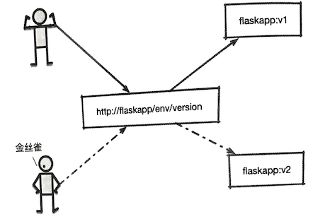
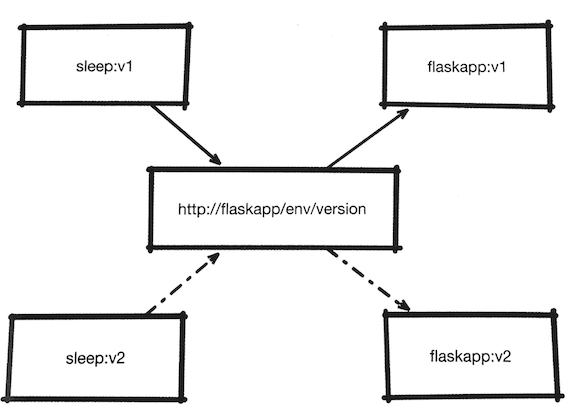
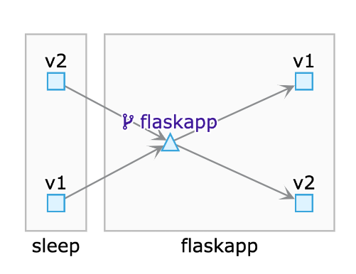
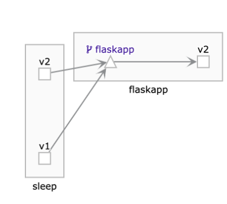
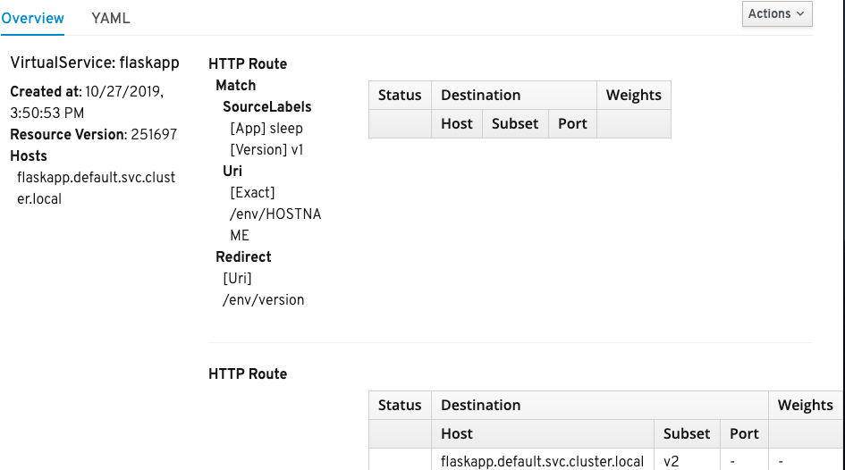
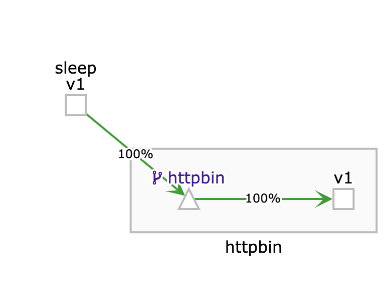

# 10. HTTPS流量管理

* 10.1 金丝雀部署
* 10.2 根据来源服务进行路由
* 10.3 对`URI`进行重定向

## 10.1 金丝雀部署

简单说来，金丝雀部署就是在发布新版本时，部署的新版本并不对外开放，而是选择一小部分用户为测试目标，这部分用户对服务的访问会指向特定的版本，通过对这些金丝雀用户的使用情况的观察，来确定新版本服务的发布效果，在确定结果之前, 所有其他用户都继续使用原有版本。
 
这里还是以`flaskapp`为例，按照案例需求，我们假定`v1`是旧版本，`v2`是新版本。在发布新版本时 , 选择一部分用户作为金丝雀用户，在金丝雀用户访问 `flaskapp` 时产生流量的`HTTP header`中会有一行`lab:canary`, 我们会用该内容区别用户， 其他登录用户和匿名用户全部访问就版本`flaskapp`,金丝雀用户在访问`flaskapp`时会访问新版本的`flaskapp`，整体场景如下

 
 

根据`HTTP`内容进行路由的能力, 这里可以针对金丝雀用户的需求，再次修改我们的`VirtualService`

```
apiVersion: networking.istio.io/v1alpha3
kind: VirtualService
metadata: 
  name: flaskapp 
spec: 
  hosts:
  - flaskapp.default.svc.cluster.local
  http: 
  - match:
    - headers:
        lab:
          exact: canary
    route: 
    - destination: 
        host: flaskapp.default.svc.cluster.local
        subset: v2
  - route: 
    - destination: 
        host: flaskapp.default.svc.cluster.local
        subset: v1   
```

将`YAML`内容保存为`canary.virtualservice.yaml`使用`kubectl apply`命令将其提交到`Kubernetes`集群、进人`sleep Pod`开始测试： 

```
$ kubectl apply -f canary-virtualservice.yaml 
virtualservice.networking.istio.io/flaskapp created
```

```
$ kubectl exec -it sleep-6c9c898f6c-snzx5 -c sleep bash

bash-4.4# http --body http://flaskapp/env/version
v1
```
重复执行几遍，会看到在默认情况下访问的都是`v1`版本的`flaskapp`。 

我们可以在请求中加入`lab:canary Header`，再次调用`flaskapp`

```
http --body http://flaskapp/env/version lab:canary
v2
```

可以看到这次得到的是`v2`版本的返回值。 

把`canary`换成`phoenix`再试验一下 
 
```
bash-4.4# http --body http://flaskapp/env/version lab:phoenix
v1
```

可以发现不符合判断条件，生效的仍然是v1版本 

对于这个`VirtualService`我们需要了解以下内容。
 
* **这里也在`http`字段定义了两个路由(`HTTPRoute`对象，区别是这次加人了一个`match`字段match字段提供了丰富的匹配 功能其匹配范围不仅包括`HTTP Header`,还包括`uri`、 `scheme`、 `method`、`authority`,端口，来源标签和`gateway`等**
* **这里使用的是针对`http header`的匹配，要求lab的取值必须完全匹配`canary`,这里除了可以使用代表完全相等的`exact`动词，还可以使用`prefix`和`regex`，分别代表前缀和正则表达式的匹配方式**

## 10.2 根据来源服务进行路由 

我们根据用户发出的请求中的`HTTP Header`进行了转发。在实际工作中还存在另一种情况：

**来自不同版本的服务访问不同版本的目标服务**

* 比如`v1`版本的`sleep`向f`laskapp`发出的请求由`flaskapp`的`v1`版本提供响应，
* 其他版本由`flaskapp`的`v2`版本负责，如图所示。 

 

`sourceLabels-virtualservice.yaml`

```
apiVersion: networking.istio.io/v1alpha3
kind: VirtualService
metadata: 
  name: flaskapp 
spec: 
  hosts:
  - flaskapp.default.svc.cluster.local
  http: 
  - match:
    - sourceLabels:
        app: sleep
        version: v1
    route: 
    - destination: 
        host: flaskapp.default.svc.cluster.local
        subset: v1
  - route: 
    - destination: 
        host: flaskapp.default.svc.cluster.local
        subset: v2
```

使用`kubectl apply`更新`VirtualService`，然后分别进人两个版本的`sleep Pod`进行 

```
$ kubectl exec -it sleep-v1-548d87cc5c-wfk7v -c sleep bash

bash-4.4# http --body http://flaskapp/env/version
v1

$ kubectl exec -it sleep-v2-7c6b874968-hl6dj -c sleep bash

bash-4.4# http --body http://flaskapp/env/version
v2
```

侧试结果很清楚,从`sleep`服务的`v1`版本发给`flaskapp`的请求，由`flaskapp`的`v1`版本进行了处理，跟我们的预期是一致的。 

 

在上面的`VirtualService`定义里，用`SourceLabels`对来源路由进行了匹配，`app`标签为`sleep`标签为`version`标签`v1`的请求，会被发送给`flaskapp`的`v1`版本进行处理, 其他来源的请求由`V2` 版本进行匹配。 

## 10.3 对`URI`进行重定向 

**还有另外一种对目标路由的分流方式，即根据URL进行重定向**

例如，**`v2`版本的`sleep`服务发起对`flaskapp`服务`"/env/HOSTNAME"`路径的请求， 那么将其照实返回**；

**如果请求来自`v1`版本的`sleep`服务,那么将其请求路径由 `"/env/HOSTNAME"`修改为`"/env/HOSTNAME"`。将`flaskapp.virtualservice.yaml`的`spec`字段修改为如下内容**： 


`uri-virtualservice.yaml`

```
apiVersion: networking.istio.io/v1alpha3
kind: VirtualService
metadata: 
  name: flaskapp 
spec: 
  hosts:
  - flaskapp.default.svc.cluster.local
  http: 
  - match:
    - sourceLabels:
        app: sleep
        version: v1
      uri:
        exact: "/env/HOSTNAME"
    redirect:
      uri: /env/version
  - route: 
    - destination: 
        host: flaskapp.default.svc.cluster.local
        subset: v2
```

分别进入两个`sleep pod` `v1`，`v2`

```
$ kubectl exec -it sleep-v1-548d87cc5c-wfk7v -c sleep bash

bash-4.4# http http://flaskapp/env/HOSTNAME
HTTP/1.1 301 Moved Permanently
content-length: 0
date: Sun, 27 Oct 2019 07:54:40 GMT
location: http://flaskapp/env/version
server: envoy

kubectl exec -it sleep-v2-7c6b874968-hl6dj -c sleep bash

http http://flaskapp/env/HOSTNAME
HTTP/1.1 200 OK
content-length: 27
content-type: text/html; charset=utf-8
date: Sun, 27 Oct 2019 07:55:39 GMT
server: envoy
x-envoy-upstream-service-time: 1

flaskapp-v2-d5bc47bf5-5kk5k
```

 

 

在`v1`中会发现返回一个301指令，我们在指令中加入重定向的指令再次尝试

```
$ kubectl exec -it sleep-v1-548d87cc5c-wfk7v -c sleep bash

bash-4.4# http --follow http://flaskapp/env/HOSTNAME
HTTP/1.1 200 OK
content-length: 2
content-type: text/html; charset=utf-8
date: Sun, 27 Oct 2019 07:59:25 GMT
server: envoy
x-envoy-upstream-service-time: 1

v2
```


这一次成功看到发生了重定向，即最终由“/env/version”路径处理了我们的请求。 

在这次的`VirtualService`定义中，将由`v1`版本的`sleep`服务发起的到`http://flaskapp/env/HOSTNAME`的请求，用`301`指令进行了重定向。

**这里要注意：`redirect`指令会把`URI`进行整体替换，因此灵活性不高**；

**另外`301`指令无法支持`Post`方法。**

例如我们想要给`httpbin`设置一个使用`Post`方法的重定向，则可编写如下代码： 

```
apiVersion: networking.istio.io/v1alpha3
kind: VirtualService
metadata: 
  name: httpbin 
spec: 
  hosts:
  - flaskapp.default.svc.cluster.local
  http: 
  - match:
    - uri:
        exact: "get"
    redirect:
      uri: /post
  - route: 
    - destination: 
        host: flaskapp.default.svc.cluster.local
```

将这一段代码保存到`httpbin.virtualservice.yaml`中，并使用`kubectl apply`将其提交到`Kubernetes`集群。

**这里定义了将对`httpbin`服务`“/get”`路径的访问重定向到`“/post"`上**，下面用`sleep Pod`发起请求测试一下： 

```
$ kubectl get vs
NAME       GATEWAYS   HOSTS                                  AGE
flaskapp              [flaskapp.default.svc.cluster.local]   32m
httpbin               [flaskapp.default.svc.cluster.local]   5s
```

> 我遇到的问题：

```
bash-4.4# http -f POST http://httpbin:8000/post data=nothing
HTTP/1.1 503 Service Unavailable
content-length: 95
content-type: text/plain
date: Sun, 27 Oct 2019 08:27:56 GMT
server: envoy

upstream connect error or disconnect/reset before headers. reset reason: connection termination
```

> 原因我错误的修改了`mlts`，变成了`global enabled`

```
$ kubectl get MeshPolicy default -oyaml
apiVersion: authentication.istio.io/v1alpha1
kind: MeshPolicy
metadata:
  annotations:
    kubectl.kubernetes.io/last-applied-configuration: |
      {"apiVersion":"authentication.istio.io/v1alpha1","kind":"MeshPolicy","metadata":{"annota
tions":{},"name":"default"},"spec":{"peers":[{"mtls":{}}]}}
  creationTimestamp: "2019-10-18T09:23:09Z"
  generation: 2
  name: default
  resourceVersion: "198498"
  selfLink: /apis/authentication.istio.io/v1alpha1/meshpolicies/default
  uid: f1b9dc29-d94c-415d-b879-25c71a3d4769
spec:
  peers:
  - mtls: {}
```

> 解决方式，该回到`permissive`, 

```
$ kubectl edit  MeshPolicy default
meshpolicy.authentication.istio.io/default edited

peers:
- mtls: 
    mode: PERMISSIVE
```


```
$ kubectl exec -it sleep-v1-548d87cc5c-wfk7v -c sleep bash

http -f POST http://httpbin:8000/post data=nothing
HTTP/1.1 200 OK
access-control-allow-credentials: true
access-control-allow-origin: *
content-length: 586
content-type: application/json
date: Sun, 27 Oct 2019 09:24:50 GMT
server: envoy
x-envoy-upstream-service-time: 6

{
    "args": {},
    "data": "",
    "files": {},
    "form": {
        "data": "nothing"
    },
    "headers": {
        "Accept": "*/*",
        "Accept-Encoding": "gzip, deflate",
        "Content-Length": "12",
        "Content-Type": "application/x-www-form-urlencoded; charset=utf-8",
        "Host": "httpbin:8000",
        "User-Agent": "HTTPie/0.9.9",
        "X-B3-Parentspanid": "159205ecd8ddc070",
        "X-B3-Sampled": "1",
        "X-B3-Spanid": "cda267c471801f5e",
        "X-B3-Traceid": "fda0d72802b78b9c159205ecd8ddc070"
    },
    "json": null,
    "origin": "127.0.0.1",
    "url": "http://httpbin:8000/post"
}
```

 

可以看到，POST成功。我们再次发起请求，这次请求的目标是`"/get"`: 

```
bash-4.4# http --follow -f POST http://httpbin:8000/get data=nothing
HTTP/1.1 405 Method Not Allowed
access-control-allow-credentials: true
access-control-allow-origin: *
allow: OPTIONS, POST
content-length: 178
content-type: text/html
date: Sun, 27 Oct 2019 09:32:51 GMT
server: envoy
x-envoy-upstream-service-time: 3

<!DOCTYPE HTML PUBLIC "-//W3C//DTD HTML 3.2 Final//EN">
<title>405 Method Not Allowed</title>
<h1>Method Not Allowed</h1>
<p>The method is not allowed for the requested URL.</p>
```


这次发生了重定向， 但是很明显， 并没有满足我们的要求， `Istio`还提供了`Rewrite`的方式来提供这种在调用前进行`URI`重写的支持。 

下面再次修改`httpbin`的路由规则， 把`redirect`修改为`rewrite`


```
apiVersion: networking.istio.io/v1alpha3
kind: VirtualService
metadata: 
  name: httpbin 
spec: 
  hosts:
  - httpbin.default.svc.cluster.local
  http: 
  - match:
    - uri:
        exact: "/get"
    rewrite:
      uri: /post
    route: 
    - destination: 
        host: httpbin.default.svc.cluster.local
  - route: 
    - destination: 
        host: httpbin.default.svc.cluster.local
```

在提交新的规则之后，再次进入`Sleep Pod`进行尝试： 

```
bash-4.4#  http -f POST http://httpbin:8000/get data=nothing
HTTP/1.1 301 Moved Permanently
connection: close
content-length: 0
date: Sun, 27 Oct 2019 09:43:13 GMT
location: http://httpbin:8000/post
server: envoy
```

这次完成了对`post`方式改写

`rewrite`方法和`rediret`方法不同之处在于，**在`rewrite`方法的`match`一节必须包含对目标的定义。并且，`rewrite`方法和`rediret`方法不能共存**。


