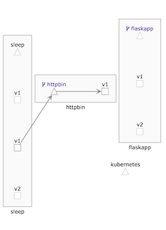

# 11. HTTPS流量管理

* 11.1 通信超时控制 
* 11.2 故障重试控制
* 11.3 入口流量管理
* 11.4 出口流量管理

## 11.1 通信超时控制 

在微服务之间进行相互调用时，因为服务问题或者网络故障的影响，发生超时 是在所难免的。对于这种情况如果不加控制，则通常需要等待默认的超时时间，会导致业务处理时间大幅度延长；如果故障持续存在，则往往会造成业务积压，到了一定程度之后甚至会导致故障扩一散，造成大面积故障。

即使全部加以控制（例如，对于某一服务的调用，一旦超过一定的时间则自动终止该调用），但因为服务和业务情况多变，需要不断调整控制过程来进行调整和优化。例如，有哪些调用点需要控制？每个调用点的超时应该设置为多少？修改其中一点之后，会对其他调用点的超时设置产生什么样的影响？这种调整意味着很多的重复工作，往往需要非常多的人力和时间投人才能达到较好的效果。 

**通过`Istio`的流量控制功能可以对服务间的超时进行控制，在应用无感知的情况下，根据`VirtualService`的配置，动态调整调用过程中的超时上限，从而达到控制故障范围的目的**。

相对于代码修改，这种非人侵的调整方式能够节省大量的成本。 


这里为`httpbin`服务编写一个`VirtualService`，设置它的超时上限，使对`httpbin` 服务的调用一旦超过`3`秒，则判定为超时： 

`httpbin.timeout.yaml`

```
apiVersion: networking.istio.io/v1alpha3
kind: VirtualService
metadata: 
  name: httpbin 
spec: 
  hosts:
  - httpbin.default.svc.cluster.local
  http: 
    - route:
      - destination: 
          host: httpbin.default.svc.cluster.local
      timeout: 3s
```

```
$ kubectl apply -f httpbin.timeout.yaml 
virtualservice.networking.istio.io/httpbin created
```

**然后使用`sleep Pod`进行测试，在测试中使用`httpbin`的`"/delay"`路径，这个路径接收一个整数作为参数，在服务器延时指定秒数之后才返回响应**


```
$ kubectl exec -it sleep-6c9c898f6c-448v6  -c sleep bash 

bash-4.4# http --body http://httpbin:8000/delay/2
{
    "args": {},
    "data": "",
    "files": {},
    "form": {},
    "headers": {
        "Accept": "*/*",
        "Accept-Encoding": "gzip, deflate",
        "Content-Length": "0",
        "Host": "httpbin:8000",
        "User-Agent": "HTTPie/0.9.9",
        "X-B3-Parentspanid": "a35e61fc2a2adba8",
        "X-B3-Sampled": "1",
        "X-B3-Spanid": "8bbbca0d349b1326",
        "X-B3-Traceid": "66816ed2aa478250a35e61fc2a2adba8"
    },
    "origin": "127.0.0.1",
    "url": "http://httpbin:8000/delay/2"
}

http --body http://httpbin:8000/delay/4
upstream request timeout

bash-4.4# http --body http://httpbin:8000/delay/5
upstream request timeout
```


**如此看来我们的超时设置已经生效，如果延迟了2秒，则方法可以正常完成调用, 如果延迟超过3秒则会发生超时、失败**  

**可以看出，超时配置非常简单，而且是`VirtualService`的一部分，因此各种过滤和路由也是有效的。我们可以通过请求的源和目的、标签等流量特征来动态确定超时内容.**


## 11.2 故障重试控制 

在服务间调用的过程中，有时会发生闪断的隋况目标服务在短时间内不可用，此时如果进行重试，则可能会继续顺利地完成调用。这一功能和在超时控制一样，都是用于应对故障的常用手段。在无须开发介入的情况下，直接在运行环境中对故障重试行为进行调整, 能够极大地增强系统弹性和健性。 

下面继续利用`httpbin`服务，返回一个`500`错误，看看重试过程是如何工作的。 

改写`httpbin virtualservice.yaml`，在其中加人重试定义 

```
apiVersion: networking.istio.io/v1alpha3
kind: VirtualService
metadata: 
  name: httpbin 
spec: 
  hosts:
  - httpbin.default.svc.cluster.local
  http: 
    - route:
      - destination: 
          host: httpbin.default.svc.cluster.local
      retries:
        attempts: 3
```

这里定义：

在对`httpbin`服务的访问返回故障之后，可以进行三次重试。将新定义的`Virtual Service`规则使用`kubectl apply`命令提交到`Kubernetes`集群，之后使用`sleep Pod`进行测试： 

```
$ kubectl exec -it sleep-6c9c898f6c-448v6  -c sleep bash 

bash-4.4# http http://httpbin:8000/status/500
HTTP/1.1 500 Internal Server Error
access-control-allow-credentials: true
access-control-allow-origin: *
content-length: 0
content-type: text/html; charset=utf-8
date: Sun, 27 Oct 2019 10:39:54 GMT
server: envoy
x-envoy-upstream-service-time: 6
```


 

结果毫无悬念地返回了内部错误。如何才能知道是否真的进行了重试？可以查看`httpbin pod`中`istio-proxy`容器访问日志

```
$ kubectl logs -f httpbin-7d9d5b55b9-kzt5k -c istio-proxy
```
```
[2019-10-27T10:39:54.372Z] "GET /status/500 HTTP/1.1" 500 - "-" 0 0 5 3 "-" "HTTPie/0.9.9" "0d1cc197-8376-9756-a3c9-7d7c5706ca6f" "httpbin:8000" "127.0.0.1:80" inbound|8000|http|httpbin.default.svc.cluster.local - 10.1.0.120:80 10.1.0.122:41152 -
[2019-10-27T10:39:54.372Z] "GET /status/500 HTTP/1.1" 500 - "-" 0 0 5 3 "-" "HTTPie/0.9.9" "0d1cc197-8376-9756-a3c9-7d7c5706ca6f" "httpbin:8000" "127.0.0.1:80" inbound|8000|http|httpbin.default.svc.cluster.local - 10.1.0.120:80 10.1.0.122:41152 -
...
```

**会发现，每次访问都产生了4条访问日志，也就是说发生了3次重试** 

超时控制内容问题变得复杂了起来：

重试有超时设置， 服务调用本身也有超时设置，
两者是如何协调的呢？我们可以接着进行测试 将上面的路由规则进行修改。

```
apiVersion: networking.istio.io/v1alpha3
kind: VirtualService
metadata: 
  name: httpbin 
spec: 
  hosts:
  - httpbin.default.svc.cluster.local
  http: 
    - route:
      - destination: 
          host: httpbin.default.svc.cluster.local
      # timeout: 3s
      retries:
        attempts: 3
        perTryTimeout: 1s
      timeout: 7s
```
这里设置每次重试的超时容忍时间为1秒，｛俪急体的超时容忍时间为7秒，在应用这一规则后进入`sleep Pod`，使用`http://httpbin:8000/delay/10`进行测试 

```
# time http http://httpbin:8000/delay/10
HTTP/1.1 504 Gateway Timeout
content-length: 24
content-type: text/plain
date: Sun, 27 Oct 2019 11:09:09 GMT
server: envoy

upstream request timeout


real    0m4.309s
user    0m0.265s
sys     0m0.037s
bash-4.4# 

```

可以看到，返回时间是4秒多，可以判断是重试的超时设置产生了作用.

再次修改路由规则： 

```
apiVersion: networking.istio.io/v1alpha3
kind: VirtualService
metadata: 
  name: httpbin 
spec: 
  hosts:
  - httpbin.default.svc.cluster.local
  http: 
    - route:
      - destination: 
          host: httpbin.default.svc.cluster.local
      # timeout: 3s
      retries:
        attempts: 3
        perTryTimeout: 1s
      timeout: 3s
```

```
bash-4.4# time http http://httpbin:8000/delay/10
HTTP/1.1 504 Gateway Timeout
content-length: 24
content-type: text/plain
date: Sun, 27 Oct 2019 11:12:36 GMT
server: envoy

upstream request timeout


real    0m3.337s
user    0m0.297s
sys     0m0.025s
```
这次生效的就是总体的超时时间了。
 
可以得结论：**对于重试的超时设置和总体的超时设置，可以将重试的超时和重试次数的乘积与总体的超时进行比较，哪个小，哪个设置就会优先生效。**

## 11.3 入口流量管理 

`Kubernetes`为第三方厂商提供了`Ingress Controller`规范，用于入站流量管理。 

`Istio`的早期版本也据此实现了自己的`Ingress Controller`，又因`Ingress Controller`在后来无法满足不断增加的需求，所以`Istio`又推出了`Gateway`的概念，用于在网络边缘进行入站和出站的流量管理。 

`Ingress Gateway`在逻辑上相当于网络边缘的一个负载均衡器，用于接收和处理网格边缘出站和入站的网络连接， 其中包含开放端口和`TLS`的配置等内容。

在使用`Helm`进行`Istio`部署时, 需要通过下面的设置来启用`Ingress Gateway`: 

```
gateways: 
	enabled:true 
	istio-ingressgateway: 
		enabled：true 
```

实际上，在前面的流量管理探讨中使用的`VirtualService`对象，都默认包含`gateways`字段，如果没有指定，那么其默认值是： 

```
gatways:
- mesh
```


**这里的`mesh`是`Istio`内部的虚拟`Gateway`，代表网格内部的所有`Sidecar`**，

换句话说：

所有网格内部服务之间的互相通信，都是通过这个网关进行的。如果要对外提供服务，就需要定义`Gateway`对象，并在`gateways`字段中进行赋值。

一旦在`gateways`中填写了`mesh`之外的对象名称，就要继续对内部通信进行流量控制，并必 须显式地将内置的`mesh`对象名称也加入列表中。 

### 11.3.1 使用Gateway开放服务 

我们首先尝试使用`Gateway`开放服务。与`Kubernetes Ingress`类似，我们首先要定义一个`Gateway`: 

```
apiVersion: networking.istio.io/v1alpha3 
kind: Gateway 
metadata: 
  name: example-gateway 
spec: 
  selector: 
    istio: ingressgateway 
  servers: 
    - port: 
        number: 80 
        name: http 
        protocol: HTTP 
      hosts: 
      - "*.microservice.rocks" 
      - "*.microservice.xyz"  
```

把文件内容保存为`example.gateway.yaml`.

在这个定义中有以下儿点需要注意：
 
* **`selector`实际上是一个标签选择器，用于指定由哪些`Gateway Pod`来负责这个`Gateway`对象的运行**。
* **在`hosts`字段中用了一个通配特域名来指明这个`Gateway`可能要负责的主机名**。
* 可以使用`kubectl get svc -n istio-system istio-ingressgateway`来查看该服务 
的`IP`, 并将测试域名映射这个`IP`


将配置提交给`Kubernetes`集群

```
$ kubectl apply -f example.gateway.yaml 
gateway.networking.istio.io/example-gateway created

$ kubectl get gw
NAME              AGE
example-gateway   16s
``` 

```
$ sudo vi /etc/hosts
127.0.0.1 flaskapp.microservice.xyz flaskapp.microservice.xyz
127.0.0.1 flaskapp.microservice.rocks flaskapp.microservice.rocks
```


```
$ kubectl get svc -n istio-system istio-ingressgateway
NAME                   TYPE           CLUSTER-IP     EXTERNAL-IP   PORT(S)           AGE                                                                       
istio-ingressgateway   LoadBalancer   10.104.0.103   localhost     15020:30047/TCP,80:31380/TC
P,443:31390/TCP,31400:31400/TCP,15029:32144/TCP,15030:30106/TCP,15031:30007/TCP,15032:31464/TC
P,15443:31744/TCP   9d
```

```
$ pip3 install --upgrade httpie


$ http flask.microservice.rocks
HTTP/1.1 404 Not Found
Age: 0
Connection: keep-alive
Content-Encoding: gzip
Content-Type: text/html
Date: Mon, 28 Oct 2019 07:21:18 GMT
Server: nginx/1.14.0 (Ubuntu)
Transfer-Encoding: chunked
Via: 1.1 akamai (ACE 5.10.3/5.10.3)
```

回过头看`Gateway`的概念，不难发现，其中并没有指定负责响应请求的服务，我们需要对`flaskapp`的路由规则进行修改： 

```
apiVersion: networking.istio.io/v1alpha3
kind: VirtualService
metadata: 
  name: flaskapp
spec: 
  hosts:
  - flaskapp.default.svc.cluster.local
  - flaskapp.microservice.rocks
  gateways:
  - mesh
  - example-gateway
  http:
    - route: 
      - destination: 
          host: flaskapp.default.svc.cluster.local
          subset: v2
```

```
$ kubectl apply -f gatway-flaskapp-virtualservice.yaml 
virtualservice.networking.istio.io/flaskapp configured
```

```
bash-4.4# http flaskapp.microservice.rocks/env/version
HTTP/1.1 200 OK
content-length: 2
content-type: text/html; charset=utf-8
date: Mon, 28 Oct 2019 07:18:49 GMT
server: envoy
x-envoy-upstream-service-time: 0

v2
```

### 11.3.2 为`gatwaway`添加证书支持


入口网关通常承担着流量加密的任务，`Ingress Gateway`也具备这样的能力

在`Ingress Gateway`中用可选方式加载了一个名称为`istio-ingressgateway-certs`的`Secret`, 

并将其加载到了`/etc/istio/ingressgateway-ca-cert` 目录中，因此我们只要使用证书和密钥创建这个`Secret`，就可以将其提供给`Gateway`使用了。

**在`Gateway`中可以使用`tls`字段来定义对证书的使用。** 

首先使用证书文件创建`Secret`: 

```
kubectl create -n istio-secret tls istio-ingressgateway-certs --key rocks/key.pem --cert rocks/cert.pem
```
 

然后修改`Gateway`的定义

```
apiVersion: networking.istio.io/v1alpha3 
kind: Gateway 
metadata: 
  name: example-gateway 
spec: 
  selector: 
    istio: ingressgateway 
  servers: 
    - port: 
        number: 80 
        name: http 
        protocol: HTTP 
      hosts: 
      - "*.microservice.rocks" 
      - "*.microservice.xyz" 
    - port: 
        number: 443 
        name: https 
        protocol: HTTPS 
      tls: 
        mode: SIMPLE 
        serverCertificate: /etc/istio/ingressgateway-certs/tls.crt 
        privateKey: /etc/istio/ingressgateway-certs/tls.key 
      hosts: 
      - "flaskapp.microservice.rocks" 
      - "flaskapp.microservice.xyz" 
```


```
http https://flaskapp.microservice.rocks/env/version
HTTP/1.1 200 OK
...
server: envoy
x-envoy-upstream-service-time: 1

v2
```

可以看到，对域名`flaskapp.microservice.rocks`的`HTTPS`访问已经生效： 

### 11.3.3 为`gatwaway`添加多个证书支持 

参照官方文档可以发现，`tls secret`只能包含一个证书对，因此一个`Gateway`是无法处理两个域名的`HTTPS`的，可以换用`Generic`类型的证书, 这里需要删除原有的`Secret`并重新创建： 

```
$ kubectl delete secret istio-ingressgateway-certs -n istio-system 
secret "istio-ingressgateway-certs" deleted 

$ kubectl create secret generic istio-ingressgateway-certs -n istio-system -from-file=rocks-cert.pem --from-file=rocks-key.pem --from-file=xyz-cert.pem --from-file=xyz-keys.pem 
secret/istio-ingressgateway-certs created 
```

在新的`Secret`创建好之后，还需要修改`Gateway`的配置

```
apiVersion: networking.istio.io/v1alpha3 
kind: Gateway 
metadata: 
  name: example-gateway 
spec: 
  selector: 
    istio: ingressgateway 
  servers: 
    - port: 
        number: 80 
        name: http-all
        protocol: HTTP 
      hosts: 
      - "*.microservice.rocks" 
      - "*.microservice.xyz" 
    - port: 
        number: 443 
        name: https-rocks 
        protocol: HTTPS 
      tls: 
        mode: SIMPLE 
        serverCertificate: /etc/istio/ingressgateway-certs/rocks-cert.pem 
        privateKey: /etc/istio/ingressgateway-certs/rocks-cert.pem
      hosts: 
      - "flaskapp.microservice.rocks" 
    - port: 
        number: 443 
        name: https-xyz
        protocol: HTTPS 
      tls: 
        mode: SIMPLE 
        serverCertificate: /etc/istio/ingressgateway-certs/xyz-cert.pem 
        privateKey: /etc/istio/ingressgateway-certs/xyz-cert.pem
      hosts: 
      - "flaskapp.microservice.xyz" 
```

在提交到集群之后，再次进行测试： 

```
$ http --body https://flaskapp.microservice.xyz/env/version 
v2 

$ http --body https://flaskapp.microservice.rocks/env/version 
v2 
```

### 11.3.4 配置入口流量的路由 

`VirtualService`中的路由匹配功能对 `ingress`流量也是有效的， 例如，我们希望流量来自外部流量由`flaskapp`服务`v1`,则可以这样修改原有的`VirtualService`

```
apiVersion: networking.istio.io/v1alpha3
kind: VirtualService
metadata: 
  name: flaskapp
spec: 
  hosts:
  - flaskapp.default.svc.cluster.local
  - flaskapp.microservice.rocks
  - flaskapp.microservice.xyz
  gateways:
  - mesh
  - example-gateway
  http:
  - match:
    - gateways:
      - example-gateway
    route:
      - destination: 
          host: flaskapp.default.svc.cluster.local
          subset: v1
  - route:
     - destination: 
          host: flaskapp.default.svc.cluster.local
          subset: v2
```

```
$ http --body http://flaskapp.microservice.xyz/env/version
v1

$ http --body http://flaskapp.microservice.rocks/env/version
v1
```

> delete `127.0.0.1 flaskapp.microservice.rocks flaskapp.microservice.rocks` from /etc/hosts


```
$ kubectl exec -it sleep-v1-548d87cc5c-wfk7v -c sleep bash
http --body http://flaskapp.microservice.xyz/env/version
v2
```


可以看到，按照我们的设计，所有从`example-gateway`进人的流量，都由`flaskapp`服务的`v`版本进行处理 

来自内部的流量则由`flaskapp`服务的`v2`版本进行处理。 


## 11.4 出口流量管理 

`Istio`在对应用进行注入的时候，会劫持该应用的所有流量，在默认情况下，网格之内的应用是无法访问网格之外的服务的, 例如尝试在`Sleep Pod`中访问
`http://api.jd.com`

```
$ kubectl exec -it sleep-v1-548d87cc5c-wfk7v -c sleep bash

bash-4.4# http http://api.jd.com
HTTP/1.1 200 OK
age: 0
cache-control: max-age=0
content-encoding: gzip
content-type: text/html
date: Tue, 29 Oct 2019 09:03:50 GMT
etag: W/"131-1571644820000"
expires: Tue, 29 Oct 2019 09:03:51 GMT
last-modified: Mon, 21 Oct 2019 08:00:20 GMT
server: envoy
transfer-encoding: chunked
vary: Accept-Encoding
x-envoy-upstream-service-time: 279

<html>
<script type="text/javascript">
    window.location="http://jos.jd.com";
</script>
<body>
<h2></h2>
</body>
</html>
```

但是从网格内部发起对外的网络请求是常见的需求，`Istio`提供了以下几种方式用于网格外部通信。

* 设置`Sidcar`的流量劫持范围根据`IP`地址来告知`Sidecar`哪些外部资源可以放开访问。
* 注册`ServiceEntry`：把网格外部的服务使用`ScrviceEntry`的方式注册到网格内部.

下面将分别进行实践。 

### 11.4.1 设置`Sidecar`的流量劫持范围 

网格内部的应用流址劫持是由`istio-init`容器完成的有以下两种方式可以影响它的劫持范围

* **第1种设置`values.yaml`中的`proxy.includeIPRange`变量**。
* **第2种使用`Pod`注解`traffic.sidecar.istio.io/includeOutboundIPRanges`表明劫持范围** 

第`1`种方式和之前修改`HELM`输人变量的所有方式基本相同但是， 需要重新创建所有被注人的`Pod`。

下面测试一下注解方式

使用`kubectl`编辑`sleep-v1`对象, 在`template`中加人新的注解：

```
metadata:
  name: sleep-v1
  annotations: 
    traffic.sidecar.istio.io/includeOutboundIPRanges: 10.96.0.0/12
``` 

这里设置了一个白名单要求初始化容器只对自名单范围内的护进行劫持这 

里输人的`CIDR`范围就是笔者的测试集群的服务地址范围, 

通过`kubectl`命令可以看到`sleep-v1`的`Pod`会被重建 


在`Pod`启动完成之后我们再次进行测试 

**Get Services IPs range**

```
 kubectl cluster-info dump | grep -m 1 service-cluster-ip-range
                            "--service-cluster-ip-range=10.96.0.0/12",
```

```
$ kubectl apply -f sleep.istio.yaml 
service/sleep configured
deployment.extensions/sleep-v1 configured
deployment.extensions/sleep-v2 unchanged
```

```
$ kubectl exec -it sleep-v1-548d87cc5c-wfk7v -c sleep bash
$ kubectl exec -it sleep-v1-548d87cc5c-wfk7v -c sle
ep bash
bash-4.4# http http://api.jd.com
HTTP/1.1 200 OK
cache-control: max-age=0
content-encoding: gzip
content-type: text/html
date: Tue, 29 Oct 2019 09:42:01 GMT
etag: W/"131-1571644820000"
expires: Tue, 29 Oct 2019 09:42:01 GMT
last-modified: Mon, 21 Oct 2019 08:00:20 GMT
server: envoy
transfer-encoding: chunked
vary: Accept-Encoding
x-envoy-upstream-service-time: 1792

<html>
<script type="text/javascript">
    window.location="http://jos.jd.com";
</script>
<body>
<h2></h2>
</body>
</html>
```

可以看到这一修改已经生效.

这种方式非常直接但实际土在网格内部是一个例外：

**访问外部地址的请求会由业务`Pod`发出绕过`Sidecar`完全不受`Istio`的监控和管理**

为了进行测试找们再次编辑`sleep-v1`去掉注解的内容 

### 11.4.2 设置`ServiceEntry` 

可以为外部服务设置`ServiceEntry`相当于将外部服务在网格内部进行了注册.

相对于使用`CIDR`白名单的方式这种方式， 让`Istio`对外部服务的访问有了更大的管理能力 

我们首先为`httpbin.org`设置一个`ServicerEntry`

```
apiVersion: networking.istio.io/v1alpha3 
kind: ServiceEntry 
metadata: 
  name: httpbin-ext 
spec: 
  hosts: 
  - httpbin.org 
  ports: 
  - number: 80 
    name: http 
    protocol: HTTP 
  resolution: DNS 
```

上述内容被保存为`httpbin.entry.yaml`，并使用`kubectL apply`提交到集群，然后尝试访问： 

```
$ kubectl apply -f httpbin.entry.yaml 
serviceentry.networking.istio.io/httpbin-ext created
$ kubectl exec -it sleep-v1-548d87cc5c-wfk7v -c sleep bash
```

```
http http://httpbin.org/get
HTTP/1.1 200 OK
access-control-allow-credentials: true
access-control-allow-origin: *
age: 0
content-encoding: gzip
content-length: 503
content-type: application/json
date: Wed, 30 Oct 2019 01:59:25 GMT
referrer-policy: no-referrer-when-downgrade
server: envoy
x-content-type-options: nosniff
x-envoy-upstream-service-time: 615
x-frame-options: DENY
x-xss-protection: 1; mode=block

{
    "args": {},
    "headers": {
        "Accept": "*/*",
        "Accept-Encoding": "gzip, deflate",
        "Cache-Control": "max-stale=0",
        "Host": "httpbin.org",
        "User-Agent": "HTTPie/0.9.9",
        "X-B3-Sampled": "1",
        "X-B3-Spanid": "fbf90cdccaae19eb",
        "X-B3-Traceid": "6af3dc0f3e12e8f5fbf90cdccaae19eb",
        "X-Bluecoat-Via": "0aa8a714ac138a74",
        "X-Envoy-Decorator-Operation": "httpbin.org:80/*",
        "X-Istio-Attributes": "CikKGGRlc3RpbmF0aW9uLnNlcnZpY2UuaG9zdBINEgtodHRwYmluLm9yZwoqCh1
kZXN0aW5hdGlvbi5zZXJ2aWNlLm5hbWVzcGFjZRIJEgdkZWZhdWx0CikKGGRlc3RpbmF0aW9uLnNlcnZpY2UubmFtZRINE
gtodHRwYmluLm9yZwo+Cgpzb3VyY2UudWlkEjASLmt1YmVybmV0ZXM6Ly9zbGVlcC12MS01NDhkODdjYzVjLXdmazd2LmR
lZmF1bHQ="
    },
    "origin": "169.145.197.12, 169.145.197.12",
    "url": "https://httpbin.org/get"
}
```

可以看到，注册后的内容访问成功了 

使用`ServiceEntry`的一个好处就是，可以利用流量管理特胜，对外部访问进行监控和管理。例如，我们对刚才的`ServiceEntry`设置了一个`3`秒的超时限制： 


```
apiVersion: networking.istio.io/v1alpha3 
kind: VirtualService 
metadata: 
  name: httpbin-service 
spec: 
  hosts: 
  - httpbin.org 
  http: 
  - timeout: 3s
    route:
    - destination:
    host: httbin.org
```

将文本保存为`serviceentry.virtualservice.yaml`,并提交到`Kubernetes`集群运行 

```
$ kubectl apply -f serviceentry.virtualservice.yaml
virtualservice.networking.istio.io/httpbin-service created
```

```
$ kubectl exec -it sleep-6c9c898f6c-448v6 -c sleep bash
bash-4.4# time http --body http://httpbin.org/delay/10


real    0m0.302s
user    0m0.262s
sys     0m0.031s
```

可以看到，超时策略已经生效，在请求时间达到我们设置的超时时间之后会直接返回失败。 

### 11.4.3 新建`Gateway`控制器 

受到网络策略或者安全因素的影响，我们在实际工作中通常需要设置多个不同 的边缘网关来完成不同的任务，例如，只有特定节点提供了出站连接能力，或者外 部负载均衡只能为部分服务器分发负载等，这时就需要对服务网格中的`Gateway`控制器部署进行定制。 

不同用途的`Gateway`控制器可以分布在不同的节点，或者使用不同数量的资源等。
 
`Istio`在`Helm chart`中提供了一个新建`Gateway`的功能，可以在对输人值进行定制之后，首先使用`Helm`指令生成新的控制器。

下面进行实际操作。 

在`values.yaml`的`gateways`字段加人如下内容： 


```
$ cd Istio/istio-1.1.16/install/kubernetes/helm/istio/charts/gateways
$ values.yaml

... 
enabled: true

istio-myingress: 
  enabled: true 
  labels: 
    app: istio-ingressgateway 
    istio: myingress 
  replicaCount: 3 
  autoscaleMax: 5 
  resources: {}
  cpu: 
    targetAverageUtilization: 80 
  loadBalancerIP: "" 
  serviceAnnotations: {} 
  # type: LoadBalancer 
  type: NodePort 
  ports: 
  - port: 80 
    targetPort: 80 
    name: http-myingress 


istio-ingressgateway:
  enabled: true
...
```

> https://istio.io/docs/tasks/traffic-management/ingress/ingress-control/#determining-the-ingress-ip-and-ports
> Change from loadbalancer to NodePort


这里设置了一个新的`Ingress Gateway`控制器，它会建立三个`Pod`，开放`80`端口供外界访问。 

使用`Helm`渲染并进行部署： 

```
$ cd Istio/istio-1.1.16/install/kubernetes/helm/
```

```
helm template istio --name istio -f istio/values.yaml --namespace istio-system  |  kubectl apply -f -
``` 

```
$ kubectl get pod -n istio-system
...
istio-myingress-5bbcddc954-8jvp7           1/1     Running     0          9m37s
istio-myingress-5bbcddc954-f4k82           1/1     Running     0          9m37s
istio-myingress-5bbcddc954-ftc6r           1/1     Running     0          9m37s
...
```


在完成之后可以尝试为`httpbin`服务创建一个`Gateway`对象来对外开放服务： 

`http-bin-gateway.yaml`

```
apiVersion: networking.istio.io/v1alpha3 
kind: Gateway 
metadata:
  name: httpbin-gateway 
spec: 
  selector: 
    istio: myingress 
  servers: 
  - port: 
      number: 80 
      name: http-all 
      protocol: HTTP 
    hosts:
    - "*"  
```

```
$ kubectl apply -f httpbin-gateway.yaml
 
gateway.networking.istio.io/httpbin-gateway created
```

在这个定义中： 

* 仅开放了`80`端口； 
* 没有对主机名做出要求，使用了通配符“*”作为主机名； 
* `selector`用于选择我们新建的`Gateway`控制器。 

然后，修改`httpbin.gatwayservice.yaml`，设置其中的`gateways`字段：

```
apiVersion: networking.istio.io/v1alpha3 
kind: VirtualService 
metadata: 
  name: httpbin 
spec: 
  hosts: 
  - "*"
  gateways: 
  - httpbin-gateway 
  http: 
  - route: 
    - destination: 
    host: httpbin.default.svc.cluster.local 
timeouts: 5s
```

```
$ kubectl delete vs httpbin
virtualservice.networking.istio.io "httpbin" deleted

$ kubectl create -f httpbin.gatwayservice.yaml 
virtualservice.networking.istio.io/httpbin created
```


这里让`VirtualService`使用新建的`httbin-gateway`对象对外开放服务我们测试一下 

```
$ kubectl get svc  -n istio-system
...
istio-myingress          NodePort       10.103.69.251    <none>        80:31472/TCP   
...
```
```
$ http 127.0.0.1/31472
HTTP/1.1 200 OK
...
```

可以看到访问成功得到了响应也就是说我们成功使用新建的`GateWay`控制器完成了服务的对外开放 


