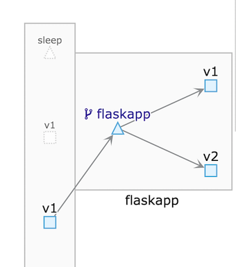

# 12. HTTPS流量管理

* 12.1 设置服务熔断
* 12.2 故障注入测试
* 12.3 注入中断
* 12.4 流量复制

## 12.1设置服务熔断 

服务熔断是一种保护性措施，即在服务实例无法正常提供服务的清况下将其从负载均衡池中移除，不再为其分配任务，避免在故障实例上积压更多的任务并且可以在等待服务能力恢复后，重新将发生故障的`Pod`加人负载均衡池。


这也是一种常见的服务降级方法。 在`Istio`中同样提供了非侵入式的服务熔断功能。

对这一功能只需设置`DestinationRule`对象即可完成。

例如，我们为`httpbin`服务设置一个目标规则： 

**`httpbin-fuse-dr.yaml`**

```
apiVersion: networking.istio.io/v1alpha3 
kind: DestinationRule 
metadata: 
  name: httpbin 
spec: 
  host: httpbin 
  trafficPolicy:
    connectionPool:
      tcp: 
        maxConnections: 1 
      http: 
        http1MaxPendingRequests: 1 
        maxllequesisPerConnection: 1 
    outlierDetection: 
        consecutiveErrors: 1 
        interval: 1s 
        baseEjectionT1me: 1m 
        maxejectiosPercent: 100 
```

```
$ kubectl apply -f httpbin-fuse-dr.yaml 
destinationrule.networking.istio.io/httpbin created
```

接下来使用`sleep Pod`中的`wrk`工具测试熔断效果： 

```
$ kubectl exec sleep-6c9c898f6c-448v6 -it bash -c sleep
bash-4.4# wrk -c 3 -t 3 http://httpbin:8000/ip
Running 10s test @ http://httpbin:8000/ip
  3 threads and 3 connections
  Thread Stats   Avg      Stdev     Max   +/- Stdev
    Latency     4.49ms    5.93ms  65.45ms   88.70%
    Req/Sec   338.84    298.81     1.20k    77.78%
  10108 requests in 10.03s, 2.39MB read
  Non-2xx or 3xx responses: 6140  ❤️
Requests/sec:   1007.53
Transfer/sec:    243.48KB
```


**可以看到，非正常结果占了绝大多数，表明熔断已经生效。** 


接着删除熔断设置，重新测试： 

```
$ kubectl delete dr httpbin
destinationrule.networking.istio.io "httpbin" deleted
```

```
$ kubectl exec sleep-6c9c898f6c-448v6 -it bash -c sleep
bash-4.4# wrk -c 3 -t 3 http://httpbin:8000/ip
Running 10s test @ http://httpbin:8000/ip
  3 threads and 3 connections
  Thread Stats   Avg      Stdev     Max   +/- Stdev
    Latency     5.47ms    5.53ms  60.24ms   87.98%
    Req/Sec   229.36     71.43   440.00     69.70%
  6861 requests in 10.04s, 1.68MB read
Requests/sec:    683.52
Transfer/sec:    171.58KB
```


在删掉熔断设置之后，wrk重新运行，所有请求都会完成。 

这里使用的熔断设置为了测试方便，比较极端： 

* `TCP`和`HTTP`连接池大小都被设置为1; 
* 只允许出错一次； 
* 每秒做一次请求计数； 
* 可以从负载均衡池中移除`100％`的`Pod`; 
* 发生故障的`Pod`最少在被移除`3`分钟后才能再次加入负载均衡池。 

这里用`wrk`工具直接使用超出熔断标准的并行数量来访问`httpbin`服务，在引发熔断后会产生大量的异常响应；在删除目标规则后，熔断规则不复存在，再次用同样的参数运行wrk，就会恢复正常的访问能力了。 


## 12.2 故障注入测试 

**在微服务的测试过程中，往往需要对网络故障的场景进行模拟，`Istio`也在这方面提供了两种故障注入的能力：`延迟`和`中断`**。

 
**借助`Istio`的故障注人能力，测试人员可以使用`VirtualService`配置方式，在任意调用中加入模拟故障，从而测试应用在故障状态下的响应情况，甚至可以在请求中注入中断，来阻止某些情况下的服务访问**。 

## 12.2.1 注入延迟

首先，编辑`httpbin`的`VirtualService`，为服务加人一个`3`秒的延迟： 

```
apiVersion: networking.istio.io/v1alpha3 
kind: VirtualService 
metadata: 
  name: httpbin 
spec: 
  hosts: 
  - "httpbin.default.svc.cluster.local"
  http:
  - route: 
    - destination: 
        host: httpbin.default.svc.cluster.local 
    fault:
      delay:
        fixedDelay: 3s
        percent: 100
```

```
$ kubectl apply -f http-lag-virtualservice.yaml 
virtualservice.networking.istio.io/httpbin configure
```

```

bash-4.4# http --body http://httpbin:8000/delay/1
...

real    0m 4.321s
```

实际延迟了`3`秒，也就是说注人的延迟生效了。 

这很自然就让人联想到前面提到的超时控制。 

这里为`httpbin`服务设置一个两秒的超时限制，也就是在路由规则中加入 `timeout: 2s"`,再次进行测试： 

```
apiVersion: networking.istio.io/v1alpha3 
kind: VirtualService 
metadata: 
  name: httpbin 
spec: 
  hosts: 
  - httpbin.default.svc.cluster.local
  http:
  - route: 
    - destination: 
        host: httpbin.default.svc.cluster.local 
    timeout: 2s
    fault:
      delay:
        fixedDelay: 3s
        percent: 100
```

```
bash-4.4# time http --body http://httpbin:8000/ip
...
real    0m 3.331s
...

http --body http://httpbin:8000/delay/2
real    0m 5.45s
```


结果一目了然，我们在请求中注入的延时并不会触发超时，对延迟的注人由以下两项构成。 

* `percent`：是一个百分比，用于指定注人延迟的比率，其默认值为`1000` 。
* `fixedDelay`：表明延迟的时间长度，必须大于`1`毫秒。 


## 12.3 注入中断
 
可以通过向服务调用过程中注人中断的方式测试服务通信中断的结果。仍然以`httpbin`服务为例我们将户的服拟服务定义修改为 

```
apiVersion: networking.istio.io/v1alpha3 
kind: VirtualService 
metadata: 
  name: httpbin 
spec: 
  hosts: 
  - "httpbin.default.svc.cluster.local"
  http:
  - fault:
      abort:
        httpStatus: 500
        percent: 100
    match:
    - sourceLabels:
        version: v1
    route:
    - destination:
        host: httpbin.default.svc.cluster.local
  - route:
    - destination:
        host: httpbin.default.svc.cluster.local
```

```
$ kubectl apply -f httpbin-abort-virtualservice.yaml
virtualservice.networking.istio.io/httpbin created
```

```
$  kubectl exec -it sleep-v1-548d87cc5c-wfk7v -c sleep bash
bash-4.4# http --body http://httpbin:8000/ip
fault filter abort

$  kubectl exec -it sleep-v2-7c6b874968-hl6dj -c sleep bash
bash-4.4# http --body http://httpbin:8000/ip
{
    "origin": "127.0.0.1"
}
```

同我们设计的执行过程一致：

**来自`sleep`服务`v1`版本的流量，会被注人一个`HTTP 500`错误；来自`sleep`服务`v2`版本的流量，则不会受到影响。和延迟注人一样，中断注人也可以使用`percent`字段来设置注入百分比。** 

## 12.4 流量复制 

流量复制是另一个用于测试的强大功能，它可以把指向一个服务版本的流量复制一份出来，发送给另一个服务版本。

**这一功能能够将生产流量导人测试应用, 在复制出来的镜像流量发出之后不会等待响应**，因此对正常应用的性能影响较小，又能在不影响代码的情况下用更实际的数据对应用进行测试。 

**这里将使用`flaskapp`服务作为测试目标.将访问流量都发给其`v1`版本, 同时复制一份到其`v2`版本**

该工作同样在`VirtualService`中完成，编辑`flaskapp`的`VirtualService`，将其设置为如下内容： 

```
apiVersion: networking.istio.io/v1alpha3 
kind: VirtualService 
metadata: 
  name: flaskapp 
spec: 
  hosts: 
  - fiaskapp.default.svc.cluster.local 
  http: 
  - route: 
    - destination: 
        host: flaskapp.default.svc.cluster.local 
        subset: v1 
    mirror:  ❤️
      host: flaskapp.default.svc.cluster.local 
      subset: v2 
```

```
$ kubectl apply -f flaskapp-copy-virtualservice.yaml 
virtualservice.networking.istio.io/flaskapp created
```

* Source pod `sleep-v1`

```
$ kubectl exec -it sleep-v1-548d87cc5c-wfk7v -c sleep bash
bash-4.4# http --body http://flaskapp/env/version
v1
```

* Dest pod 1 `flask-v1`

```
$ kubectl logs flaskapp-v1-578d79dbcf-74ptj -c flaskapp | tail -1
[pid: 12|app: 0|req: 488/790] 10.1.0.122 () {50 vars in 1085 bytes} [Fri Nov  1 07:28:47 2019] GET /env/version => generated 2 bytes in 24 msecs
 (HTTP/1.1 200) 2 headers in 78 bytes (1 switches on core 
```

* Dest pod 2 `flask-v2`

```
$ kubectl logs flaskapp-v2 -c flaskapp | tail -1
[pid: 13|app: 0|req: 873/1441] 10.1.0.122 () {50 vars in 1085 bytes} [Fri Nov  1 07:26:53 2019] GET /env/version => generated 2 bytes in 29 msec
s (HTTP/1.1 200) 2 headers in 78 bytes (1 switches on core 0)
```



在从`sleep Pod`发出测试之后，可以看到,按照默认路由调用了`flaskapp`服务的`v1`版本，返回了正常的结果；


**使用`kubectl logs`命令查看`flaskapp`服务两个不的`Pod`，会发现在其`v2`版本的`Pod`中, 在同一时间内也产生了同样的调用记录。** 

