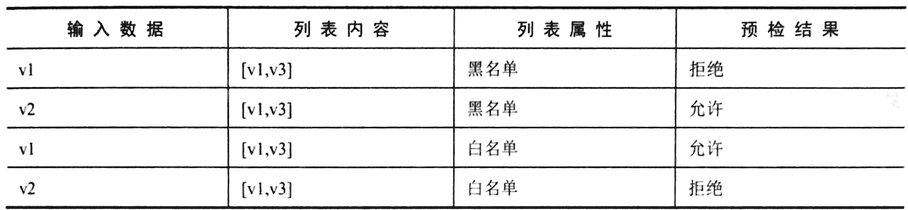

# 13. Mixer 适配器的应用

`Istio` 除了提供了丰富的流量控制功能，还通过`Mixer`：提供了可扩展的外接功能。 

**`Mixer`“知晓”每一次服务间的调用过程，这些调用过程会为`Mixer`：提供丰富的相关信息，`Mixer`通过接人的适配器对这些信息进行处理，能够在调用的预检（执行前)和报告（执行后）阶段执行多种任务**

并且`Mixer`的适配器模型是可以扩充的，这也赋予了`Mixer`更大的扩展能力。 

## 13.1 Mixer适配器简介 

Mixer：中现有的适配器大致可以分为以下两类。

* **一类是`Istio`内部实现的适配器，用于完成网格的内部功能**，例如`Fluentd`、 `Stdio`、`RedisQuota`等。
* **另一类是第三方服务的适配器，用于和外部系统进行对接**，例如`DataDog`、 `StackDriver`等。 

本章同样从应用场景出发，介绍在`Istio`中使用`Mixer`：能够完成的各种任务，只涉及网格内部功能相关的适配器，如下所述。 

* **`Denier`：根据自定义条件判断是否拒绝服务**。 
* `Fluentd`: 向`Fluentd`服务提交日志。 
* `List`：用于执行白名单或者黑名单检查。 
* `MemQuota`：以内存为存储后端，提供简易的配额控制功能。 
* `Prometheus`：为`Prometheus`提供`Istio`的监控指标。 
* `RedisQuota`：基于`Redis`存储后端，提供配额管理功能。 
* `StatsD`：向`StatsD`发送监控指标。 
* `Stdio`：用于在本地输出日志和指标。 

**`Mixer`：的配置通常由以下三部分组成**。 

* `Handler`: 声明一个适配器的配置
* `Instance`: 声明一个模板，用模板将传给`Mixer`的数据转换为特定适配器的输出格式
* `Rule`: 将`Instance`和`Hanlder`连接起来， 确认处理关系


## 13.2 基于`Denier`适配器的访问控制 


本节会利用`Denier`适配器为`httpbin`服务创建一个`Rule`对象，该对象会阻止来自`sleep` 服务的`v1`版本的请求。
 
要使用`Denier`适配器, 则首先要定义它的个`Handler`，每个适配器都会自己的配置格式，可前往官方网站（`https://istio.io/docs/reference/config/policy-and-telemetry/adapters/`）进行查询。

本节为`Denier`：适配器定义的`Handler`结构很简单，仅包含一个错误码和消息： 

```
apiVersion: "config.istio.io/v1alpha2" 
kind: denier 
metadata: 
  name: code-7 
spec: 
  status: 
    code: 7 
    message: Not allowed 
```

这段代码意味着：**如果有流量的预检请求通过`Rule`对象传递给了这个`Handler`就会调用失败，返回错误码`7`及错误信急`Not allowed`。**

将其保存为`denier.yaml` 然后使用`kubectl apply`命令提交到`Kubernetes`集群 

```
$ kubectl apply -f denier.yaml 
denier.config.istio.io/code-7 created
```

**我们现在只想禁止一个`sleep`服务的`v1`版本．仅通过`Rule`对象的`match`字段匹配即可因此可以使用一个`checknonting`的校板来定义输入．就是说无须对进入的数据进行检查** 

```
apiVersion: "config.istio.io/v1alpha2" 
kind: checknothing 
metadata: 
  name: place-holder 
spec: 
```

`checknothing`的模板因为没做任何处理．所以也是相当简单的将其深存为`checknothing.yaml`并使用`kubectl apply`命令提交到`Kubernetes`集群 

```
$ kubectl apply -f checknonthing.yaml --validate=false
checknothing.config.istio.io/place-holder created
```

接下来就可以创建一个`Rule`对象把二者连接起来编辑`denier.rule.yaml`

```
apiVersion: "config.istio.io/v1alpha2" 
kind: rule 
metadata: 
  name: deny-sleep-v1-to-httpbin 
spec: 
  match: destination.labels["app"] == "httpbin" && source.labels["app"] == "sleep" && source.labels["version"] == "v1"
  actions: 
  - handler: code-7.denier 
    instances: place-holder.checknothing
``` 

**注意，在`instance`和`handler`两个宇段中引用对象的方式为一`名称.类型`**

```
handler: code-7.denier 
instances: [place-holder.checknothing]
```    

**在`match`字段中使用源和目标的标签时服进行鉴别、整个表达式实现了对来自`Sleep`服务的`v1`版本向`httpbin`服务发起调用的流量的识别**

```
$ kubectl apply -f denier.rule.yaml 
rule.config.istio.io/deny-sleep-v1-to-httpbin created
```

```
$ kubectl exec -it sleep-v1-548d87cc5c-92lqk -c sleep bash
bash-4.4# http --body http://httpbin:8000/ip
PERMISSION DENIED:code一7.denier.defau1t:Not allowed


$ kubectl exec -it sleep-v2-7c6b874968-dx6ll -c sleep bash
bash-4.4# http --body http://httpbin:8000/ip
{
    "origin": "127.0.0.1"
}
```

测试结果表明，从`sleep`服务的`v1`版本向`httpbin`服务发起i请求，会失败且返回`"PERMISSION DENIED:code一7.denier.defau1t:Not allowed"` ,

从`sleep`服务的`v2`版本向`httpbin`服务发起请求，就会正常返回结果。 

为了后续内容的继续进行，删除刚刚创建的三个对象：

```
$ kubectl delete -f denier.rule.yaml -f checknonthing.yaml -f denier.yaml 
rule.config.istio.io "deny-sleep-v1-to-httpbin" deleted
checknothing.config.istio.io "place-holder" deleted
denier.config.istio.io "code-7" deleted
```

## 13.3 基于`Listchecker`适配器的访问控制 

上面提供的`Denier`适配器的访问控制是比较死板的，表达式修改也稍显烦琐，如果想使用更灵活的控制方式，则可以使用`Listchecker`适配器。 

**在`Listechecker`适配器中会保存一个列表，并可以声明这一列表是黑名单还是白名单，在有数据输入后，首先判断该数据是否属于列表成员，然后根据列表的黑名单或白名单属性来返回是否许可此次调用。**



然后就可以创建一系列对象来验证这一列表是否正确了。为`Listchecker`适配器创建一个`Handler`对象，其中的数据定义来自表的第`1`行： 

```
apiVersion: config.istio.io/v1alpha2 
kind: listchecker 
metadata:
  name: chaos 
spec: 
  overrides: ["v1", "v3"] 
  blacklist: true
```

```
$ kubectl apply -f chaos-listchcker.yaml 
listchecker.config.istio.io/chaos created
```

**在上面的代码中使用了`overrides`字段保存一个列表用于检查并在`blacklist`字段声明这一列表为黑名单。**

**`Listchecker`适配器还可以使用`providerUrl`字段引用一个远程列表并定时更新，以获得更大的灵话性**

接下来使用`listentry`模板从输入数据中提取内容并输出给`Listchecker`适配器。将下面代码保存为`version.listentry.yaml`

```
apiVersion: config.istio.io/v1alpha2 
kind: listentry 
metadata:
  name: version 
spec: 
  value: source.labels["version"]
```

**`listentry`只有`value`一个字段在其中用表达式从输入数据中提取内容进行后续输出**

```
$ kubectl apply -f version.listentry.yaml 
listentry.config.istio.io/version created
```

最后创建`Rule`对象将`Instance`和 `Handler` 连接在一起这为`httpbin`的流址进行测试： 

```
apiVersion: config.istio.io/v1alpha2 
kind: rule 
metadata:
  name: checkversion 
spec: 
  match: destination.labels["app"] == "httpbin" 
  actions: 
  - handler: chaos.listchecker 
    instances: 
      - version.listentry
```

**`listentry.rule.yaml`**

```
$ kubectl apply -f listentry.rule.yaml 
rule.config.istio.io/checkversion created
```

现在`Handler`、 `Instance`, 及`Rule`三个对象都已经创建完毕了．我们可以进行测试了： 

```
$ kubectl exec -it sleep-v1-548d87cc5c-92lqk -c sleep bash
bash-4.4# http --body http://httpbin:8000/ip
PERMISSION DENIED:chaos.Iistchecker.default:v1 is blacklisted

$ kubectl exec -it sleep-v2-7c6b874968-dx6ll -c sleep bash
bash-4.4# http --body http://httpbin:8000/ip
{
    "origin": "127.0.0.1"
}
 
```

可以看到，在使用`sleep Pod`的`v1`版本访间`httpbin`服务时，访问被拒绝，出现错误信息`"PERMISSION DENIED:chaos.Iistchecker.default:v1 is blacklisted`；

**而从`sleep`服务的`v2`版本进行访问时就可以成功返回向应的内容要验证白名单也很简单、只要把`chaos.listchecker.yaml`中的`blacklist: true`改成 `blacklist: false`.然后重新提交即可。**

再次执行测试： 


```
apiVersion: config.istio.io/v1alpha2 
kind: listchecker 
metadata:
  name: chaos 
spec: 
  overrides: ["v1", "v3"] 
  blacklist: false
```

```
$ kubectl apply -f chaos-listchcker.yaml 
listchecker.config.istio.io/chaos configured
```

```
$ kubectl exec -it sleep-v1-548d87cc5c-92lqk -c sleep bash
bash-4.4# http --body http://httpbin:8000/ip
{
    "origin": "127.0.0.1"
}

$ kubectl exec -it sleep-v2-7c6b874968-dx6ll -c sleep bash
bash-4.4# http --body http://httpbin:8000/ip
NOT FOUND:chaoslistchecker.default:v2 is not whitelisted
```

在`Listchecker`适配器更新之后进行新一轮测试，可以看到测试结果发生了变化， 与中的`3:4`行一致

sleep服务的`v2`版本向httpbin发出的访问被拒绝，返回信息为
`NOT FOUND:chaoslistchecker.default:v2 is not whitelisted`

